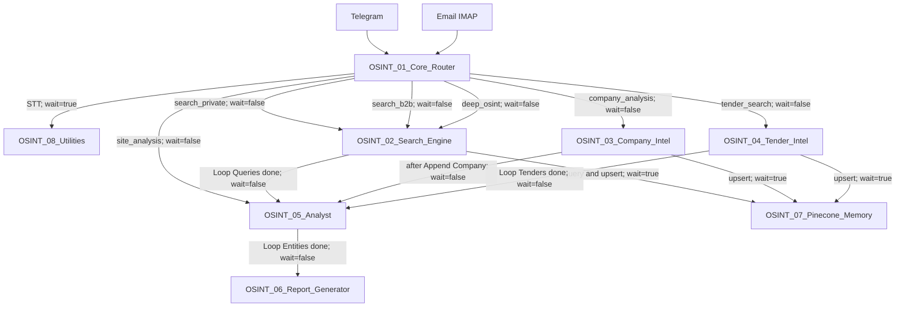

# Project Knowledge — OSINT Platform

> **Status:** APPROVED  
> **Version:** 1.0  
> **Decision authority:** Principal Architect  
> **Repository SSOT:** `XandXander/n8n-workflows`  
> **Workflow JSON baseline:** `8420e423c98dcb1d11fa02f554e0674b9705bb81`  
> **WORKFLOW_MAP baseline:** `ad9e9b92c7d76f76154d4b322f829c70ff1597e1`  
> **ARCHITECTURE baseline:** `ef1abcf42293c67dae068efe88e8b41a15cd9059`  
> **ENVIRONMENT baseline:** `577ff1c47b192451cc4039e9c99b3daed710d8bc`  
> **DECISIONS baseline:** `4b1b85c5b4f7639b8488bd19e606adfc376e83f9`  
> **ERROR_HISTORY baseline:** `c3619116ef9e818b814a0a8667f654694929a530`  
> **PROJECT_STATE baseline:** `e53628b6ff5f4165742ee6105cb501f516c39cf4`  
> **Compatibility baseline:** n8n 2.32.7  
> **Current filename:** `PROJECT_KNOWLEDGE.md`  
> **Last audited:** 2026-08-04

* * *

## 1. Purpose

This document is the canonical navigation and engineering-knowledge entry point for the OSINT Platform.
Its purpose is to:

*   explain where canonical project information is maintained;
    
*   connect the specialized SSOT documents;
    
*   summarize stable cross-document engineering knowledge;
    
*   define evidence-handling rules;
    
*   define project-governance and documentation-lifecycle rules;
    
*   provide a safe starting point for architecture, implementation, incident and runtime work;
    
*   prevent unsupported historical claims from being reused as current facts;
    
*   prevent this document from becoming a second conflicting source of truth.
    

This document is not the authoritative source for detailed:

*   workflow topology;
    
*   node configuration;
    
*   architecture;
    
*   runtime environment;
    
*   architectural decisions;
    
*   incidents;
    
*   technical debt;
    
*   evidence debt;
    
*   current project snapshot.
    

Those subjects remain owned by their specialized canonical sources.
When this document conflicts with a specialized approved document or canonical workflow JSON, the specialized source takes precedence and `PROJECT_KNOWLEDGE.md` requires synchronization.

* * *

## 2. Source-of-Truth Hierarchy

### 2.1 Repository SSOT

The GitHub repository is the project SSOT for:

*   canonical workflow JSON;
    
*   approved project documentation;
    
*   approved engineering standards;
    
*   confirmed repository changes;
    
*   accepted architectural decisions;
    
*   canonical incident and debt registers.
    

Conversation history, local files, old exports and model-generated summaries are not SSOT.

### 2.2 Specialized canonical sources

| Subject | Canonical source |
| --- | --- |
| Workflow inventory, topology, node-level paths and caller/callee mappings | `docs/WORKFLOW_MAP.md` |
| System boundaries, responsibilities, integration architecture and execution semantics | `docs/ARCHITECTURE.md` |
| Runtime evidence boundaries, configured dependencies and deployment contract | `docs/ENVIRONMENT.md` |
| Architectural and engineering decisions | `docs/DECISIONS_DRAFT.md` |
| Incidents, Root Cause confidence, technical debt and evidence debt | `docs/ERROR_HISTORY_DRAFT.md` |
| Evidence-based current project snapshot | `PROJECT_STATE.md` |
| Canonical workflow implementation | `workflows/OSINT_*.json` |
| Cross-document navigation, engineering rules and lifecycle guidance | `PROJECT_KNOWLEDGE.md` |

### 2.3 Supporting implementation standards

ADR-024 records the following implementation artifacts:

*   `docs/standards/n8n_schema.md`;
    
*   `docs/standards/node_templates.md`.
    

These files support workflow JSON Profile A and Profile C implementation.
They do not replace:

*   `WORKFLOW_MAP.md`;
    
*   `ARCHITECTURE.md`;
    
*   `ENVIRONMENT.md`;
    
*   ADR-024;
    
*   canonical workflow JSON.
    

### 2.4 Precedence rule

When sources disagree, use the following order:

1.  current canonical workflow JSON for implementation facts;
    
2.  approved specialized document for the subject it owns;
    
3.  confirmed live data for current runtime facts;
    
4.  confirmed sanitized logs for execution or infrastructure facts;
    
5.  confirmed Git commit for repository-change evidence;
    
6.  explicitly labelled historical claim.
    

A Git commit confirms repository content.
It does not independently confirm:

*   deployment;
    
*   active state;
    
*   provider health;
    
*   successful execution;
    
*   incident resolution.
    

* * *

## 3. Canonical Document State

| Document | Repository path | Status | Implementation state | Block state | Baseline |
| --- | --- | --- | --- | --- | --- |
| Workflow Map | `docs/WORKFLOW_MAP.md` | APPROVED | COMPLETE | CLOSED | `ad9e9b92c7d76f76154d4b322f829c70ff1597e1` |
| Architecture | `docs/ARCHITECTURE.md` | APPROVED | COMPLETE | CLOSED | `ef1abcf42293c67dae068efe88e8b41a15cd9059` |
| Environment | `docs/ENVIRONMENT.md` | APPROVED | COMPLETE | CLOSED | `577ff1c47b192451cc4039e9c99b3daed710d8bc` |
| Decision Register | `docs/DECISIONS_DRAFT.md` | APPROVED | COMPLETE | CLOSED | `4b1b85c5b4f7639b8488bd19e606adfc376e83f9` |
| Error History Register | `docs/ERROR_HISTORY_DRAFT.md` | APPROVED | COMPLETE | CLOSED | `c3619116ef9e818b814a0a8667f654694929a530` |
| Project State | `PROJECT_STATE.md` | APPROVED | COMPLETE | CLOSED | `e53628b6ff5f4165742ee6105cb501f516c39cf4` |
| Project Knowledge | `PROJECT_KNOWLEDGE.md` | APPROVED | COMPLETE | CLOSED | `5c08ccaf8bb7a6e843cee63e47ce48d4076f90d2` |

The `_DRAFT` suffix in the approved decision and error-history filenames remains intentional until a separate rename scope is approved.
No rename is performed or implied by this document.

* * *

## 4. Evidence Model

Every factual statement about the project must be classified by evidence.
| Evidence status | Meaning |
| --- | --- |
| `CONFIRMED BY JSON` | Directly supported by canonical workflow JSON |
| `CONFIRMED BY APPROVED DOCUMENT` | Supported by an approved canonical document |
| `CONFIRMED BY LIVE DATA` | Supported by current runtime or server evidence |
| `CONFIRMED BY LOGS` | Supported by sanitized execution, server or container logs |
| `HISTORICAL CLAIM` | Reported historically but not established as a current fact |
| `UNKNOWN` | Current accepted evidence does not establish the statement |
| `CONFLICT` | Accepted sources or contracts are incompatible |
| `INFERENCE` | A reasoned interpretation that is not itself confirmed evidence |

### 4.1 Rules for `INFERENCE`

An inference:

*   must be explicitly labelled;
    
*   must identify the evidence from which it is derived;
    
*   must not be presented as current runtime fact;
    
*   must not be recorded as confirmed Root Cause;
    
*   must not close an incident;
    
*   must not create or change an ADR;
    
*   must not authorize implementation;
    
*   must not replace missing live or log evidence.
    

An inference becomes canonical fact only after suitable evidence or an approved architectural decision.

### 4.2 Structural configuration versus runtime

Canonical JSON can confirm:

*   workflow presence;
    
*   workflow names and root IDs;
    
*   nodes;
    
*   connections;
    
*   parameters;
    
*   explicit workflow inputs;
    
*   configured providers;
    
*   configured storage paths;
    
*   configured delivery paths;
    
*   retry and timeout fields;
    
*   workflow-level settings present in JSON.
    

Canonical JSON cannot independently confirm:

*   successful deployment;
    
*   active or published state;
    
*   credential validity;
    
*   provider availability;
    
*   successful persistence;
    
*   successful PDF conversion;
    
*   successful delivery;
    
*   end-to-end operation;
    
*   runtime health.
    

### 4.3 Approved documents versus runtime

Approved documents can confirm:

*   accepted architecture;
    
*   accepted decisions;
    
*   evidence boundaries;
    
*   implementation classifications;
    
*   current contract conflicts;
    
*   technical debt;
    
*   evidence debt;
    
*   incident classifications;
    
*   approved deployment contracts.
    

Approved documents do not independently confirm runtime success unless they contain accepted live or log evidence.

### 4.4 Evidence required for Root Cause

A Root Cause is `CONFIRMED` only when direct evidence establishes the causal mechanism.
The following are insufficient on their own:

*   a plausible hypothesis;
    
*   a code change;
    
*   a configuration change;
    
*   a successful later execution;
    
*   a historical report;
    
*   the presence of a remediation in GitHub.
    

* * *

## 5. Platform Scope

### 5.1 In scope

The current OSINT Platform consists of:

*   eight canonical n8n workflows;
    
*   Telegram and email ingestion;
    
*   speech-to-text routing;
    
*   intent classification;
    
*   private and B2B lead search;
    
*   company enrichment;
    
*   tender search and analysis;
    
*   entity scoring;
    
*   Google Sheets operational-state exchange;
    
*   Jina embeddings;
    
*   Pinecone vector operations;
    
*   report generation;
    
*   configured Google Drive storage;
    
*   configured Telegram and SMTP delivery;
    
*   utility logging and throttling;
    
*   GitHub-based workflow configuration SSOT;
    
*   an approved Public API v1 update contract.
    

### 5.2 Out of scope

The current confirmed architecture does not include:

*   people or person verification;
    
*   workflow creation through POST;
    
*   a confirmed Gemini or Google AI Studio integration;
    
*   provider availability guarantees;
    
*   production SLA guarantees;
    
*   inferred live workflow state;
    
*   inferred server or container topology;
    
*   unapproved redesign;
    
*   automatic resolution of technical debt;
    
*   automatic reopening of closed ADRs.
    

* * *

## 6. Canonical Workflow Quick Reference

| WF | Exact workflow name | Root ID | Primary responsibility |
| --- | --- | --- | --- |
| WF1 | `OSINT_01_Core_Router` | `WtkTm484CwBpahGt` | Ingestion, normalization, classification and routing |
| WF2 | `OSINT_02_Search_Engine` | `fgf3zI8fRJhkqlHC` | Lead search, scraping, contact extraction and deduplication |
| WF3 | `OSINT_03_Company_Intel` | `gxCPpkQkvqc0yWf8` | Company enrichment and analysis |
| WF4 | `OSINT_04_Tender_Intel` | `zcpU6hLvcMl5RiUa` | Tender search, analysis and persistence |
| WF5 | `OSINT_05_Analyst` | `viR4AZBaC4CFA4qx` | Entity scoring and qualification |
| WF6 | `OSINT_06_Report_Generator` | `qXWixFd94G7Tfgaa` | Report generation, configured storage and delivery |
| WF7 | `OSINT_07_Pinecone_Memory` | `O3Ke6qflNx8CL1x7` | Jina embedding and Pinecone operation facade |
| WF8 | `OSINT_08_Utilities` | `IR4oQQAYQgUwIUjJ` | Speech-to-text, PDF, logging and throttle utilities |

All eight workflow JSON files are present in GitHub.
Their current live deployment, active and published states remain `UNKNOWN`.
For complete node-level topology, use `docs/WORKFLOW_MAP.md`.

* * *

## 7. Inter-Workflow Model

The confirmed high-level graph is:



### 7.1 Invocation rules

The implementation uses:

*   asynchronous dispatch for primary processing branches;
    
*   synchronous calls for speech-to-text;
    
*   synchronous calls for Pinecone operations through WF7;
    
*   Google Sheets as shared operational state.
    

The presence of `wait=true` or `wait=false` confirms configured invocation semantics.
It does not prove successful runtime ordering or completion.

### 7.2 State-boundary rule

Google Sheets is the confirmed shared operational-state boundary between workflows.
Pinecone is accessed through WF7 for vector operations.
Direct changes to these boundaries require impact analysis across:

*   caller inputs;
    
*   callee inputs;
    
*   sheet schemas;
    
*   entity identifiers;
    
*   lifecycle statuses;
    
*   report reads;
    
*   deduplication contracts.
    

* * *

## 8. Data and Integration Quick Reference

### 8.1 Google Sheets

Confirmed sheet names:

*   `jobs`;
    
*   `leads`;
    
*   `companies`;
    
*   `tenders`;
    
*   `reports`;
    
*   `logs`.
    

Runtime availability, quota state, current live schema and successful writes remain `UNKNOWN`.

### 8.2 Jina and Pinecone

Confirmed vector contract:

```text
model: jina-embeddings-v3
dimensions: 1024
upsert task: retrieval.passage
query task: retrieval.query
```

Confirmed caller namespaces:

*   `leads`;
    
*   `companies`;
    
*   `tenders`.
    

Pinecone index availability, live dimension compatibility and successful operations remain `UNKNOWN`.

### 8.3 Configured external dependencies

| Dependency | Configured workflows | Runtime state |
| --- | --- | --- |
| DeepSeek | WF1, WF3, WF4, WF5, WF6 | UNKNOWN |
| Serper | WF2, WF3, WF4 | UNKNOWN |
| Tavily | WF4 | UNKNOWN |
| Firecrawl | WF2, WF3 | UNKNOWN |
| DaData | WF3 | UNKNOWN |
| Jina | WF7 | UNKNOWN |
| Pinecone | WF7 | UNKNOWN |
| Groq | WF8 | UNKNOWN |
| Gotenberg | WF6, WF8 | UNKNOWN |
| Google Sheets | WF1, WF2, WF3, WF4, WF5, WF6, WF8 | UNKNOWN |
| Google Drive | WF6 | UNKNOWN |
| Telegram | WF1, WF6, WF8 | UNKNOWN |
| IMAP | WF1 | UNKNOWN |
| SMTP | WF6 | UNKNOWN |

Configured dependencies must not be described as healthy, available or operational without current live or log evidence.

* * *

## 9. Current Runtime Knowledge

### 9.1 Confirmed live baseline

The only current runtime fact confirmed by the approved evidence baseline is:

```text
n8n version: 2.32.7
```

This is also the workflow compatibility baseline.

### 9.2 Runtime properties that remain unknown

The following remain `UNKNOWN` without new live or log evidence:

*   hosting provider;
    
*   operating system;
    
*   kernel;
    
*   CPU;
    
*   RAM and swap;
    
*   disk state;
    
*   virtualization;
    
*   Docker version;
    
*   Docker Compose version;
    
*   container inventory;
    
*   image tags and digests;
    
*   container health;
    
*   network topology;
    
*   published ports;
    
*   restart policies;
    
*   Binary Data Mode;
    
*   execution concurrency;
    
*   payload limits;
    
*   global retention;
    
*   global pruning;
    
*   backup policy;
    
*   container-update policy;
    
*   current workflow deployment;
    
*   active or published state;
    
*   provider availability;
    
*   credential validity;
    
*   end-to-end health.
    

### 9.3 Runtime claim rule

Do not convert:

*   a historical server snapshot;
    
*   an old local export;
    
*   a previous chat statement;
    
*   a configured node;
    
*   a credential reference;
    
*   a Git commit;
    

into a current runtime fact.

* * *

## 10. Workflow JSON Artifact Profiles

ADR-024 defines four artifact profiles.
| Profile | Purpose | Status |
| --- | --- | --- |
| Profile A | GitHub canonical workflow | APPROVED |
| Profile B | POST/create payload | NOT IMPLEMENTED |
| Profile C | Sanitized PUT update payload | APPROVED |
| Profile D | Server response/export | REQUIRES EVIDENCE — NON-BLOCKING |

ADR-024 remains:

```text
Decision status: ACCEPTED
Implementation scope: COMPLETE
Architectural block: CLOSED
```

Profile D evidence debt does not block:

*   Profile A;
    
*   Profile C;
    
*   the existing-workflow update contract;
    
*   current canonical documentation;
    
*   engineering work on existing workflows.
    

This document does not reopen ADR-024.

* * *

## 11. Approved Deployment Contract

### 11.1 Existing workflow update

The approved update method is:

```text
PUT https://xandai.ru/api/v1/workflows/{workflow_id}
```

The workflow ID comes from Profile A root `id`.
An update must stop if root `id` is absent.
The approved authorization header name is:

```text
X-N8N-API-KEY
```

The header value must never be documented or displayed.

### 11.2 PUT sanitation

Remove the following root fields from the PUT body:

```text
id
versionId
active
createdAt
updatedAt
shared
tags
triggerCount
pinData
meta
```

### 11.3 Preservation rules

For an existing workflow update:

*   preserve existing `nodes[].id`;
    
*   do not generate missing node IDs automatically;
    
*   preserve credential references;
    
*   do not modify automatic credential substitution;
    
*   do not remove unknown server-managed fields without evidence;
    
*   do not reuse Profile C as a POST/create contract.
    

### 11.4 Prohibited deployment assumptions

The approved contract does not confirm:

*   live endpoint accessibility;
    
*   API-key validity;
    
*   successful PUT of the current baseline;
    
*   live workflow deployment;
    
*   active or published state;
    
*   Profile D response shape.
    

The internal route family `/rest/workflows` is not the approved workflow-update method.

* * *

## 12. n8n Engineering Rules

### 12.1 Canonical JSON rule

Canonical workflow changes must preserve Profile A validity.
Before an existing-workflow update, the payload must be transformed into Profile C.
Repository JSON and API payloads are distinct artifacts and must not be treated as interchangeable.

### 12.2 Node identity rule

Existing node IDs are opaque identifiers.
They must be preserved when present.
A node ID must not be:

*   regenerated for formatting;
    
*   removed because it appears non-UUID;
    
*   rewritten without a specific approved reason;
    
*   confused with the workflow root ID.
    

### 12.3 Credential rule

Credential references must remain unchanged unless credential work is the explicit approved scope.
Do not:

*   disclose credential IDs in documentation;
    
*   disclose credential values;
    
*   replace credentials automatically;
    
*   infer credential validity from a node reference;
    
*   treat credential presence as successful authentication.
    

### 12.4 Code-node rule

Use sandbox-safe patterns already represented in canonical JSON.
Do not assume availability of:

*   Node.js modules;
    
*   runtime globals;
    
*   filesystem access;
    
*   environment access;
    
*   unsupported binary APIs.
    

Current canonical patterns include:

*   `prepareBinaryData` for WF6 HTML binary preparation;
    
*   timestamp and `Math.random()` identifier construction;
    
*   `new Date().toISOString()`.
    

The availability of `Buffer`, `crypto`, `require()` or global environment access is not a current confirmed runtime fact.

### 12.5 HTTP response-preservation rule

When an HTTP Request node is configured to place its response in a field:

*   downstream consumers must read the same field;
    
*   original context must remain available;
    
*   consumer paths must be validated against actual output shape;
    
*   a configured output field does not prove that all downstream consumers are aligned.
    

Current WF2 response preservation remains `PARTIAL` because:

```text
Serper Search output: serperResult
Extract URLs consumer: root-level organic
```

This is TD-004 and must not be silently described as resolved.

### 12.6 Loop-context rule

Changes involving `SplitInBatches` or loop nodes must preserve explicit item provenance.
Existing uses of:

```text
$items(..., $runIndex)
```

and `.item` fallback are tracked as TD-006.
They must not be:

*   assumed safe without runtime verification;
    
*   described as confirmed Root Cause;
    
*   removed outside an approved implementation scope;
    
*   generalized into an unsupported universal n8n rule.
    

### 12.7 Dynamic Sheet Name rule

ADR-020 rejected a blanket ban on dynamic Sheet Name expressions.
Current rule:

*   fixed-purpose nodes may use static names;
    
*   dynamic entity-table selection is permitted when explicitly documented;
    
*   runtime correctness remains a separate verification concern.
    

### 12.8 Binary preparation rule

ADR-007 establishes `prepareBinaryData` for the current WF6 Gotenberg HTML input.
ADR-021, which used Convert to File, is `SUPERSEDED`.
Successful Gotenberg conversion remains a runtime-verification question.

### 12.9 Error-handling rule

Retry, timeout, `onError`, backoff and partial-result behavior are not uniform across providers.
Current provider-failure policy remains an open architectural decision.
Do not claim a unified retry policy until OPEN-DEC-002 is resolved through an ADR.

* * *

## 13. GitHub SSOT and Change-Control Rules

### 13.1 Repository authority

GitHub is authoritative for the project's canonical configuration and documentation.
The following are not authoritative when they conflict with GitHub:

*   chat history;
    
*   local copies;
    
*   exported files not committed to the repository;
    
*   model memory;
    
*   generated summaries;
    
*   historical drafts;
    
*   server exports not classified under Profile D.
    

### 13.2 Scope rule

Every change must have an explicit scope.
A documentation scope does not automatically authorize:

*   workflow modification;
    
*   deployment;
    
*   credential changes;
    
*   server commands;
    
*   infrastructure changes;
    
*   incident closure;
    
*   ADR creation.
    

A workflow scope does not automatically authorize rewriting every project document.

### 13.3 Impact-analysis rule

Before changing an artifact, identify the affected contracts.
Potential impacts include:

*   topology;
    
*   caller/callee inputs;
    
*   workflow roles;
    
*   data schema;
    
*   state lifecycle;
    
*   provider contract;
    
*   deployment profile;
    
*   ADR status;
    
*   incident status;
    
*   technical debt;
    
*   evidence debt;
    
*   project snapshot;
    
*   knowledge navigation.
    

Only affected documents should be synchronized.

### 13.4 Approval rule

A proposed document or architectural change remains a candidate until explicitly approved by the Principal Architect.
Approval of content and application of content are separate states.
A document must not be marked:

*   `APPROVED`;
    
*   `COMPLETE`;
    
*   `CLOSED`;
    

before the corresponding approval and repository implementation are confirmed.

### 13.5 Git responsibility boundary

The project governance model separates:

*   architectural analysis and approval;
    
*   application of approved changes;
    
*   manual repository operations;
    
*   independent final verification.
    

Repository history must not be claimed as updated until the actual commit and push are confirmed in GitHub SSOT.

* * *

## 14. Roles and Responsibilities

### 14.1 Principal Architect

The Principal Architect:

*   performs evidence-based architectural analysis;
    
*   identifies conflicts across canonical artifacts;
    
*   distinguishes confirmed facts from hypotheses;
    
*   approves or rejects architectural decisions;
    
*   approves canonical document content;
    
*   defines implementation scope;
    
*   prepares technical specifications;
    
*   performs final architectural review;
    
*   closes document or architecture blocks.
    

The Principal Architect does not treat chat history as stronger evidence than GitHub SSOT.

### 14.2 AI Engineer

The AI Engineer:

*   applies only approved content or approved implementation specifications;
    
*   preserves scope boundaries;
    
*   validates changed files;
    
*   reports exact changed-file scope;
    
*   does not silently change architectural decisions;
    
*   does not reinterpret canonical content;
    
*   does not modify unrelated artifacts;
    
*   does not claim runtime success without evidence.
    

### 14.3 User and repository operator

The user:

*   authorizes the active scope;
    
*   provides required live or log evidence;
    
*   performs or authorizes repository operations;
    
*   confirms commit and push results;
    
*   controls credentials and server access;
    
*   decides when implementation or runtime verification begins.
    

### 14.4 Independent auditor

The independent auditor:

*   reads the current GitHub SSOT;
    
*   verifies commit scope;
    
*   verifies internal document consistency;
    
*   verifies baselines;
    
*   identifies blocking contradictions;
    
*   does not silently correct the audited artifact;
    
*   does not substitute prior conclusions for current repository evidence.
    

* * *

## 15. Documentation Lifecycle

### 15.1 General lifecycle

The standard lifecycle is:

1.  identify the active scope;
    
2.  read the current GitHub SSOT;
    
3.  collect the allowed evidence baseline;
    
4.  audit the existing artifact or define the new artifact;
    
5.  classify conflicts and unknowns;
    
6.  prepare candidate content;
    
7.  obtain explicit architectural approval;
    
8.  apply only the approved content;
    
9.  verify the exact repository change;
    
10.  perform final architectural review;
     
11.  close the document block.
     

### 15.2 Document ownership

| Change type | Primary document |
| --- | --- |
| Workflow topology or mappings | `WORKFLOW_MAP.md` |
| Architecture or system boundary | `ARCHITECTURE.md` |
| Runtime evidence boundary or deployment contract | `ENVIRONMENT.md` |
| Architectural decision | `DECISIONS_DRAFT.md` |
| Incident, Root Cause confidence, TD or ED | `ERROR_HISTORY_DRAFT.md` |
| Current evidence-based snapshot | `PROJECT_STATE.md` |
| Cross-document navigation or general engineering process | `PROJECT_KNOWLEDGE.md` |

### 15.3 Synchronization rule

Documents are not rewritten automatically after every workflow change.
The required process is:

1.  inspect the change;
    
2.  identify affected contracts;
    
3.  determine document impact;
    
4.  open a separate approved synchronization scope;
    
5.  update only affected documents;
    
6.  refresh their baselines where required.
    

### 15.4 ADR lifecycle rule

An ADR is created or updated only when:

*   a genuine architectural decision exists;
    
*   alternatives or consequences require governance;
    
*   the decision affects system structure, contracts or policy.
    

Incidents, defects and observations are not ADRs.
Technical debt is not automatically an ADR.

### 15.5 Error-history lifecycle rule

`ERROR_HISTORY_DRAFT.md` is updated only when evidence supports:

*   a new incident record;
    
*   a classification change;
    
*   a Root Cause confidence change;
    
*   an implementation-state change;
    
*   runtime-verification evidence;
    
*   new technical debt;
    
*   new evidence debt.
    

A historical claim must not be promoted to confirmed incident occurrence without accepted evidence.

### 15.6 Project-state lifecycle rule

`PROJECT_STATE.md` is an evidence-based snapshot.
It must separate:

*   implementation;
    
*   deployment;
    
*   runtime;
    
*   incidents;
    
*   technical debt;
    
*   evidence debt;
    
*   open decisions;
    
*   planned work.
    

It must not infer runtime health from repository configuration.

### 15.7 Project-knowledge lifecycle rule

`PROJECT_KNOWLEDGE.md` is a navigation and engineering-rules document.
It must not become:

*   a duplicate workflow map;
    
*   a duplicate architecture document;
    
*   a second environment register;
    
*   a second ADR register;
    
*   a second incident register;
    
*   a replacement project-state snapshot.
    

When a specialized source changes, this document is updated only if:

*   navigation changes;
    
*   a cross-document rule changes;
    
*   a baseline changes;
    
*   a general engineering rule changes;
    
*   the knowledge summary becomes materially inaccurate.
    

* * *

## 16. Decision State

The canonical decision register contains 24 ADRs.

### 16.1 ADR status summary

| Status | ADR |
| --- | --- |
| IMPLEMENTED | ADR-001, ADR-002, ADR-003, ADR-004, ADR-007, ADR-008, ADR-009, ADR-010, ADR-013, ADR-014, ADR-016 |
| PARTIAL | ADR-005, ADR-006, ADR-011, ADR-023 |
| UNKNOWN | ADR-012, ADR-017, ADR-018, ADR-019, ADR-022 |
| REQUIRES VERIFICATION | ADR-015 |
| REJECTED | ADR-020 |
| SUPERSEDED | ADR-021 |
| ACCEPTED | ADR-024 |

### 16.2 Open decisions

Three architectural decisions remain open.

#### OPEN-DEC-001 — Unified Job and Entity Lifecycle

A future ADR is required to define:

*   valid job statuses;
    
*   valid entity statuses;
    
*   terminal outcomes;
    
*   transition rules;
    
*   `partial`;
    
*   `no_results`;
    
*   `failed`.
    

#### OPEN-DEC-002 — Unified Provider Failure Policy

A future ADR may define consistent:

*   retry;
    
*   timeout;
    
*   backoff;
    
*   `onError`;
    
*   partial-result handling.
    

#### OPEN-DEC-003 — Tavily Role in Tender Search

A future ADR may define whether Tavily is:

*   mandatory;
    
*   fallback;
    
*   supplementary;
    
*   removable without changing WF4 semantics.
    

Open decisions are not approved implementation work.

* * *

## 17. Incident and Debt State

### 17.1 Incident register

The canonical error register contains:

```text
Total indexed records: 16
Incident records: 14
Historical non-incident records: 2
```

Retained incident records:

*   ERR-001;
    
*   ERR-002;
    
*   ERR-003;
    
*   ERR-005;
    
*   ERR-006;
    
*   ERR-007;
    
*   ERR-008;
    
*   ERR-009;
    
*   ERR-010;
    
*   ERR-011;
    
*   ERR-012;
    
*   ERR-013;
    
*   ERR-015;
    
*   ERR-016.
    

Historical non-incident records:

*   ERR-004;
    
*   ERR-014.
    

### 17.2 Root Cause and runtime state

For the retained incident records:

*   occurrence is `HISTORICAL CLAIM`;
    
*   no Root Cause is `CONFIRMED`;
    
*   runtime remediation state is `NOT VERIFIED`.
    

Implementation state varies between:

*   `IMPLEMENTED IN CANONICAL JSON`;
    
*   `IMPLEMENTED IN APPROVED CONTRACT`;
    
*   `PARTIAL`;
    
*   `CONFLICT`;
    
*   `NOT PRESENT`;
    
*   `SUPERSEDED`.
    

No retained incident is classified as runtime-resolved.

### 17.3 Technical debt

The canonical technical-debt register contains nine records.
| ID | Summary |
| --- | --- |
| TD-001 | WF1 to WF2 missing `intent` |
| TD-002 | WF1 to WF3 serialized `entities` |
| TD-003 | Direct `site_analysis` contract |
| TD-004 | WF2 `serperResult` consumer mismatch |
| TD-005 | WF6 qualification semantics |
| TD-006 | Loop context recovery |
| TD-007 | Inconsistent external-provider retry configuration |
| TD-008 | Unverified loop input indexes |
| TD-009 | Unverified Gotenberg Telegram output index |

Technical debt is not an incident and is not an ADR.

### 17.4 Evidence debt

The canonical evidence-debt register contains 12 records.
| ID | Summary |
| --- | --- |
| ED-001 | Current execution logs |
| ED-002 | WF2 end-to-end context verification |
| ED-003 | DeepSeek provider verification |
| ED-004 | Firecrawl target-specific responses |
| ED-005 | Code-node runtime environment |
| ED-006 | IMAP runtime payload |
| ED-007 | Gotenberg runtime conversion |
| ED-008 | Pinecone and Jina live compatibility |
| ED-009 | Public API runtime update |
| ED-010 | Active and published workflow state |
| ED-011 | External-provider availability |
| ED-012 | Credential validity |

Evidence debt is not automatically:

*   a blocker;
    
*   an incident;
    
*   technical debt;
    
*   approved work.
    

* * *

## 18. Incident Investigation Protocol

When investigating a failure:

1.  identify the affected workflow and execution;
    
2.  preserve sanitized evidence;
    
3.  distinguish occurrence from Root Cause;
    
4.  reproduce the failure when safe and possible;
    
5.  inspect canonical JSON and approved contracts;
    
6.  identify conflicting ADR, TD or ED records;
    
7.  classify the Root Cause confidence;
    
8.  define the minimum necessary remediation;
    
9.  define runtime-verification evidence;
    
10.  update `ERROR_HISTORY_DRAFT.md` only within an approved scope.
     

### 18.1 Required evidence examples

Depending on the incident, evidence may include:

*   execution ID;
    
*   workflow ID;
    
*   node name;
    
*   execution timestamp;
    
*   sanitized node input;
    
*   sanitized node output;
    
*   HTTP method and status;
    
*   sanitized response body;
    
*   retry count;
    
*   request duration;
    
*   caller and callee payloads;
    
*   persistence result;
    
*   generated binary metadata;
    
*   provider response metadata.
    

### 18.2 Root Cause wording

Use:

*   `CONFIRMED` only with direct causal evidence;
    
*   `SUPPORTED` when evidence supports but does not fully prove causality;
    
*   `UNKNOWN` when causality is not established;
    
*   `CONFLICT` when the claim contradicts accepted evidence;
    
*   `NOT APPLICABLE` for non-incident records.
    

* * *

## 19. Secret and Credential Safety

Canonical documentation must not contain:

*   API key values;
    
*   access tokens;
    
*   passwords;
    
*   credential IDs;
    
*   `.env` contents;
    
*   authentication cookies;
    
*   secret header values;
    
*   private keys;
    
*   unsanitized personal data;
    
*   unsanitized confidential payloads.
    

Allowed documentation may include:

*   environment-variable names;
    
*   credential type names;
    
*   approved header names without values;
    
*   sanitized endpoint contracts;
    
*   sanitized example payload shapes.
    

The header name:

```text
X-N8N-API-KEY
```

may be documented.
Its value must never be documented.

* * *

## 20. Safe Operational Boundaries

### 20.1 Documentation does not authorize execution

A document may describe a contract without authorizing:

*   API calls;
    
*   deployment;
    
*   activation;
    
*   server commands;
    
*   credential changes;
    
*   database changes;
    
*   container changes.
    

### 20.2 No automatic remediation

The presence of:

*   technical debt;
    
*   evidence debt;
    
*   an open decision;
    
*   an incident record;
    
*   a contract conflict;
    

does not authorize automatic correction.
Implementation requires a separate approved scope and technical specification.

### 20.3 No silent architecture change

Do not silently:

*   change workflow responsibility;
    
*   merge workflows;
    
*   split workflows;
    
*   replace providers;
    
*   alter storage boundaries;
    
*   change synchronization semantics;
    
*   change retry policy;
    
*   change entity lifecycle;
    
*   change deployment profiles;
    
*   reopen closed ADRs.
    

### 20.4 Minimum-change principle

Prefer the smallest change that:

*   addresses the confirmed issue;
    
*   preserves current architecture;
    
*   preserves identifiers and credentials;
    
*   avoids unrelated refactoring;
    
*   is testable;
    
*   has defined verification evidence.
    

A full-system rewrite requires demonstrated necessity.

* * *

## 21. Engineering Work Entry Points

Use the following starting point for common tasks.
| Task | Read first |
| --- | --- |
| Understand the workflow graph | `docs/WORKFLOW_MAP.md` |
| Assess an architectural change | `docs/ARCHITECTURE.md`, then related ADRs |
| Inspect runtime assumptions | `docs/ENVIRONMENT.md` |
| Check whether a decision already exists | `docs/DECISIONS_DRAFT.md` |
| Investigate a known error | `docs/ERROR_HISTORY_DRAFT.md` |
| Understand current project state | `PROJECT_STATE.md` |
| Modify workflow JSON safely | ADR-024, `docs/standards/n8n_schema.md`, `docs/standards/node_templates.md` |
| Diagnose deployment/update behavior | ADR-009, ADR-010, ADR-024, `docs/ENVIRONMENT.md` |
| Check cross-document rules | `PROJECT_KNOWLEDGE.md` |

### 21.1 Before architecture work

Check:

*   relevant ADRs;
    
*   related ERR records;
    
*   current TD and ED;
    
*   caller/callee contracts;
    
*   data boundaries;
    
*   deployment profile impact;
    
*   document impact.
    

### 21.2 Before workflow implementation

Define:

*   exact workflow;
    
*   exact nodes;
    
*   expected input;
    
*   expected output;
    
*   unchanged contracts;
    
*   credential handling;
    
*   error behavior;
    
*   validation criteria;
    
*   required runtime evidence;
    
*   affected documents.
    

### 21.3 Before runtime claims

Collect:

*   current live data;
    
*   sanitized logs;
    
*   execution identifiers;
    
*   timestamps;
    
*   relevant provider responses;
    
*   server or container evidence where applicable.
    

* * *

## 22. Terminology

| Term | Meaning |
| --- | --- |
| SSOT | Single source of truth |
| Canonical JSON | Repository workflow representation under Profile A |
| Profile C | Sanitized PUT payload for an existing workflow |
| Implementation state | What is represented in repository artifacts |
| Deployment state | Whether repository artifacts were applied to the live system |
| Runtime state | What currently happens during execution |
| Incident | A retained failure claim requiring evidence tracking |
| Root Cause | The causal mechanism of an incident |
| Technical debt | A current implementation or contract weakness |
| Evidence debt | Missing evidence required to establish a fact |
| Open decision | An unresolved architectural question requiring a future ADR |
| Historical claim | A historical statement not established as current fact |
| Closed block | A completed and approved scope that must not be reopened implicitly |

* * *

## 23. Current Knowledge Summary

| Knowledge dimension | Current state |
| --- | --- |
| Repository SSOT | CONFIRMED BY APPROVED DOCUMENT |
| Canonical workflows | Eight, CONFIRMED BY JSON |
| Compatibility baseline | n8n 2.32.7, CONFIRMED BY LIVE DATA |
| Workflow deployment | UNKNOWN |
| Active/published state | UNKNOWN |
| End-to-end runtime state | UNKNOWN |
| Provider availability | UNKNOWN |
| Credential validity | UNKNOWN |
| Runtime logs in current approved baseline | NONE |
| Canonical ADR count | 24 |
| Open decisions | 3 |
| Canonical ERR count | 16 |
| Retained incident records | 14 |
| Historical non-incident records | 2 |
| Confirmed Root Causes | 0 |
| Retained incident runtime verification | NOT VERIFIED |
| Technical-debt records | 9 |
| Evidence-debt records | 12 |
| ADR-024 decision status | ACCEPTED |
| ADR-024 implementation scope | COMPLETE |
| ADR-024 architectural block | CLOSED |
| Profile D | REQUIRES EVIDENCE — NON-BLOCKING |
| Current approved implementation plan | NONE IN THIS DOCUMENT |

* * *

## 24. Evidence Classification

### CONFIRMED BY JSON

*   eight workflow files;
    
*   exact workflow names and root IDs;
    
*   workflow nodes and connections;
    
*   caller and callee mappings;
    
*   configured providers;
    
*   configured storage and delivery paths;
    
*   current Jina and Pinecone contract;
    
*   workflow-level retry and timeout fields;
    
*   current technical contract conflicts represented in JSON.
    

### CONFIRMED BY APPROVED DOCUMENT

*   GitHub SSOT;
    
*   specialized document ownership;
    
*   approved architecture;
    
*   decision statuses;
    
*   deployment contract;
    
*   artifact profiles;
    
*   ADR-024 closure;
    
*   incident classifications;
    
*   technical-debt register;
    
*   evidence-debt register;
    
*   open decisions;
    
*   runtime evidence boundaries.
    

### CONFIRMED BY LIVE DATA

*   n8n version 2.32.7;
    
*   compatibility baseline n8n 2.32.7.
    

### CONFIRMED BY LOGS

*   none in the current approved baseline.
    

### HISTORICAL CLAIM

*   incident occurrences retained in the error register;
    
*   historical provider failures without accepted current logs;
    
*   historical runtime and infrastructure descriptions without current evidence;
    
*   historical remediation-success claims without runtime verification.
    

### UNKNOWN

*   current deployment;
    
*   active and published workflow states;
    
*   provider health;
    
*   credential validity;
    
*   server and container topology;
    
*   successful Sheets operations;
    
*   successful Pinecone operations;
    
*   successful Jina operations;
    
*   successful PDF generation;
    
*   successful Google Drive upload;
    
*   successful Telegram delivery;
    
*   successful SMTP delivery;
    
*   end-to-end health.
    

### CONFLICT

*   WF2 `serperResult` output versus root-level `organic` consumer;
    
*   historical protected-target bypass claim versus current WF2;
    
*   historical node-ID removal claim versus ADR-010 and ADR-024;
    
*   historical full response-preservation claim versus ADR-005 `PARTIAL`;
    
*   historical uniform retry-policy claim versus current JSON;
    
*   historical IMAP post-processing claim versus current JSON;
    
*   historical Pinecone configuration versus the current Jina/Pinecone contract.
    

* * *

## 25. Verification Checklist

*   GitHub repository is identified as SSOT.
    
*   Workflow JSON baseline is recorded.
    
*   WORKFLOW_MAP baseline is recorded.
    
*   ARCHITECTURE baseline is recorded.
    
*   ENVIRONMENT baseline is recorded.
    
*   DECISIONS baseline is recorded.
    
*   ERROR_HISTORY baseline is recorded.
    
*   PROJECT_STATE baseline is recorded.
    
*   Compatibility baseline is n8n 2.32.7.
    
*   Six approved documents are recorded as COMPLETE and CLOSED.
    
*   `PROJECT_KNOWLEDGE.md` is separated from specialized SSOT documents.
    
*   Evidence classes are defined.
    
*   `INFERENCE` is separated from confirmed evidence.
    
*   Structural implementation is separated from deployment.
    
*   Deployment is separated from runtime.
    
*   Configured providers are separated from provider health.
    
*   Active and published state is not inferred.
    
*   Eight workflow names and root IDs are recorded.
    
*   Sync and async invocation models are separated.
    
*   Google Sheets and Pinecone boundaries are recorded.
    
*   ADR-024 remains ACCEPTED, COMPLETE and CLOSED.
    
*   Profile D remains non-blocking evidence debt.
    
*   Profile B remains NOT IMPLEMENTED.
    
*   PUT sanitation rules are recorded.
    
*   Existing node-ID preservation is recorded.
    
*   Credential-preservation rules are recorded.
    
*   Internal `/rest/workflows` routes are not presented as approved update methods.
    
*   ADRs are separated from incidents.
    
*   Incidents are separated from technical debt.
    
*   Evidence debt is separated from incidents and technical debt.
    
*   Open decisions are not presented as approved work.
    
*   Historical claims are not presented as current facts.
    
*   Documentation lifecycle rules are recorded.
    
*   Role boundaries are recorded.
    
*   No secret values or credential IDs are included.
    
* [x] Principal Architect approval recorded.
* [x] Status changed from `REVIEW CANDIDATE` to `APPROVED`.
    
*   File created in GitHub SSOT within a separately approved implementation scope.
