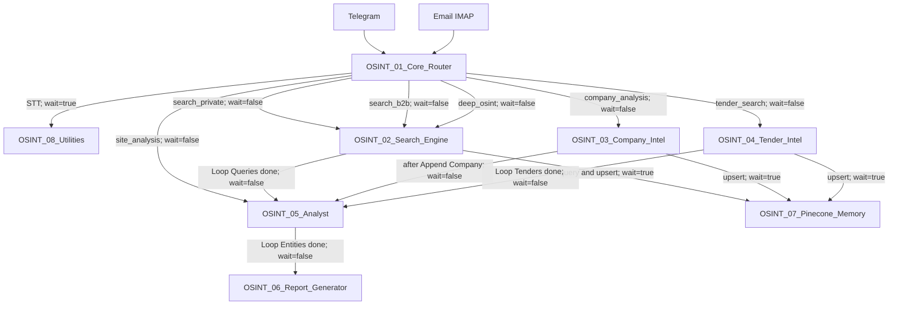

# Project State — OSINT Platform

> **Status:** APPROVED  
> **Version:** 1.0  
> **Decision authority:** Principal Architect  
> **Repository SSOT:** `XandXander/n8n-workflows`  
> **Workflow JSON baseline:** `8420e423c98dcb1d11fa02f554e0674b9705bb81`  
> **WORKFLOW_MAP baseline:** `ad9e9b92c7d76f76154d4b322f829c70ff1597e1`  
> **ARCHITECTURE baseline:** `ef1abcf42293c67dae068efe88e8b41a15cd9059`  
> **ENVIRONMENT baseline:** `577ff1c47b192451cc4039e9c99b3daed710d8bc`  
> **DECISIONS baseline:** `4b1b85c5b4f7639b8488bd19e606adfc376e83f9`  
> **ERROR_HISTORY baseline:** `c3619116ef9e818b814a0a8667f654694929a530`  
> **Compatibility baseline:** n8n 2.32.7  
> **Current filename:** `PROJECT_STATE.md`  
> **Last audited:** 2026-08-04

* * *

## 1. Purpose

This document records the current evidence-based state of the OSINT Platform.
It summarizes:

*   approved documentation state;
    
*   canonical workflow implementation state;
    
*   confirmed architectural decisions;
    
*   deployment-contract state;
    
*   runtime-verification state;
    
*   configured external dependencies;
    
*   current evidence debt;
    
*   current technical debt;
    
*   retained incident state;
    
*   open architectural decisions.
    

This document does not replace:

*   `docs/WORKFLOW_MAP.md`;
    
*   `docs/ARCHITECTURE.md`;
    
*   `docs/ENVIRONMENT.md`;
    
*   `docs/DECISIONS_DRAFT.md`;
    
*   `docs/ERROR_HISTORY_DRAFT.md`;
    
*   canonical workflow JSON;
    
*   runtime execution logs;
    
*   server or container logs;
    
*   implementation specifications;
    
*   ADR records.
    

GitHub is the repository SSOT for project configuration and documentation.
The existence of a workflow, node, connection, credential reference or external-service configuration in GitHub does not independently prove:

*   successful deployment;
    
*   active or published workflow state;
    
*   valid credentials;
    
*   provider availability;
    
*   successful execution;
    
*   successful end-to-end processing;
    
*   successful report delivery;
    
*   successful persistence;
    
*   incident resolution.
    

* * *

## 2. Evidence Model

| Evidence status | Meaning |
| --- | --- |
| `CONFIRMED BY JSON` | Directly supported by canonical workflow JSON |
| `CONFIRMED BY APPROVED DOCUMENT` | Supported by an approved and closed canonical document |
| `CONFIRMED BY LIVE DATA` | Supported by current runtime or server evidence |
| `CONFIRMED BY LOGS` | Supported by sanitized execution, server or container logs |
| `HISTORICAL CLAIM` | Reported historically but not established as current fact |
| `UNKNOWN` | Current accepted evidence does not establish the statement |
| `CONFLICT` | Accepted evidence sources or contracts are incompatible |

### 2.1 Evidence boundaries

Canonical workflow JSON can confirm:

*   workflow existence;
    
*   workflow names and root IDs;
    
*   node configuration;
    
*   workflow connections;
    
*   explicit input mappings;
    
*   retry and timeout fields;
    
*   configured providers;
    
*   configured storage paths;
    
*   configured delivery paths;
    
*   workflow-level settings represented in JSON.
    

Canonical workflow JSON cannot independently confirm:

*   live deployment;
    
*   active or published state;
    
*   successful provider access;
    
*   credential validity;
    
*   successful persistence;
    
*   successful report generation;
    
*   successful delivery;
    
*   end-to-end execution;
    
*   runtime health.
    

Approved documents can confirm:

*   accepted architecture;
    
*   accepted decisions;
    
*   evidence boundaries;
    
*   current contract conflicts;
    
*   current technical debt;
    
*   current evidence debt;
    
*   incident classification;
    
*   approved deployment rules.
    

Approved documents cannot independently confirm current runtime success unless they cite accepted live or log evidence.
A Git commit confirms repository content at that commit.
A Git commit does not independently prove that the same content is deployed or active on the n8n server.

* * *

## 3. Canonical Document State

| Document | Repository path | Status | Implementation state | Block state | Baseline |
| --- | --- | --- | --- | --- | --- |
| Workflow Map | `docs/WORKFLOW_MAP.md` | APPROVED | COMPLETE | CLOSED | `ad9e9b92c7d76f76154d4b322f829c70ff1597e1` |
| Architecture | `docs/ARCHITECTURE.md` | APPROVED | COMPLETE | CLOSED | `ef1abcf42293c67dae068efe88e8b41a15cd9059` |
| Environment | `docs/ENVIRONMENT.md` | APPROVED | COMPLETE | CLOSED | `577ff1c47b192451cc4039e9c99b3daed710d8bc` |
| Decision Register | `docs/DECISIONS_DRAFT.md` | APPROVED | COMPLETE | CLOSED | `4b1b85c5b4f7639b8488bd19e606adfc376e83f9` |
| Error History Register | `docs/ERROR_HISTORY_DRAFT.md` | APPROVED | COMPLETE | CLOSED | `c3619116ef9e818b814a0a8667f654694929a530` |
| Project State | `PROJECT_STATE.md` | APPROVED | COMPLETE | CLOSED | `340bfd9606624c4ea8b85e8de26ccfbd3a5e9a1c` |

The `_DRAFT` suffix in the approved decision and error-history filenames remains intentional until a separate rename scope is approved.
No rename is performed or implied by this document.

* * *

## 4. Platform Scope

### 4.1 In scope

The current OSINT Platform scope contains:

*   eight canonical n8n workflows;
    
*   Telegram and email request ingestion;
    
*   speech-to-text routing;
    
*   intent classification;
    
*   private and B2B lead search;
    
*   company enrichment;
    
*   tender search and analysis;
    
*   entity scoring;
    
*   Google Sheets operational-state exchange;
    
*   Jina embedding generation;
    
*   Pinecone vector operations;
    
*   report generation;
    
*   configured Google Drive storage;
    
*   configured Telegram delivery;
    
*   configured SMTP delivery;
    
*   utility logging and throttling operations;
    
*   GitHub-based workflow configuration SSOT;
    
*   approved Public API v1 update contract.
    

### 4.2 Out of scope

The following are not part of the confirmed current architecture:

*   people or person verification workflow;
    
*   workflow creation through POST;
    
*   Gemini or Google AI Studio integration;
    
*   guaranteed provider availability;
    
*   production SLA;
    
*   inferred active or published state;
    
*   inferred server or container topology;
    
*   unapproved workflow redesign;
    
*   automatic resolution of current technical debt;
    
*   automatic reopening of closed ADRs.
    

* * *

## 5. Canonical Workflow Inventory

| WF | Exact workflow name | Root ID | Architectural role | GitHub state | Live deployment | Active/published state |
| --- | --- | --- | --- | --- | --- | --- |
| WF1 | `OSINT_01_Core_Router` | `WtkTm484CwBpahGt` | Ingestion, normalization, classification and routing | PRESENT | UNKNOWN | UNKNOWN |
| WF2 | `OSINT_02_Search_Engine` | `fgf3zI8fRJhkqlHC` | Lead search, scraping, contact extraction and deduplication | PRESENT | UNKNOWN | UNKNOWN |
| WF3 | `OSINT_03_Company_Intel` | `gxCPpkQkvqc0yWf8` | Company enrichment and analysis | PRESENT | UNKNOWN | UNKNOWN |
| WF4 | `OSINT_04_Tender_Intel` | `zcpU6hLvcMl5RiUa` | Tender search, analysis and persistence | PRESENT | UNKNOWN | UNKNOWN |
| WF5 | `OSINT_05_Analyst` | `viR4AZBaC4CFA4qx` | Entity scoring and qualification | PRESENT | UNKNOWN | UNKNOWN |
| WF6 | `OSINT_06_Report_Generator` | `qXWixFd94G7Tfgaa` | Report generation, configured storage and configured delivery | PRESENT | UNKNOWN | UNKNOWN |
| WF7 | `OSINT_07_Pinecone_Memory` | `O3Ke6qflNx8CL1x7` | Jina embedding and Pinecone operation facade | PRESENT | UNKNOWN | UNKNOWN |
| WF8 | `OSINT_08_Utilities` | `IR4oQQAYQgUwIUjJ` | Speech-to-text, PDF, logging and throttle utilities | PRESENT | UNKNOWN | UNKNOWN |

`PRESENT` means that the canonical workflow JSON exists in GitHub.
It does not mean that the workflow is deployed, active, published or functioning successfully.

* * *

## 6. Confirmed Workflow Graph

The confirmed inter-workflow graph is:



### 6.1 Invocation model

The current orchestration model is:

*   asynchronous dispatch for primary search, company, tender, site-analysis and reporting paths;
    
*   synchronous calls for WF1 speech-to-text use of WF8;
    
*   synchronous calls for Pinecone operations through WF7;
    
*   Google Sheets as the shared operational-state boundary.
    

Runtime completion ordering and end-to-end behavior remain unverified.

* * *

## 7. Current Implementation State

### 7.1 Confirmed by canonical JSON

The following implementation facts are confirmed:

*   eight-workflow architecture;
    
*   exact workflow names and root IDs;
    
*   Telegram and IMAP trigger nodes in WF1;
    
*   DeepSeek model allocation;
    
*   Execute Workflow caller and callee graph;
    
*   Google Sheets sheet references;
    
*   Serper configuration in WF2, WF3 and WF4;
    
*   Tavily configuration in WF4;
    
*   Firecrawl configuration in WF2 and WF3;
    
*   DaData configuration in WF3;
    
*   entity scoring in WF5;
    
*   HTML preparation and Gotenberg request path in WF6;
    
*   Google Drive upload configuration in WF6;
    
*   Telegram and SMTP delivery nodes in WF6;
    
*   Jina and Pinecone operations in WF7;
    
*   Groq Whisper configuration in WF8;
    
*   logs sheet usage in WF8;
    
*   configured retry and timeout fields;
    
*   workflow-level execution settings represented in selected workflows.
    

### 7.2 Implementation does not prove runtime

The following remain separate from implementation state:

*   provider authentication success;
    
*   current provider availability;
    
*   successful input-trigger execution;
    
*   successful data persistence;
    
*   successful vector operations;
    
*   successful PDF conversion;
    
*   successful report upload;
    
*   successful Telegram delivery;
    
*   successful SMTP delivery;
    
*   successful end-to-end execution.
    

* * *

## 8. Capability State

| Capability | Implementation state | Runtime state | Evidence |
| --- | --- | --- | --- |
| Telegram request ingestion | CONFIGURED | UNKNOWN | CONFIRMED BY JSON |
| Email request ingestion | CONFIGURED | UNKNOWN | CONFIRMED BY JSON |
| Speech-to-text routing | CONFIGURED | UNKNOWN | CONFIRMED BY JSON |
| Intent classification | IMPLEMENTED IN JSON | UNKNOWN | CONFIRMED BY JSON |
| Private and B2B lead search | IMPLEMENTED IN JSON | UNKNOWN | CONFIRMED BY JSON |
| Company enrichment | IMPLEMENTED IN JSON | UNKNOWN | CONFIRMED BY JSON |
| Tender search and analysis | IMPLEMENTED IN JSON | UNKNOWN | CONFIRMED BY JSON |
| Entity scoring | IMPLEMENTED IN JSON | UNKNOWN | CONFIRMED BY JSON |
| Google Sheets state exchange | CONFIGURED | UNKNOWN | CONFIRMED BY JSON |
| Pinecone deduplication path | IMPLEMENTED IN JSON | UNKNOWN | CONFIRMED BY JSON |
| Pinecone upsert/query/delete | IMPLEMENTED IN JSON | UNKNOWN | CONFIRMED BY JSON |
| PDF report construction | IMPLEMENTED IN JSON | UNKNOWN | CONFIRMED BY JSON |
| Google Drive upload | CONFIGURED | UNKNOWN | CONFIRMED BY JSON |
| Telegram report delivery | CONFIGURED | UNKNOWN | CONFIRMED BY JSON |
| SMTP report delivery | CONFIGURED | UNKNOWN | CONFIRMED BY JSON |
| Error logging to Sheets | CONFIGURED | UNKNOWN | CONFIRMED BY JSON |
| Telegram error notification | CONFIGURED | UNKNOWN | CONFIRMED BY JSON |
| Throttle utility | IMPLEMENTED IN JSON | UNKNOWN | CONFIRMED BY JSON |

No capability is classified as runtime-verified in the current approved baseline.

* * *

## 9. Data and Storage State

### 9.1 Google Sheets

Confirmed sheet names:

*   `jobs`;
    
*   `leads`;
    
*   `companies`;
    
*   `tenders`;
    
*   `reports`;
    
*   `logs`.
    

Confirmed ownership map:
| Sheet | Confirmed writers | Confirmed readers or updaters |
| --- | --- | --- |
| `jobs` | WF1 | WF6 |
| `leads` | WF2 | WF5, WF6 |
| `companies` | WF3 | WF5, WF6 |
| `tenders` | WF4 | WF5, WF6 |
| `reports` | WF6 | None confirmed |
| `logs` | WF8 | None confirmed |

Google Sheets runtime availability, quota state, current schema and successful writes remain `UNKNOWN`.

### 9.2 Pinecone and Jina

Current confirmed vector contract:

```text
model: jina-embeddings-v3
dimensions: 1024
upsert task: retrieval.passage
query task: retrieval.query
```

Current confirmed namespaces used by callers:

*   `leads`;
    
*   `companies`;
    
*   `tenders`.
    

Pinecone index availability, dimension compatibility and successful operations remain `UNKNOWN`.

### 9.3 Google Drive

WF6 contains a configured Google Drive upload operation and consumes a resulting `webViewLink`.
Successful upload, folder accessibility and report retention remain `UNKNOWN`.

### 9.4 n8n internal persistence

The following remain `UNKNOWN`:

*   database type and version;
    
*   queue backend;
    
*   execution database host;
    
*   filesystem volume paths;
    
*   Binary Data Mode;
    
*   binary-data persistence path;
    
*   backup storage;
    
*   global execution-retention policy;
    
*   global pruning policy.
    

* * *

## 10. Configured External Dependencies

| Dependency | Configured workflows | Configured purpose | Runtime status |
| --- | --- | --- | --- |
| DeepSeek | WF1, WF3, WF4, WF5, WF6 | Classification, enrichment, scoring and report generation | UNKNOWN |
| Serper | WF2, WF3, WF4 | Search | UNKNOWN |
| Tavily | WF4 | Tender search | UNKNOWN |
| Firecrawl | WF2, WF3 | Web scraping | UNKNOWN |
| DaData | WF3 | Company lookup by INN | UNKNOWN |
| Jina | WF7 | Text embeddings | UNKNOWN |
| Pinecone | WF7 | Vector query, upsert and delete | UNKNOWN |
| Groq | WF8 | Whisper speech-to-text | UNKNOWN |
| Gotenberg | WF6, WF8 | HTML-to-PDF conversion | UNKNOWN |
| Google Sheets | WF1, WF2, WF3, WF4, WF5, WF6, WF8 | Operational state | UNKNOWN |
| Google Drive | WF6 | PDF storage | UNKNOWN |
| Telegram | WF1, WF6, WF8 | Input, confirmation, delivery and notifications | UNKNOWN |
| IMAP | WF1 | Email input | UNKNOWN |
| SMTP | WF6 | Email delivery | UNKNOWN |

Configured dependencies must not be described as healthy, available or operational without live or log evidence.

* * *

## 11. Runtime Environment State

### 11.1 Confirmed live data

| Runtime property | Value | Evidence |
| --- | --- | --- |
| n8n version | `2.32.7` | CONFIRMED BY LIVE DATA |
| Compatibility baseline | n8n `2.32.7` | CONFIRMED BY LIVE DATA |

### 11.2 Unknown runtime properties

| Runtime property | Status |
| --- | --- |
| Hosting provider | UNKNOWN |
| Operating system and release | UNKNOWN |
| Kernel version | UNKNOWN |
| CPU architecture | UNKNOWN |
| Virtualization type | UNKNOWN |
| Server timezone | UNKNOWN |
| CPU count and model | UNKNOWN |
| RAM and swap | UNKNOWN |
| Disk size and free space | UNKNOWN |
| Docker Engine version | UNKNOWN |
| Docker Compose version | UNKNOWN |
| Compose project name | UNKNOWN |
| Compose file path | UNKNOWN |
| n8n image tag and digest | UNKNOWN |
| Container inventory | UNKNOWN |
| Container health state | UNKNOWN |
| Docker network topology | UNKNOWN |
| Published ports | UNKNOWN |
| Restart policies | UNKNOWN |
| Gotenberg image and version | UNKNOWN |
| Binary Data Mode | UNKNOWN |
| Maximum concurrent executions | UNKNOWN |
| Maximum payload size | UNKNOWN |
| Backup policy | UNKNOWN |
| Container-update policy | UNKNOWN |
| Active workflow state | UNKNOWN |
| Published workflow state | UNKNOWN |
| Current end-to-end status | UNKNOWN |

No current server, container or execution logs are included in the approved evidence baseline.

* * *

## 12. Workflow-Level Execution Configuration

Canonical JSON explicitly represents the following settings in selected workflows:

```text
executionOrder: v1
saveDataSuccessExecution: all
saveExecutionProgress: true
callerPolicy: workflowsFromSameOwner
```

These values are confirmed only for workflow JSON where the fields are present.
They do not establish:

*   global n8n defaults;
    
*   effective live-server settings;
    
*   settings of workflows where the fields are absent;
    
*   failure-data retention;
    
*   execution pruning;
    
*   runtime persistence behavior.
    

* * *

## 13. Deployment Contract State

### 13.1 Approved update contract

Existing workflow updates use:

```text
PUT https://xandai.ru/api/v1/workflows/{workflow_id}
```

The workflow ID is read from Profile A root `id`.
The update must stop if root `id` is absent.
The authorization header name is:

```text
X-N8N-API-KEY
```

The header value must not be documented or displayed.
The following root fields are removed from the PUT body:

```text
id
versionId
active
createdAt
updatedAt
shared
tags
triggerCount
pinData
meta
```

Existing `nodes[].id` values are preserved.
Missing node IDs are not generated automatically.
Credentials and automatic credential substitution remain unchanged.

### 13.2 Artifact profiles

| Profile | Purpose | Status |
| --- | --- | --- |
| Profile A | GitHub canonical workflow | APPROVED |
| Profile B | POST/create payload | NOT IMPLEMENTED |
| Profile C | Sanitized PUT update payload | APPROVED |
| Profile D | Server response/export | REQUIRES EVIDENCE — NON-BLOCKING |

### 13.3 Deployment implementation and runtime state

| Deployment aspect | Status | Evidence |
| --- | --- | --- |
| Public API v1 update decision | IMPLEMENTED | CONFIRMED BY APPROVED DOCUMENT |
| Sanitized PUT contract | IMPLEMENTED | CONFIRMED BY APPROVED DOCUMENT |
| Workflow JSON profile decision | ACCEPTED | CONFIRMED BY APPROVED DOCUMENT |
| ADR-024 implementation scope | COMPLETE | CONFIRMED BY APPROVED DOCUMENT |
| ADR-024 architectural block | CLOSED | CONFIRMED BY APPROVED DOCUMENT |
| Current live endpoint accessibility | UNKNOWN | No accepted live evidence |
| Current API-key validity | UNKNOWN | No accepted live evidence |
| Successful PUT of current workflow baseline | UNKNOWN | No accepted response evidence |
| Server response/export Profile D | REQUIRES EVIDENCE — NON-BLOCKING | Approved ADR state |
| Current deployment of WF1–WF8 | UNKNOWN | No accepted live evidence |
| Current active/published state | UNKNOWN | No accepted live evidence |

The deployment contract is closed.
The runtime deployment state remains separate and unknown.

* * *

## 14. Architecture Decision State

### 14.1 Decision index

| ADR | Decision | Status |
| --- | --- | --- |
| ADR-001 | Eight-workflow modular architecture | IMPLEMENTED |
| ADR-002 | DeepSeek model allocation | IMPLEMENTED |
| ADR-003 | Google Sheets operational state boundary | IMPLEMENTED |
| ADR-004 | Execute Workflow communication model | IMPLEMENTED |
| ADR-005 | HTTP response preservation with Put Output in Field | PARTIAL |
| ADR-006 | Gotenberg HTML-to-PDF service | PARTIAL |
| ADR-007 | `prepareBinaryData` for Gotenberg HTML input | IMPLEMENTED |
| ADR-008 | Sandbox-safe canonical Code-node patterns | IMPLEMENTED |
| ADR-009 | n8n Public API v1 for workflow updates | IMPLEMENTED |
| ADR-010 | Sanitized PUT update contract | IMPLEMENTED |
| ADR-011 | DeepSeek retry and timeout policy | PARTIAL |
| ADR-012 | Firecrawl bypass for protected targets | UNKNOWN |
| ADR-013 | Serper queries without `site:` operator | IMPLEMENTED |
| ADR-014 | Jina embeddings and Pinecone vector facade | IMPLEMENTED |
| ADR-015 | Filesystem Binary Data Mode | REQUIRES VERIFICATION |
| ADR-016 | Always Output Data for entity reads | IMPLEMENTED |
| ADR-017 | IMAP post-processing policy | UNKNOWN |
| ADR-018 | Open WebUI and DeepSeek development context | UNKNOWN |
| ADR-019 | Manual subworkflow test harness | UNKNOWN |
| ADR-020 | Blanket ban on dynamic Sheet Name expressions | REJECTED |
| ADR-021 | Convert to File for Gotenberg input | SUPERSEDED |
| ADR-022 | Google AI Studio and Gemini integration | UNKNOWN |
| ADR-023 | Groq retry and error policy | PARTIAL |
| ADR-024 | Workflow JSON artifact profiles | ACCEPTED |

### 14.2 Closed architectural block

ADR-024 remains:

```text
Decision status: ACCEPTED
Implementation scope: COMPLETE
Architectural block: CLOSED
```

Profile D evidence debt is non-blocking.
This document does not reopen or alter ADR-024.

### 14.3 Superseded and rejected decisions

| ADR | Status | Current effect |
| --- | --- | --- |
| ADR-020 | REJECTED | Dynamic Sheet Name expressions remain permitted where documented |
| ADR-021 | SUPERSEDED | `prepareBinaryData` replaces Convert to File for current WF6 HTML input |

No superseded or rejected decision is reintroduced as current policy.

* * *

## 15. Incident State

The approved error register contains:

```text
Total indexed records: 16
Incident records: 14
Historical non-incident records: 2
```

### 15.1 Retained incident records

*   ERR-001;
    
*   ERR-002;
    
*   ERR-003;
    
*   ERR-005;
    
*   ERR-006;
    
*   ERR-007;
    
*   ERR-008;
    
*   ERR-009;
    
*   ERR-010;
    
*   ERR-011;
    
*   ERR-012;
    
*   ERR-013;
    
*   ERR-015;
    
*   ERR-016.
    

### 15.2 Historical non-incident records

*   ERR-004;
    
*   ERR-014.
    

### 15.3 Incident evidence state

For the retained incident records:

*   occurrence is classified as `HISTORICAL CLAIM`;
    
*   no Root Cause has confidence `CONFIRMED`;
    
*   runtime remediation status is `NOT VERIFIED`;
    
*   implementation state varies between:
    *   `IMPLEMENTED IN CANONICAL JSON`;
        
    *   `IMPLEMENTED IN APPROVED CONTRACT`;
        
    *   `PARTIAL`;
        
    *   `CONFLICT`;
        
    *   `NOT PRESENT`;
        
    *   `SUPERSEDED`.
        

No incident is classified as runtime-resolved in the approved baseline.
The project state must not convert historical incident claims into current failures or confirmed remediations without new accepted evidence.

* * *

## 16. Technical Debt — Not Incidents and Not ADRs

The current canonical technical-debt register contains:

### TD-001 — WF1 to WF2 missing `intent`

WF1 does not pass `intent` to WF2.
WF2 defaults to `search_private`.

### TD-002 — WF1 to WF3 serialized `entities`

WF1 passes serialized `entities`.
WF3 contains object-style entity access expectations.

### TD-003 — Direct `site_analysis` contract

WF1 sends direct `site_analysis` work to WF5 without an explicit `entity_type`.
WF5 defaults to `lead`.

### TD-004 — WF2 `serperResult` consumer mismatch

`Serper Search` stores its response in `serperResult`.
`Extract URLs` reads root-level `organic`.

### TD-005 — WF6 qualification semantics

`Read Qualified Entities` does not filter by `status=qualified`.
The `qualified` statistic counts structurally non-empty entities.

### TD-006 — Loop context recovery

WF2 and WF4 contain `$items(..., $runIndex)` and `.item` fallback context recovery.

### TD-007 — Inconsistent external-provider retry configuration

Retry, timeout and error handling are not uniform across external-provider nodes.

### TD-008 — Unverified loop input indexes

Runtime behavior of done-connections targeting loop input index 1 remains unknown.

### TD-009 — Unverified Gotenberg Telegram output index

WF6 connects Telegram delivery to Gotenberg output index 1.
Runtime emission of that output remains unknown.
These items are technical debt.
They are not confirmed runtime incidents unless separate occurrence evidence is supplied.

* * *

## 17. Evidence Debt

### ED-001 — Current execution logs

No current sanitized execution logs are included in the approved baseline.

### ED-002 — WF2 end-to-end context verification

Required for ERR-001, ERR-008 and ERR-009.

### ED-003 — DeepSeek provider verification

Required for ERR-002, ERR-003 and ERR-016.

### ED-004 — Firecrawl target-specific responses

Required for ERR-005.

### ED-005 — Code-node runtime environment

Required for ERR-006.

### ED-006 — IMAP runtime payload

Required for ERR-007.

### ED-007 — Gotenberg runtime conversion

Required for ERR-010.
The following remain unverified:

*   container availability;
    
*   image version;
    
*   successful HTML-to-PDF conversion;
    
*   output binary integrity.
    

### ED-008 — Pinecone and Jina live compatibility

Required for ERR-011.
The following remain unverified:

*   Pinecone index availability;
    
*   live index dimension;
    
*   embedding-response dimensions;
    
*   successful upsert;
    
*   successful query.
    

### ED-009 — Public API runtime update

Required for ERR-012 and ERR-013.
The following remain unverified:

*   endpoint availability;
    
*   API-key validity;
    
*   successful sanitized PUT;
    
*   server response contract;
    
*   Profile D.
    

### ED-010 — Active and published workflow state

Active and published state remains unknown for WF1–WF8.

### ED-011 — External-provider availability

Runtime availability remains unknown for configured providers.

### ED-012 — Credential validity

Credential references exist in canonical workflow JSON.
Credential validity and permission scopes remain unknown.

* * *

## 18. Open Architectural Decisions

### OPEN-DEC-001 — Unified Job and Entity Lifecycle

A future ADR is required to define:

*   valid job statuses;
    
*   valid entity statuses;
    
*   terminal outcomes;
    
*   transition rules;
    
*   handling of `partial`;
    
*   handling of `no_results`;
    
*   handling of `failed`.
    

### OPEN-DEC-002 — Unified Provider Failure Policy

A future ADR may define consistent:

*   retry behavior;
    
*   timeout behavior;
    
*   backoff;
    
*   `onError`;
    
*   partial-result handling;
    

for external providers.

### OPEN-DEC-003 — Tavily Role in Tender Search

A future ADR may define whether Tavily is:

*   mandatory;
    
*   fallback;
    
*   supplementary;
    
*   removable without changing WF4 semantics.
    

These remain open decisions.
This document does not resolve them and does not create new ADRs.

* * *

## 19. Planned Work State

No new implementation plan is approved by this document.
The presence of technical debt, evidence debt or open decisions does not automatically authorize:

*   workflow modification;
    
*   workflow activation;
    
*   provider replacement;
    
*   infrastructure changes;
    
*   backup-tool installation;
    
*   container-update tooling;
    
*   retry-policy changes;
    
*   report-semantic changes;
    
*   data-contract changes;
    
*   new API integrations.
    

Any implementation work must proceed through its appropriate scope:

*   runtime evidence collection;
    
*   incident investigation;
    
*   technical specification;
    
*   ADR;
    
*   approved workflow change;
    
*   documentation-only update.
    

* * *

## 20. Current Project State Summary

| State dimension | Current status |
| --- | --- |
| GitHub repository SSOT | CONFIRMED BY APPROVED DOCUMENT |
| Eight canonical workflow JSON files | CONFIRMED BY JSON |
| Workflow architecture | IMPLEMENTED |
| Workflow graph | CONFIRMED BY JSON |
| Closed document set | COMPLETE |
| ADR-024 implementation scope | COMPLETE |
| ADR-024 architectural block | CLOSED |
| Public API update contract | IMPLEMENTED |
| Current workflow deployment | UNKNOWN |
| Current active/published state | UNKNOWN |
| Current end-to-end runtime status | UNKNOWN |
| Current provider availability | UNKNOWN |
| Current credential validity | UNKNOWN |
| Current server/container topology | UNKNOWN |
| Current runtime logs | NOT PRESENT IN APPROVED BASELINE |
| Retained incident runtime verification | NOT VERIFIED |
| Technical debt | 9 canonical records |
| Evidence debt | 12 canonical records |
| Open architectural decisions | 3 |
| Current approved implementation plan | NONE IN THIS DOCUMENT |

* * *

## 21. Evidence Classification

### CONFIRMED BY JSON

*   eight canonical workflows;
    
*   exact workflow names and root IDs;
    
*   workflow nodes and connections;
    
*   inter-workflow calls;
    
*   configured DeepSeek model allocation;
    
*   Google Sheets storage map;
    
*   configured external integrations;
    
*   Jina embedding configuration;
    
*   Pinecone namespaces and operations;
    
*   Gotenberg endpoint configuration;
    
*   `prepareBinaryData` use;
    
*   configured retry and timeout fields;
    
*   configured report storage and delivery paths;
    
*   current technical contract conflicts represented in JSON.
    

### CONFIRMED BY APPROVED DOCUMENT

*   GitHub SSOT;
    
*   five closed canonical documents;
    
*   workflow and architecture baselines;
    
*   ADR statuses;
    
*   Public API v1 update contract;
    
*   sanitized PUT contract;
    
*   Profile A and Profile C approval;
    
*   Profile D non-blocking evidence debt;
    
*   ADR-024 implementation scope COMPLETE;
    
*   ADR-024 architectural block CLOSED;
    
*   incident classification;
    
*   technical-debt register;
    
*   evidence-debt register;
    
*   open-decision register;
    
*   runtime evidence boundaries.
    

### CONFIRMED BY LIVE DATA

*   n8n version `2.32.7`;
    
*   compatibility baseline n8n `2.32.7`.
    

### CONFIRMED BY LOGS

*   none in the current approved project-state baseline.
    

### HISTORICAL CLAIM

*   incident occurrences retained in `docs/ERROR_HISTORY_DRAFT.md`;
    
*   historical provider errors without accepted current logs;
    
*   historical infrastructure descriptions not supported by current live evidence;
    
*   historical deployment or activation claims without current server evidence;
    
*   historical remediation-success claims without runtime verification.
    

### UNKNOWN

*   current workflow deployment;
    
*   active and published workflow states;
    
*   end-to-end execution;
    
*   provider availability;
    
*   credential validity;
    
*   successful Sheets operations;
    
*   successful Pinecone operations;
    
*   successful Jina embeddings;
    
*   successful Gotenberg conversion;
    
*   successful Drive upload;
    
*   successful Telegram delivery;
    
*   successful SMTP delivery;
    
*   current server and container topology;
    
*   Binary Data Mode;
    
*   backup policy;
    
*   update policy;
    
*   global retention and pruning;
    
*   runtime effect of current technical debt.
    

### CONFLICT

*   WF2 `serperResult` output versus root-level `organic` consumer;
    
*   historical protected-target bypass claim versus current WF2;
    
*   historical node-ID removal claim versus ADR-010 and ADR-024;
    
*   historical full HTTP response-preservation claim versus ADR-005 `PARTIAL`;
    
*   historical uniform retry-policy claim versus current workflow configuration;
    
*   historical IMAP post-processing claim versus current JSON;
    
*   historical Pinecone configuration versus current Jina/Pinecone contract.
    

* * *

## 22. Verification Checklist

* [x] GitHub repository is identified as SSOT.
* [x] Workflow JSON baseline is recorded.
* [x] WORKFLOW_MAP baseline is recorded.
* [x] ARCHITECTURE baseline is recorded.
* [x] ENVIRONMENT baseline is recorded.
* [x] DECISIONS baseline is recorded.
* [x] ERROR_HISTORY baseline is recorded.
* [x] Compatibility baseline is n8n 2.32.7.
* [x] Five previously approved documents are recorded as CLOSED.
* [x] Workflow implementation is separated from deployment state.
* [x] Deployment contract is separated from live deployment.
* [x] Configured integrations are separated from runtime health.
* [x] Active and published state is not inferred.
* [x] Runtime success is not inferred from GitHub presence.
* [x] Incidents are separated from technical debt.
* [x] Technical debt is separated from ADRs.
* [x] Evidence debt is recorded separately.
* [x] Open decisions are recorded separately.
* [x] Planned work is not presented as approved implementation.
* [x] Closed ADR-024 is not reopened.
* [x] Historical claims are not presented as current facts.
* [x] No secret values or credential IDs are included.
* [x] Principal Architect approval recorded.
* [x] Status changed from `REVIEW CANDIDATE` to `APPROVED`.
