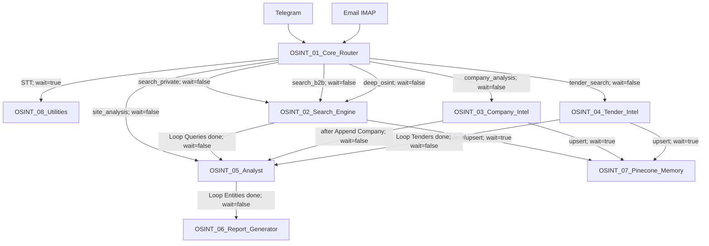

# ARCHITECTURE.md

> **Status:** APPROVED
> **Version:** 1.0
> **Owner:** Open WebUI / AI Engineer
> **Final approver:** ChatGPT / Principal Architect
> **Source of truth:** GitHub repository
> **Evidence baseline:** `docs/WORKFLOW_MAP.md` at commit `ad9e9b92c7d76f76154d4b322f829c70ff1597e1`; workflow JSON at commit `beb2e716f94abfdd674d946962e01fad868127c5`
> **Compatibility baseline:** n8n 2.32.7
> **Last updated:** 2026-08-02

---

## 1. Purpose

This document defines the confirmed architecture of the OSINT Platform.

It describes:

* system boundaries;
* workflow responsibilities;
* inter-workflow communication;
* data and storage architecture;
* external integrations;
* execution semantics;
* deployment contract;
* workflow JSON artifact profiles;
* confirmed contract conflicts;
* unresolved evidence gaps.

Detailed node-level topology and data mappings are maintained in `docs/WORKFLOW_MAP.md`.

This document does not treat GitHub workflow presence as evidence that a workflow is active or published on the n8n server.

---

## 2. Evidence Model

Every architectural statement belongs to one of four evidence classes.

| Status                   | Meaning                                                                              |
| ------------------------ | ------------------------------------------------------------------------------------ |
| `CONFIRMED BY JSON`      | Directly supported by current workflow root fields, nodes, parameters or connections |
| `CONFIRMED BY LIVE DATA` | Supported by separate runtime or server evidence                                     |
| `UNKNOWN`                | Current sources do not establish the fact                                            |
| `CONFLICT`               | Two confirmed project contracts or representations are incompatible                  |

Future improvements and proposed changes are excluded from this document unless accepted through an ADR.

---

## 3. System Scope

### In scope

* eight n8n workflows: `OSINT_01` through `OSINT_08`;
* Telegram and email ingestion;
* intent classification;
* lead, company and tender processing;
* external search and scraping;
* entity scoring;
* Google Sheets state exchange;
* Pinecone vector operations;
* report generation;
* configured delivery integrations;
* workflow deployment and GitHub SSOT contract;
* workflow JSON artifact profiles.

### Out of scope

* active/published state without live evidence;
* production availability guarantees;
* provider SLA and API quota guarantees;
* unimplemented workflow creation through POST;
* people/person verification;
* future workflow redesign;
* functional fixes for known contract conflicts;
* infrastructure facts not supported by the approved evidence baseline.

---

## 4. System Overview

The platform is implemented as eight interconnected n8n workflows.

Primary architectural roles:

1. WF1 accepts and classifies requests.
2. WF2 searches for private and B2B leads.
3. WF3 analyses companies.
4. WF4 searches and analyses tenders.
5. WF5 scores entities stored in Google Sheets.
6. WF6 builds a report and executes configured storage and delivery paths.
7. WF7 provides Jina embedding and Pinecone operations.
8. WF8 provides utility operations.

The orchestration model is hybrid:

* asynchronous dispatch for the primary processing pipeline;
* synchronous calls for STT and Pinecone operations;
* Google Sheets as the shared operational state boundary;
* Pinecone as vector storage accessed through WF7.

The existence of configured output nodes does not prove successful end-to-end delivery.

---

## 5. Workflow Inventory

| WF  | Exact name                  | Root ID            | Architectural role                                        | Entry point                          | Live state |
| --- | --------------------------- | ------------------ | --------------------------------------------------------- | ------------------------------------ | ---------- |
| WF1 | `OSINT_01_Core_Router`      | `WtkTm484CwBpahGt` | Ingestion, normalization, classification and routing      | Telegram Trigger; Email IMAP Trigger | UNKNOWN    |
| WF2 | `OSINT_02_Search_Engine`    | `fgf3zI8fRJhkqlHC` | Lead search, scrape, contact extraction and deduplication | Execute Workflow Trigger             | UNKNOWN    |
| WF3 | `OSINT_03_Company_Intel`    | `gxCPpkQkvqc0yWf8` | Company enrichment and analysis                           | Execute Workflow Trigger             | UNKNOWN    |
| WF4 | `OSINT_04_Tender_Intel`     | `zcpU6hLvcMl5RiUa` | Tender search, analysis and persistence                   | Execute Workflow Trigger             | UNKNOWN    |
| WF5 | `OSINT_05_Analyst`          | `viR4AZBaC4CFA4qx` | Entity scoring and qualification                          | Execute Workflow Trigger             | UNKNOWN    |
| WF6 | `OSINT_06_Report_Generator` | `qXWixFd94G7Tfgaa` | Report generation, storage and configured delivery        | Execute Workflow Trigger             | UNKNOWN    |
| WF7 | `OSINT_07_Pinecone_Memory`  | `O3Ke6qflNx8CL1x7` | Embedding and Pinecone CRUD facade                        | Execute Workflow Trigger             | UNKNOWN    |
| WF8 | `OSINT_08_Utilities`        | `IR4oQQAYQgUwIUjJ` | STT, PDF, logging and throttle utilities                  | Execute Workflow Trigger             | UNKNOWN    |

`PRESENT` in GitHub means only that the canonical JSON file exists.

---

## 6. High-Level Workflow Graph



Intent labels on WF1 edges identify Router branches. They do not mean that the `intent` field is included in the Execute Workflow payload.

---

## 7. Inter-Workflow Invocation Contract

| Caller | Callee | Invocation point                               |  Wait | Confirmed input                                       |
| ------ | ------ | ---------------------------------------------- | ----: | ----------------------------------------------------- |
| WF1    | WF8    | Voice branch                                   |  true | `operation=stt`, `file_id`, `user_id`, `chat_id`      |
| WF1    | WF2    | Router outputs for private, B2B and deep OSINT | false | `job_id`, serialized `entities`, `user_id`, `chat_id` |
| WF1    | WF3    | Company route                                  | false | `job_id`, serialized `entities`, `user_id`, `chat_id` |
| WF1    | WF4    | Tender route                                   | false | `job_id`, serialized `entities`, `user_id`, `chat_id` |
| WF1    | WF5    | Site-analysis route                            | false | `job_id`, serialized `entities`, `user_id`, `chat_id` |
| WF2    | WF7    | Duplicate query and vector upsert              |  true | operation-specific Pinecone contract                  |
| WF2    | WF5    | `Loop Queries` done-output                     | false | `job_id`, `entity_type=lead`                          |
| WF3    | WF7    | Before company persistence                     |  true | `operation=upsert`, namespace `companies`             |
| WF3    | WF5    | After `Append Company`                         | false | `job_id`, `entity_type=company`                       |
| WF4    | WF7    | Relevant tender branch                         |  true | `operation=upsert`, namespace `tenders`               |
| WF4    | WF5    | `Loop Tenders` done-output                     | false | `job_id`, `entity_type=tender`                        |
| WF5    | WF6    | `Loop Entities` done-output                    | false | `job_id`, `entity_type`                               |

### Confirmed done-paths

```text
WF2:
Loop URLs done
→ Loop Queries next iteration

Loop Queries done
→ Run Analyst
→ WF5
```

```text
WF3:
Pinecone Upsert
→ Append Company
→ Trigger Analyst
→ WF5
```

```text
WF4:
Relevant or rejected tender
→ Loop Tenders next iteration

Loop Tenders done
→ Trigger Analyst
→ WF5
```

If WF4 `Filter Skip` rejects the no-URL item, its false-output is not connected and `Loop Tenders` is not entered.

```text
WF5:
Update Row
→ Loop Entities next iteration

Loop Entities done
→ Trigger Report
→ WF6
```

Runtime behavior of done-connections targeting input index 1 remains UNKNOWN.

---

## 8. Workflow Responsibilities

### WF1 — Core Router

Responsibilities:

* ingest Telegram and email events;
* normalize input;
* invoke WF8 synchronously for voice STT;
* classify six intents through DeepSeek;
* create a `jobs` row;
* dispatch the selected processing workflow asynchronously;
* send a configured Telegram confirmation branch.

Confirmed outputs to downstream processing workflows:

* `job_id`;
* serialized `entities`;
* `user_id`;
* `chat_id`.

`intent` is not included in the Execute Workflow payload.

### WF2 — Search Engine

Responsibilities:

* parse input entities;
* build a query matrix;
* search through Serper;
* scrape URLs through Firecrawl;
* extract contacts;
* query and upsert Pinecone through WF7;
* append lead rows;
* dispatch WF5 after the outer query loop completes.

Only WF2 performs Pinecone query-before-upsert among WF2, WF3 and WF4.

### WF3 — Company Intelligence

Responsibilities:

* branch on URL and INN availability;
* scrape website data through Firecrawl;
* query DaData;
* merge sources;
* search news through Serper;
* analyse company data through DeepSeek;
* upsert Pinecone through WF7;
* append a company row;
* dispatch WF5 after persistence.

The current caller sends serialized `entities`, while WF3 accesses `entities` as an object. This is a recorded contract conflict.

### WF4 — Tender Intelligence

Responsibilities:

* search Serper and Tavily in parallel;
* combine and deduplicate result URLs;
* analyse each tender through DeepSeek;
* filter by `relevance_score >= 20`;
* upsert relevant tenders through WF7;
* append tender rows;
* dispatch WF5 from the tender-loop done-output.

WF4 does not contain a Firecrawl node.

### WF5 — Analyst

Responsibilities:

* select `leads`, `companies` or `tenders` from `entity_type`;
* read rows by `job_id`;
* score each entity through DeepSeek;
* calculate weighted `total_score`;
* update the corresponding entity row;
* dispatch WF6 after the entity loop completes.

Scoring formula:

```text
total_score =
0.35 × relevance_score
+ 0.20 × freshness_score
+ 0.25 × solvency_score
+ 0.20 × contactability_score
```

Qualification:

```text
total_score >= 60 → qualified
otherwise         → new
```

When `entity_type` is absent, WF5 defaults to `lead`.

### WF6 — Report Generator

Responsibilities:

* read the job row;
* read the selected entity table by `job_id`;
* remove structurally empty rows;
* sort entities by `total_score`;
* prepare report context;
* generate Markdown through DeepSeek;
* convert Markdown to HTML;
* create HTML binary;
* call Gotenberg;
* execute configured storage and delivery paths;
* append a `reports` row;
* update the `jobs` row.

The node named `Read Qualified Entities` does not filter `status=qualified`.

The `qualified` statistic is calculated from all structurally non-empty entities.

Confirmed structural path:

```text
Start
→ Set Vars
→ Read Job
→ Read Qualified Entities
→ Prepare Context
→ DeepSeek Generate MD
→ MD to HTML
→ Create HTML Binary
→ Gotenberg to PDF
```

Storage and email path:

```text
Gotenberg output 0
→ Upload to Drive
→ Log Report
→ Send Email
→ Update Job Done
```

Telegram node is connected to Gotenberg output index 1. Runtime emission of this output is UNKNOWN.

SMTP delivery uses a fixed configured recipient, not a dynamically resolved job initiator.

### WF7 — Pinecone Memory

Responsibilities:

* route `upsert`, `query` and `delete`;
* generate Jina embeddings;
* call Pinecone;
* return operation-specific results.

Confirmed embedding configuration:

* `jina-embeddings-v3`;
* 1024 dimensions;
* `retrieval.passage` for upsert;
* `retrieval.query` for query.

Current callers use:

* `leads`;
* `companies`;
* `tenders`.

No current caller invokes delete.

### WF8 — Utilities

Implemented operations:

| Operation        | Confirmed caller   |
| ---------------- | ------------------ |
| `stt`            | WF1                |
| `pdf_from_html`  | None among WF1–WF8 |
| `notify_admin`   | None among WF1–WF8 |
| `throttle_check` | None among WF1–WF8 |

WF8 uses:

* Telegram file API;
* Groq Whisper;
* Gotenberg;
* Google Sheets `logs`;
* Telegram admin notification;
* workflow static data.

Only `stt` has a confirmed cross-workflow caller.

---

## 9. State and Storage Architecture

### Google Sheets

Google Sheets is the confirmed shared operational state boundary.

| Sheet       | Writers | Readers/updaters | Purpose                            |
| ----------- | ------- | ---------------- | ---------------------------------- |
| `jobs`      | WF1     | WF6              | Job metadata and report completion |
| `leads`     | WF2     | WF5, WF6         | Lead entities                      |
| `companies` | WF3     | WF5, WF6         | Company entities                   |
| `tenders`   | WF4     | WF5, WF6         | Tender entities                    |
| `reports`   | WF6     | None confirmed   | Report metadata                    |
| `logs`      | WF8     | None confirmed   | Utility logs                       |

`job_id` is the primary cross-workflow correlation field.

Google Sheets availability, quotas and transactional behavior are runtime concerns and are not established by workflow JSON.

### Pinecone

Pinecone is accessed only through WF7.

Confirmed usage:

* WF2: query and upsert in namespace `leads`;
* WF3: upsert in namespace `companies`;
* WF4: upsert in namespace `tenders`.

Pinecone index availability and live dimension compatibility are UNKNOWN.

### Google Drive

WF6 contains a configured Google Drive upload path and consumes the resulting `webViewLink`.

Successful runtime upload is UNKNOWN without execution evidence.

### n8n internal storage

PostgreSQL, Redis and filesystem persistence are outside the workflow JSON evidence boundary.

Their runtime configuration must be documented and verified separately.

---

## 10. External Integration Map

| Integration   | Workflows                         | Confirmed purpose                                                                |
| ------------- | --------------------------------- | -------------------------------------------------------------------------------- |
| DeepSeek      | WF1, WF3, WF4, WF5, WF6           | Classification, company analysis, tender analysis, scoring and report generation |
| Serper        | WF2, WF3, WF4                     | Search                                                                           |
| Tavily        | WF4                               | Tender search                                                                    |
| Firecrawl     | WF2, WF3                          | Web scraping                                                                     |
| DaData        | WF3                               | Company lookup by INN                                                            |
| Jina          | WF7                               | Embeddings                                                                       |
| Pinecone      | WF7                               | Vector query, upsert and delete                                                  |
| Groq          | WF8                               | Whisper STT                                                                      |
| Gotenberg     | WF6, WF8                          | HTML-to-PDF conversion                                                           |
| Google Sheets | WF1, WF2, WF3, WF4, WF5, WF6, WF8 | Operational state                                                                |
| Google Drive  | WF6                               | PDF storage                                                                      |
| Telegram      | WF1, WF6, WF8                     | Input, confirmation and configured delivery/notification                         |
| IMAP          | WF1                               | Email input                                                                      |
| SMTP          | WF6                               | Configured email delivery                                                        |

Provider availability, authentication validity and successful execution are not proven by static JSON.

---

## 11. People Verification Status

A dedicated people/person verification capability is not implemented in the current eight-workflow architecture.

There is no:

* person-specific intent;
* person-verification workflow;
* corresponding Execute Workflow route;
* person storage table;
* confirmed identity-verification provider.

The `search_private` intent searches for private leads. It is not a people-verification function.

Status:

```text
PEOPLE VERIFICATION — NOT IMPLEMENTED
```

---

## 12. Deployment Architecture

GitHub is the single source of truth for workflow definitions.

The deployment mechanism is implemented by `n8n_workflow_manager`.

### Existing workflow update contract

1. Read the canonical workflow JSON from GitHub.
2. Obtain `workflow_id` from the root `id`.
3. Stop if root `id` is absent.
4. Build:

```text
PUT https://xandai.ru/api/v1/workflows/{workflow_id}
```

5. Remove the following root fields from the request body:

```text
id
versionId
active
createdAt
updatedAt
shared
tags
triggerCount
pinData
meta
```

6. Execute the PUT through n8n Public API v1.
7. Only after successful PUT, create and push the Git commit when changes exist.

Related decisions:

* ADR-009;
* ADR-010.

API keys, credential IDs and automatic credential substitution are outside the scope of this document and are not modified by these decisions.

---

## 13. Workflow JSON Artifact Profiles

**Compatibility baseline:** n8n 2.32.7
**Decision:** ADR-024

| Profile   | Purpose                                                 | Status                           |
| --------- | ------------------------------------------------------- | -------------------------------- |
| Profile A | GitHub canonical representation of an existing workflow | APPROVED                         |
| Profile B | POST/create payload                                     | NOT IMPLEMENTED                  |
| Profile C | Sanitized PUT update payload                            | APPROVED                         |
| Profile D | Server response/export                                  | REQUIRES EVIDENCE — NON-BLOCKING |

### Profile A

For an existing workflow:

* root `id` is required;
* root `id` must occur exactly once;
* duplicate JSON keys are forbidden;
* `nodes[].id` uses `PRESERVE IF PRESENT`;
* missing node IDs are allowed;
* existing node IDs remain unchanged;
* short and non-UUID node IDs are allowed;
* credentials remain unchanged;
* sanitation is required before update.

### Profile B

The project has no confirmed POST/create implementation.

Profile C must not be reused as a create payload without a separate ADR and verified implementation.

### Profile C

Profile C is generated from Profile A.

* workflow ID is passed in the URL;
* root ID is removed from the body;
* the approved root blacklist is removed;
* `nodes[].id` is preserved when present;
* credentials and automatic credential substitution are not changed;
* unknown fields are not added to the blacklist without evidence.

### Profile D

The exact server response/export contract is not confirmed.

Profile D must be verified read-only on n8n 2.32.7.

It does not block the existing update pipeline.

---

## 14. Confirmed Contract Conflicts

The current conflicts describe incompatible current contracts. They do not establish root causes or authorize workflow changes. `CONFLICT-ARCH-004` is retained below only as a repository-history resolution note and is not counted as a current contract conflict.

### CONFLICT-ARCH-001 — WF1 → WF2 intent

WF1 routes three intent branches to WF2 but does not pass the `intent` field.

WF2 defaults missing intent to `search_private`.

### CONFLICT-ARCH-002 — WF1 → WF3 entities type

WF1 passes `entities` as a serialized JSON string.

WF3 accesses `$json.entities?.target_url`, `$json.entities?.target_inn` and `$json.entities?.target_name` as object properties.

### CONFLICT-ARCH-003 — Direct site analysis contract

WF1 direct `site_analysis` dispatch does not pass `entity_type`.

WF5 defaults missing `entity_type` to `lead` and reads the `leads` table.

The passed `entities` field is not consumed by WF5.

### CONFLICT-ARCH-004 — WF2 Serper response path — repository-static resolved

The pre-`beb2e71` repository baseline contained a Serper producer/consumer mismatch.

Commit `beb2e71` removes that mismatch from canonical WF2:

```text
Extract URLs consumes serperResult.organic.
```

```text
TD-004 — STATICALLY RESOLVED / RUNTIME TO VERIFY
MIS-001 — CLOSED FOR REPOSITORY-LEVEL STATIC IMPLEMENTATION / RUNTIME NOT VERIFIED
Repository evidence: CONFIRMED BY GITHUB @ beb2e71
```

Runtime behavior remains unverified.

### CONFLICT-ARCH-005 — WF6 qualification semantics

`Read Qualified Entities` filters only by `job_id`.

`Prepare Context` counts all structurally non-empty entities as `qualified`.

These conflicts must be handled through separate ERR records, evidence and approved implementation specifications.

---

## 15. Unknowns and Evidence Gaps

The following remain UNKNOWN:

1. Active/published state of all eight workflows.
2. End-to-end execution success.
3. Runtime behavior of loop done-connections targeting input index 1.
4. Runtime availability of Gotenberg output index 1 used by Telegram delivery.
5. Actual Telegram delivery of generated PDF.
6. Successful Google Drive upload.
7. Successful SMTP delivery.
8. Delivery to the original request initiator.
9. Item-linking behavior for `.item` and `$items(..., $runIndex)` references.
10. Live provider and credential validity.
11. Infrastructure runtime configuration not represented by workflow JSON.
12. Profile D server response/export contract.
13. Behavior of WF8 operations without confirmed callers.
14. Behavior of WF5 and WF6 when no matching entity rows exist.

Unknowns must not be converted into confirmed facts without new evidence.

---

## 16. Current Architecture Status

### CONFIRMED BY JSON

* eight workflow definitions and root IDs;
* caller/callee graph;
* Execute Workflow input mappings;
* wait flags;
* loop done-paths;
* table names and explicit column mappings;
* configured external integrations;
* absence of a people-verification branch;
* WF2 Serper static producer/consumer contract: `Serper Search` stores its response in `serperResult`, and `Extract URLs` consumes `serperResult.organic`;
* four current contract conflicts.

### CONFIRMED BY LIVE DATA

* current environment version: n8n 2.32.7;
* root workflow IDs for previously checked workflows match server identifiers.

This does not prove active/published state.

### UNKNOWN

* runtime availability;
* active/published state;
* end-to-end correctness;
* delivery success;
* server response/export profile;
* infrastructure details outside the workflow evidence boundary.

### CONFLICT

* WF1 → WF2 missing intent;
* WF1 → WF3 serialized entities versus object access;
* direct site-analysis contract;
* WF2 `serperResult` path mismatch;
* WF6 qualified-count semantics.

---

## 17. Related Canonical Documents

| Document                           | Role                                                    |
| ---------------------------------- | ------------------------------------------------------- |
| `docs/WORKFLOW_MAP.md`             | Detailed workflow topology and contracts                |
| `docs/DECISIONS_DRAFT.md`          | ADR register, including ADR-009, ADR-010 and ADR-024    |
| `docs/standards/n8n_schema.md`     | Workflow JSON artifact and validation standard          |
| `docs/standards/node_templates.md` | Canonical and update-payload templates                  |
| `AI_PROTOCOL.md`                   | AI Engineer change and deployment process               |
| `docs/ENVIRONMENT.md`              | Runtime environment documentation; finalized separately |

This document must be synchronized with `WORKFLOW_MAP.md` whenever workflow nodes, connections or cross-workflow contracts change.

---

## 18. Verification Checklist

* [x] Eight workflow names and root IDs synchronized with `WORKFLOW_MAP.md`.
* [x] Caller/callee graph synchronized.
* [x] `waitForSubWorkflow` values synchronized.
* [x] WF2, WF4 and WF5 loop done-paths synchronized.
* [x] WF3 post-persistence Analyst call synchronized.
* [x] Google Sheets storage map synchronized.
* [x] People-verification status recorded.
* [x] Active/published state classified as UNKNOWN.
* [x] Deployment contract synchronized with ADR-009 and ADR-010.
* [x] Artifact profiles synchronized with ADR-024.
* [x] Confirmed conflicts separated from UNKNOWN.
* [x] Future improvement candidates excluded.
* [ ] Live end-to-end execution evidence.
* [ ] Active/published state evidence.
* [ ] Profile D read-only server evidence.
