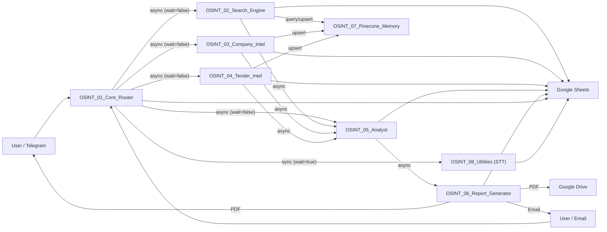
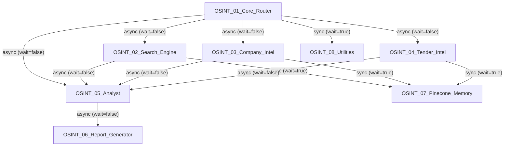
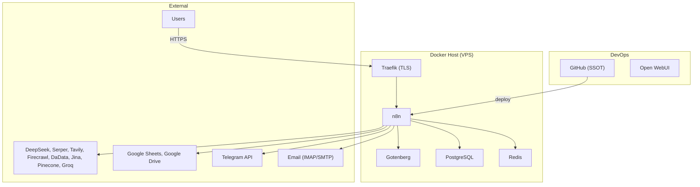

> Status: DRAFT  
> Version: 0.1  
> Owner: Open WebUI / AI Engineer  
> Final approver: ChatGPT / Principal Architect  
> Source of truth: GitHub repository  
> Last updated: 2026-07-31  
> Evidence baseline: JSON exports dated 2026-07-31 (server: xandai.ru); no prior documentation files (WORKFLOW_MAP.md, ENVIRONMENT.md, SERVER_STRUCTURE.md, DECISIONS.md, ERROR_HISTORY.md) found in repository or knowledge base.

---

## 1. Purpose

This document describes the actual, deployed architecture of the OSINT platform implemented as a set of 8 interconnected n8n workflows. It serves as the single source of architectural truth for new architects, AI agents, and auditors who need to understand the system without access to chat history.

---

## 2. System Overview

The OSINT platform automates the full cycle of open-source intelligence gathering for business development:

- **Input**: user requests via Telegram (text/voice) or Email.
- **Processing**: intent classification, search query generation, multi-engine search, web scraping, contact extraction, LLM-based entity scoring, deduplication, and vector memory.
- **Output**: a structured PDF report with scored leads/companies/tenders, delivered via Telegram and Email.

**Current state**: the platform is deployed and active on xandai.ru. All 8 workflows are present. End-to-end execution has NOT been verified by this audit. Several architectural risks are identified (see §23).

---

## 3. Architecture Scope

**In scope:**
- 8 n8n workflows (OSINT_01 through OSINT_08)
- Request routing and normalization
- Intent classification (DeepSeek)
- Search execution (Serper, Tavily)
- Web scraping (Firecrawl)
- Company data enrichment (DaData)
- LLM-based analysis and scoring (DeepSeek)
- Deduplication and vector memory (Pinecone + Jina embeddings)
- Lead/company/tender persistence (Google Sheets)
- PDF report generation (Gotenberg)
- Report delivery (Telegram, Email, Google Drive)
- Speech-to-text (Groq Whisper)
- Infrastructure: Docker, Traefik, n8n

**Out of scope:**
- CI/CD pipelines
- Monitoring/alerting infrastructure
- Development workflows
- User-facing UI (beyond Telegram bot)

---

## 4. High-Level Architecture

The platform follows a **fire-and-forget pipeline** pattern: the Core Router dispatches jobs asynchronously to downstream workflows. Each workflow reads and writes shared state through Google Sheets (primary) and Pinecone (deduplication memory). There is no synchronous request-response chain across workflows beyond the STT utility call.



### Flows explained

1. **User → Router**: Telegram messages (text/voice) and emails arrive. Router normalises them into a uniform JSON structure.

2. **Router → Search/Company/Tender/Analyst**: Based on classified intent, Router fires the appropriate workflow asynchronously (`waitForSubWorkflow: false`). For `site_analysis` intent, Analyst is called directly.

3. **Search/Company/Tender → Sheets**: Each workflow writes discovered entities (leads, companies, tenders) to the corresponding Google Sheets tab.

4. **Search/Company/Tender → Pinecone**: Before writing, each workflow queries Pinecone for duplicates. New entities are upserted.

5. **Search/Company/Tender → Analyst**: Each workflow triggers Analyst in parallel with its own processing (Analyst is called at the START of the loop, not after completion — see §7.5).

6. **Analyst → Sheets**: Reads entities from Sheets by `job_id`, scores them via DeepSeek, and writes back scores.

7. **Analyst → Report**: On the "done" branch of its entity loop, Analyst triggers Report Generator.

8. **Report → User**: Report Generator reads scored entities from Sheets, generates a Markdown report via DeepSeek, converts to PDF via Gotenberg, uploads to Google Drive, sends via Telegram and Email.

---

## 5. Architectural Principles

| Principle | Evidence | Related ADR |
|-----------|----------|-------------|
| **Async fire-and-forget workflow dispatch** | All `Execute Workflow` nodes in Router use `waitForSubWorkflow: false` (except STT) | NONE |
| **Google Sheets as shared state bus** | All workflows read/write the same Google Sheets document (`1BddnyOBG...`) | NONE |
| **`job_id` as correlation key** | Every workflow passes and filters by `job_id` | NONE |
| **Pinecone as deduplication memory** | OSINT_02 queries before insert; OSINT_03/04 upsert without pre-query | NONE |
| **LLM-as-judge for scoring** | OSINT_05 uses DeepSeek to score every entity on 4 axes | NONE |
| **Report as separate workflow** | OSINT_06 is an independent workflow triggered by OSINT_05 | NONE |
| **Utility workflow for cross-cutting concerns** | OSINT_08 handles STT, PDF, logging, throttling | NONE |
| **GitHub as SSOT for workflow definitions** | deploy_workflow tool pushes JSON to Git | NONE |

---

## 6. Component Inventory

| Component | Type | Purpose | Inputs | Outputs | Dependencies | Status |
|-----------|------|---------|--------|---------|-------------|--------|
| n8n | Platform | Workflow execution engine | — | — | Docker, PostgreSQL, Redis | PRESENT |
| OSINT_01_Core_Router | Workflow | Request ingestion, normalisation, intent classification, routing | Telegram messages, Emails | Dispatched sub-workflows, job row in Sheets | DeepSeek, OSINT_08, Google Sheets, Telegram API | PRESENT |
| OSINT_02_Search_Engine | Workflow | Search + scrape for private/B2B leads | job_id, entities | leads in Sheets, Pinecone vectors | Serper, Firecrawl, OSINT_07, OSINT_05, Google Sheets | PRESENT |
| OSINT_03_Company_Intel | Workflow | Company analysis via URL/INN | job_id, entities | company rows in Sheets, Pinecone vectors | Firecrawl, DaData, Serper, DeepSeek, OSINT_07, OSINT_05, Google Sheets | PRESENT |
| OSINT_04_Tender_Intel | Workflow | Tender search and analysis | job_id, entities | tender rows in Sheets, Pinecone vectors | Serper, Tavily, DeepSeek, OSINT_07, OSINT_05, Google Sheets | PRESENT |
| OSINT_05_Analyst | Workflow | LLM scoring of entities | job_id, entity_type | updated rows in Sheets, triggered Report | DeepSeek, Google Sheets, OSINT_06 | PRESENT |
| OSINT_06_Report_Generator | Workflow | Markdown→HTML→PDF report, delivery | job_id, entity_type | PDF in Drive, Telegram/Email sends, Sheets update | DeepSeek, Gotenberg, Google Drive, Google Sheets, Telegram, SMTP | PRESENT |
| OSINT_07_Pinecone_Memory | Workflow | Vector embedding + Pinecone CRUD | operation, namespace, text | upsert/query/delete results | Jina, Pinecone | PRESENT |
| OSINT_08_Utilities | Workflow | STT, PDF, admin notify, throttle | operation + params | STT text, PDF binary, log entries | Groq, Gotenberg, Telegram, Google Sheets | PRESENT |
| Google Sheets | External Storage | Shared state: jobs, leads, companies, tenders, reports, logs | — | — | — | PRESENT |
| Google Drive | External Storage | PDF report archive | PDF binary | webViewLink | — | PRESENT |
| Pinecone | External Vector DB | Deduplication memory (3 namespaces) | embedding vectors | match results | Jina | PRESENT |
| Jina | External API | Text embeddings (v3, 1024d) | text | embedding vectors | — | PRESENT |
| Serper | External API | Google search | query string | organic results | — | PRESENT |
| Tavily | External API | Deep search for tenders | query string | results | — | PRESENT |
| Firecrawl | External API | Web scraping | URL | markdown, HTML | — | PRESENT |
| DaData | External API | Russian company lookup by INN | INN | company data | — | PRESENT |
| DeepSeek | External LLM | Intent classification, analysis, scoring, report generation | prompts | JSON responses | — | PRESENT |
| Groq | External LLM | Whisper speech-to-text | audio file | text | — | PRESENT |
| Gotenberg | Docker Service | HTML→PDF conversion | HTML | PDF binary | — | PRESENT |
| Telegram | External Channel | Bot API (input + output) | messages | PDF, confirmations | — | PRESENT |
| Traefik | Reverse Proxy | TLS termination, routing | — | — | — | UNKNOWN |
| PostgreSQL/pgvector | Database | n8n internal state | — | — | — | UNKNOWN |
| Redis | Cache | n8n queue/broker | — | — | — | UNKNOWN |

---

## 7. Workflow Architecture

### 7.1. OSINT_01_Core_Router

**Architectural role:** Entry point. Ingests, normalises, classifies, dispatches.  
**Status:** PRESENT (`"active": false` in JSON; server reports Active — CONFLICT, see §24)  
**Trigger type:** Telegram Trigger + Email IMAP Trigger  
**Called by:** External users (Telegram, Email)  
**Calls:** OSINT_02 (×3 intents), OSINT_03, OSINT_04, OSINT_05 (site_analysis), OSINT_08 (STT)  
**Primary responsibility:** Convert heterogeneous inputs into a uniform `{job_id, intent, entities, ...}` and dispatch to the correct downstream workflow.  
**Persistent reads:** None  
**Persistent writes:** Google Sheets → `jobs` tab (append on job creation)  
**External services:** DeepSeek (intent classifier), Google Sheets, Telegram, IMAP  
**Related ADR:** NONE  
**Related ERR:** NONE

#### Input Contract

| Field | Type | Required | Producer | Notes |
|-------|------|----------|----------|-------|
| Telegram message/voice/callback | object | — | Telegram | Handled by Telegram Trigger |
| Email (IMAP UNSEEN) | object | — | Email server | Filtered by subject containing "OSINT-AI" |

#### Output Contract (to downstream workflows via `Execute Workflow`)

| Field | Type | Required | Consumer | Notes |
|-------|------|----------|----------|-------|
| job_id | string | yes | OSINT_02,03,04,05 | Generated as `job_<timestamp36>_<random>` |
| entities | string (JSON) | yes | OSINT_02,03,04,05 | Serialised entities object from DeepSeek classifier |
| user_id | string | yes | OSINT_02,03,04,05 | Telegram user ID or email address |
| chat_id | string | yes | OSINT_02,03,04,05 | Telegram chat ID or null |

#### Critical Control Flow

- **Switch: Route by Intent** — 6-output switch routing to OSINT_02 (search_private, search_b2b, deep_osint), OSINT_03 (company_analysis), OSINT_04 (tender_search), OSINT_05 (site_analysis).
- **If: Has Voice?** — Branches to STT path (sync, wait=true) or direct text path.
- **Merge After Voice** — Rejoins voice and text paths.

#### Failure Propagation

- Downstream Execute Workflow nodes use `onError: continueRegularOutput` — failures in child workflows are silently ignored by Router.
- Router does not update job status on dispatch failure.
- If DeepSeek intent classification fails (retryOnFail: 3×), Parse Intent node may throw, halting the execution.

---

### 7.2. OSINT_02_Search_Engine

**Architectural role:** Search + scrape engine for private/B2B leads.  
**Status:** PRESENT  
**Trigger type:** ExecuteWorkflowTrigger (called by OSINT_01)  
**Called by:** OSINT_01_Core_Router (intents: search_private, search_b2b, deep_osint)  
**Calls:** OSINT_05 (Analyst, at start), OSINT_07 (Pinecone: query + upsert)  
**Primary responsibility:** Generate query matrix → search via Serper → scrape via Firecrawl → extract contacts → deduplicate → persist.  
**Persistent reads:** None  
**Persistent writes:** Google Sheets → `leads` tab (append); Pinecone → namespace `leads` (query + upsert)  
**External services:** Serper, Firecrawl, Google Sheets  
**Related ADR:** NONE  
**Related ERR:** NONE

#### Critical Control Flow

- **SplitInBatches: Loop Queries** — Iterates queries; done branch triggers Analyst.
- **SplitInBatches: Loop URLs** — Iterates URLs; done branch returns to Loop Queries.
- **If: Has Contacts?** — Routes to duplicate check OR skip path.
- **If: Is Not Duplicate?** — Routes to upsert OR skip path.
- **Execute Workflow: Run Analyst** — Called on Loop Queries DONE branch, **not after all leads are found**. This means Analyst starts running BEFORE search is complete.

#### Key Output Fields

| Field | Type | Notes |
|-------|------|-------|
| lead_id | string | `lead_<timestamp>_<random>` |
| job_id | string | |
| source_url | string | Scraped URL |
| source_platform | string | Always "general" |
| contact_phone/tg/email | string | Semicolon-separated; regex-extracted |
| dedup_hash | string | Hash of contacts+title |
| total_score | number | Initialised to 0 |
| status | string | "new", "skipped_duplicate", "skipped_no_contacts" |

---

### 7.3. OSINT_03_Company_Intel

**Architectural role:** Company analysis via URL and/or INN.  
**Status:** PRESENT  
**Trigger type:** ExecuteWorkflowTrigger  
**Called by:** OSINT_01 (intent: company_analysis)  
**Calls:** OSINT_05 (Analyst, at end), OSINT_07 (Pinecone Upsert)  
**Primary responsibility:** Scrape company website (Firecrawl) + lookup by INN (DaData) → enrich with Serper news → LLM analysis → persist.  
**Persistent writes:** Google Sheets → `companies` tab; Pinecone → namespace `companies`  
**External services:** Firecrawl, DaData, Serper, DeepSeek, Google Sheets

#### Critical Control Flow

- **Parallel branches: Has URL? + Has INN?** — Both execute simultaneously. Fallback nodes for missing data.
- **Merge Sources** — Combines URL-derived and INN-derived data by position.
- **DeepSeek Analyze Company** — Uses `deepseek-v4-pro`, `response_format: json_object`.
- **Trigger Analyst** — Called AFTER company row is written (safer than OSINT_02 pattern).

---

### 7.4. OSINT_04_Tender_Intel

**Architectural role:** Tender search and analysis.  
**Status:** PRESENT  
**Trigger type:** ExecuteWorkflowTrigger  
**Called by:** OSINT_01 (intent: tender_search)  
**Calls:** OSINT_05 (Analyst, at loop start), OSINT_07 (Pinecone Upsert)  
**Primary responsibility:** Search tenders via Serper+Tavily → analyse each via DeepSeek → filter by relevance → persist.  
**Persistent writes:** Google Sheets → `tenders` tab; Pinecone → namespace `tenders`  
**External services:** Serper, Tavily, DeepSeek, Google Sheets

#### Critical Control Flow

- **Parallel: Serper Zakupki + Tavily Tenders** — Both search APIs called simultaneously.
- **Merge Sources** — Combines both result sets.
- **SplitInBatches: Loop Tenders** — Each tender analysed individually by DeepSeek; done branch returns to loop.
- **If: Filter Relevance** — Only tenders with `relevance_score >= 20` proceed.
- **Execute Workflow: Trigger Analyst** — Called on Loop Tenders DONE branch (same timing issue as OSINT_02).

---

### 7.5. OSINT_05_Analyst

**Architectural role:** LLM-based entity scoring.  
**Status:** PRESENT  
**Trigger type:** ExecuteWorkflowTrigger  
**Called by:** OSINT_01 (site_analysis), OSINT_02, OSINT_03, OSINT_04  
**Calls:** OSINT_06 (Report Generator)  
**Primary responsibility:** Read entities from Google Sheets by `job_id`, score each via DeepSeek on 4 axes, write back scores, trigger report.  
**Persistent reads:** Google Sheets (`leads`/`companies`/`tenders` tab, filtered by `job_id`)  
**Persistent writes:** Google Sheets (update rows with scores)  
**External services:** DeepSeek, Google Sheets

#### Scoring Algorithm

```
total_score = 0.35 × relevance + 0.20 × freshness + 0.25 × solvency + 0.20 × contactability
status = total_score >= 60 ? "qualified" : "new"
```

#### Critical Control Flow

- **SplitInBatches: Loop Entities** — Iterates entities; done branch triggers OSINT_06.
- **Wait: Rate Limit Wait** — 0.5s delay after each DeepSeek call.
- **Google Sheets: Update Row** — Uses entity ID (lead_id/company_id/tender_id) as matching column.

#### Known Timing Issue

OSINT_02/04 call Analyst at the START of their loops. Analyst reads from Sheets — which may be empty at that moment. On the done branch, Analyst triggers Report Generator. If zero entities are read, a zero-entity report is generated BEFORE the actual entities are written.

---

### 7.6. OSINT_06_Report_Generator

**Architectural role:** Report generation and delivery.  
**Status:** PRESENT  
**Trigger type:** ExecuteWorkflowTrigger  
**Called by:** OSINT_05_Analyst  
**Calls:** DeepSeek, Gotenberg, Google Drive, Telegram, SMTP  
**Primary responsibility:** Read job + entities → generate Markdown → convert to PDF → deliver.  
**Persistent reads:** Google Sheets (`jobs` tab, `leads`/`companies`/`tenders` tab)  
**Persistent writes:** Google Sheets (`reports` tab append, `jobs` tab update)  
**External services:** DeepSeek, Gotenberg, Google Drive, Google Sheets, Telegram, SMTP (Yandex)

#### Pipeline

```
Read Job + Entities → Prepare Context → DeepSeek Generate MD → MD to HTML → Create HTML Binary → Gotenberg to PDF
                                                                                                      ↓
                                                                                    Upload to Drive ──→ Log Report → Send Email → Update Job Done
                                                                                    Telegram Send PDF
```

- Prepare Context filters empty entities, sorts by total_score desc, takes top 20.
- Gotenberg to PDF forks: Upload to Drive AND Telegram Send PDF run in parallel.
- No deduplication check — multiple calls for same `job_id` produce multiple reports.

---

### 7.7. OSINT_07_Pinecone_Memory

**Architectural role:** Vector embedding + Pinecone CRUD facade.  
**Status:** PRESENT  
**Trigger type:** ExecuteWorkflowTrigger  
**Called by:** OSINT_02 (query + upsert), OSINT_03 (upsert), OSINT_04 (upsert)  
**Calls:** Jina (embeddings), Pinecone (upsert/query/delete)  
**Primary responsibility:** Abstract Pinecone operations behind a single workflow interface.

#### Configuration

- Pinecone host: `groq-osint-viwj8s6.svc.aped-4627-b74a.pinecone.io` (hardcoded)
- Jina model: `jina-embeddings-v3`, dimensions: 1024
- Tasks: `retrieval.passage` (upsert), `retrieval.query` (query)
- API version: `2024-07`
- Namespaces: `leads`, `companies`, `tenders`
- Text truncated to 8000 chars before embedding

---

### 7.8. OSINT_08_Utilities

**Architectural role:** Cross-cutting utilities.  
**Status:** PRESENT  
**Trigger type:** ExecuteWorkflowTrigger  
**Called by:** OSINT_01 (STT, confirmed); other callers UNKNOWN  
**Calls:** Groq Whisper, Gotenberg, Telegram, Google Sheets

#### Operations

| Operation | Called by | Status |
|-----------|-----------|--------|
| `stt` | OSINT_01 | VERIFIED (in JSON) |
| `pdf_from_html` | UNKNOWN | PRESENT (no caller found) |
| `notify_admin` | UNKNOWN | PRESENT (no caller found) |
| `throttle_check` | UNKNOWN | PRESENT (no caller found) |

The throttle checker uses in-memory `getWorkflowStaticData('global')` with per-service limits (deepseek=3/s, groq=5/s, serper=10/s, tavily=5/s, firecrawl=3/s, jina=20/s). Data is lost on n8n restart.

---

## 8. Cross-Workflow Dependency Graph



| Caller | Callee | Invocation mechanism | Waits | Input contract | Output contract | Status |
|--------|--------|---------------------|-------|----------------|-----------------|--------|
| OSINT_01 | OSINT_02 | Execute Workflow | No | job_id, entities, user_id, chat_id | (none consumed) | PRESENT |
| OSINT_01 | OSINT_03 | Execute Workflow | No | job_id, entities, user_id, chat_id | (none consumed) | PRESENT |
| OSINT_01 | OSINT_04 | Execute Workflow | No | job_id, entities, user_id, chat_id | (none consumed) | PRESENT |
| OSINT_01 | OSINT_05 | Execute Workflow | No | job_id, entities, user_id, chat_id | (none consumed) | PRESENT |
| OSINT_01 | OSINT_08 | Execute Workflow | Yes | operation=stt, file_id | text | PRESENT |
| OSINT_02 | OSINT_05 | Execute Workflow | No | job_id, entity_type="lead" | (none consumed) | PRESENT |
| OSINT_02 | OSINT_07 | Execute Workflow | Yes | operation=query/upsert, namespace="leads" | matches or vector_id | PRESENT |
| OSINT_03 | OSINT_05 | Execute Workflow | No | job_id, entity_type="company" | (none consumed) | PRESENT |
| OSINT_03 | OSINT_07 | Execute Workflow | Yes | operation=upsert, namespace="companies" | vector_id | PRESENT |
| OSINT_04 | OSINT_05 | Execute Workflow | No | job_id, entity_type="tender" | (none consumed) | PRESENT |
| OSINT_04 | OSINT_07 | Execute Workflow | Yes | operation=upsert, namespace="tenders" | vector_id | PRESENT |
| OSINT_05 | OSINT_06 | Execute Workflow | No | job_id, entity_type | (none consumed) | PRESENT |

---

## 9. End-to-End Data Flow (search_private/search_b2b path)

| # | Stage | Workflow | Key Nodes | State saved | Data loss risk | Status |
|---|-------|----------|-----------|-------------|----------------|--------|
| 1 | Receive request | OSINT_01 | Telegram Trigger / Email IMAP | — | Low | PRESENT |
| 2 | Normalise | OSINT_01 | Normalize Input | — | Medium (voice w/o caption) | PRESENT |
| 3 | STT (if voice) | OSINT_01→08 | Execute STT → Groq Whisper | — | Medium (sync, blocking) | PRESENT |
| 4 | Intent classify | OSINT_01 | DeepSeek Classifier → Parse Intent | — | Medium (parse failure) | PRESENT |
| 5 | Create job | OSINT_01 | Create Job Row | `jobs` sheet | Low | PRESENT |
| 6 | Dispatch | OSINT_01 | Execute Search Private/B2B | — | **HIGH** (async, no ack) | PRESENT |
| 7 | Build queries | OSINT_02 | Build Query Matrix | In-memory | Low | PRESENT |
| 8 | Search | OSINT_02 | Serper Search | — | Medium | PRESENT |
| 9 | Extract URLs | OSINT_02 | Extract URLs | In-memory | Low | PRESENT |
| 10 | Scrape | OSINT_02 | Firecrawl Scrape | — | Medium | PRESENT |
| 11 | Extract contacts | OSINT_02 | Extract Contacts | — | Medium (regex) | PRESENT |
| 12 | Dedup check | OSINT_02→07 | Check Duplicate | Pinecone | Low | PRESENT |
| 13 | Persist lead | OSINT_02 | Append Lead | `leads` sheet | Medium | PRESENT |
| 14 | Upsert memory | OSINT_02→07 | Upsert to Pinecone | Pinecone | Low | PRESENT |
| 15 | Score entities | OSINT_05 | DeepSeek All Scores → Update Row | `leads` sheet (update) | **HIGH** (timing race) | PRESENT |
| 16 | Generate report | OSINT_06 | DeepSeek MD → Gotenberg PDF | — | Medium | PRESENT |
| 17 | Upload PDF | OSINT_06 | Upload to Drive | Google Drive | Low | PRESENT |
| 18 | Send to user | OSINT_06 | Telegram + Email | — | Medium | PRESENT |
| 19 | Mark done | OSINT_06 | Update Job Done | `jobs` sheet | Low | PRESENT |

---

## 10. Shared Data Model

### Entity: Job
**Stored in:** Google Sheets → `jobs` tab

| Field | Type | Producer |
|-------|------|----------|
| job_id | string | OSINT_01 (generated) |
| created_at | ISO string | OSINT_01 |
| source | "telegram"\|"email" | OSINT_01 |
| user_id | string | OSINT_01 |
| chat_id | string | OSINT_01 |
| raw_text | string | OSINT_01 |
| intent | string | OSINT_01 (DeepSeek) |
| entities | JSON string | OSINT_01 (DeepSeek) |
| confidence | number (0-1) | OSINT_01 |
| status | "processing"→"done" | OSINT_01 → OSINT_06 |
| finished_at | ISO string | OSINT_06 |
| report_url | string | OSINT_06 |

### Entity: Lead
**Stored in:** Google Sheets → `leads` tab

| Field | Type | Producer |
|-------|------|----------|
| lead_id | string | OSINT_02 |
| job_id | string | OSINT_02 |
| source_url | string | OSINT_02 |
| source_platform | string | OSINT_02 (always "general") |
| title, description | string | OSINT_02 |
| contact_phone/tg/email | string | OSINT_02 (regex) |
| dedup_hash | string | OSINT_02 |
| total_score | number | OSINT_05 |
| relevance/freshness/solvency/contactability_score | number | OSINT_05 (DeepSeek) |
| matched_service, why_relevant, recommended_action, first_message_draft | string | OSINT_05 (DeepSeek) |
| status | string | OSINT_02 (initial), OSINT_05 (update) |

### Entity: Company
**Stored in:** Google Sheets → `companies` tab
Key fields: company_id, job_id, name, inn, ogrn, website, industry, tech_stack, contacts_json, total_score, scraped_at.

### Entity: Tender
**Stored in:** Google Sheets → `tenders` tab
Key fields: tender_id, job_id, platform, title, budget, deadline, url, relevance_score, win_probability, total_score, scraped_at.

### Entity: Report
**Stored in:** Google Sheets → `reports` tab
Fields: report_id, job_id, created_at, pdf_drive_url, md_content_short, email_sent.

---

## 11. State Management

- **Primary**: Google Sheets — all inter-workflow state, keyed by `job_id`.
- **Secondary**: Pinecone — deduplication vectors (3 namespaces).
- **Lost on restart**: in-flight executions, OSINT_08 throttle counters.
- **Idempotency**: job creation is NOT idempotent. Lead dedup via Pinecone (threshold 0.92). Report generation has NO dedup.
- **Race condition**: OSINT_02/04 call Analyst before entities are written to Sheets.

---

## 12. Storage Architecture

| Storage | Purpose | Writers | Readers | Status |
|---------|---------|---------|---------|--------|
| Google Sheets (`1BddnyOBG...`) | Shared state bus | OSINT_01,02,03,04,05,06,08 | OSINT_05,06 | PRESENT |
| Google Drive (`1xm1Luua...`) | PDF archive | OSINT_06 | Users, OSINT_06 Email | PRESENT |
| Pinecone (`groq-osint-viwj8s6...`) | Vector dedup | OSINT_07 (via 02,03,04) | OSINT_07 (via 02) | PRESENT |
| PostgreSQL/pgvector | n8n internal | n8n | n8n | UNKNOWN |
| Redis | n8n broker | n8n | n8n | UNKNOWN |
| Docker volumes | n8n data | n8n | n8n | UNKNOWN |

---

## 13. External Integrations

| Service | Used in | Timeout | Retry | Failure behavior |
|---------|---------|---------|-------|-----------------|
| DeepSeek | OSINT_01,03,04,05,06 | 45-120s | 3× (classifier, company, tender, analyst) | `onError: continueRegularOutput` or throw |
| Serper | OSINT_02,03,04 | 30s | No | `onError: continueRegularOutput` |
| Tavily | OSINT_04 | 30s | No | `onError: continueRegularOutput` |
| Firecrawl | OSINT_02,03 | 90s | No | `onError: continueRegularOutput` |
| DaData | OSINT_03 | 30s | No | `onError: continueRegularOutput` |
| Jina | OSINT_07 | 30s | No | Returns error object |
| Pinecone | OSINT_07 | 30s | No | `onError: continueRegularOutput` in callers |
| Groq | OSINT_08 | 120s | No | Chain break (sync) |
| Gotenberg | OSINT_06,08 | 120s | No | PDF not produced |
| Google Sheets | All | Default | n8n built-in | State passing breaks |
| Google Drive | OSINT_06 | Default | n8n built-in | PDF not archived |
| Telegram | OSINT_01,06,08 | Default | n8n built-in | Delivery silently dropped |
| SMTP (Yandex) | OSINT_06 | Default | n8n built-in | Email not sent |

---

## 14. LLM Architecture

| Model | Provider | Workflow | Task | Response format |
|-------|----------|----------|------|-----------------|
| `deepseek-v4-flash` | DeepSeek | OSINT_01 | Intent classification | `json_object` |
| `deepseek-v4-flash` | DeepSeek | OSINT_04 | Tender analysis | `json_object` |
| `deepseek-v4-pro` | DeepSeek | OSINT_03 | Company analysis | `json_object` |
| `deepseek-v4-pro` | DeepSeek | OSINT_05 | Entity scoring (4 axes) | `json_object` |
| `deepseek-v4-pro` | DeepSeek | OSINT_06 | Report Markdown generation | `json_object` |
| `whisper-large-v3` | Groq | OSINT_08 | STT | `json` |
| `jina-embeddings-v3` | Jina | OSINT_07 | Embeddings (1024d) | Standard |

Parse failure handling varies: OSINT_01 and OSINT_05 throw (trigger retry), OSINT_03/04/06 silently default to `{}`.

---

## 15. Search and Scraping Architecture

- **Query matrix**: 10 queries (private) or 14 queries (B2B) — hardcoded templates with service + region.
- **Serper**: primary search, `gl: ru, hl: ru, num: 10`. Top 3 results per query.
- **Tavily**: tender-specific, `search_depth: advanced`, domain-filtered.
- **Firecrawl**: `formats: ['markdown']` (leads) or `['markdown','html']` (companies), `onlyMainContent: true`.
- **Contact extraction**: regex-based (phones, Telegram handles, emails, budget mentions).
- **Context preservation**: `$items("NodeName", 0, $runIndex)` with `$('Node').item?.json` fallback.

**Risk**: Firebase/Firecrawl-only scraping — no alternative scraper or Wayback Machine fallback.

---

## 16. Reporting Architecture

- **Source**: scored entities from Google Sheets.
- **Pipeline**: Prepare Context → DeepSeek (Markdown) → MD→HTML (regex converter) → HTML Binary → Gotenberg (Chromium PDF).
- **Delivery**: Telegram (PDF as document) + Email (HTML with Drive link) + Google Drive archive.
- **Empty report**: DeepSeek instructed to output "no entities found" message — PDF generated normally.
- **No deduplication**: multiple triggers produce multiple reports for same job.

---

## 17. Memory and RAG Architecture

**Implemented:**
- Pinecone with 3 namespaces (`leads`, `companies`, `tenders`).
- Jina `jina-embeddings-v3`, 1024d, task-specific embedding.
- OSINT_02 queries before insert (threshold 0.92) for dedup.
- Metadata stored: entity ID, job_id, source_url, source_platform.

**Not implemented:**
- OSINT_03/04 do NOT query before upsert.
- No RAG-based report enrichment.
- No cross-job memory.
- Delete operation present in OSINT_07 but never called.

---

## 18. Infrastructure Boundary



---

## 19. Security Architecture

- Credentials managed by n8n (13 credential records identified). No raw secrets in JSON.
- TLS: UNKNOWN (Traefik assumed but not confirmed).
- Public webhooks: Telegram Trigger, Telegram Send nodes.
- Data stored in Google (Sheets, Drive) and Pinecone — external infrastructure.
- Personal data (phones, emails) present in scraped content — no anonymisation.

---

## 20. Reliability and Failure Handling

- **Retries**: DeepSeek calls only (3×, 2-5s wait).
- **Error branches**: `onError: continueRegularOutput` on all HTTP nodes and Execute Workflow nodes in Router.
- **Rate limiting**: 0.5s Wait in OSINT_05. Throttle checker exists but uncalled.
- **Partial success**: supported — partial leads proceed to report.
- **No job timeout**: stuck jobs remain "processing" indefinitely.

---

## 21. Observability

- n8n execution logs: built-in, `saveDataSuccessExecution: "all"` on OSINT_01, 05, 06.
- Google Sheets logs: `logs` tab exists, OSINT_08 notify writes to it — but no caller confirmed.
- Telegram admin alerts: OSINT_01 (parse failure) and OSINT_08 (error level).
- No metrics, monitoring, health checks, or stuck-job detection.

---

## 22. Scalability and Capacity Constraints

- n8n execution mode: UNKNOWN.
- Batch size: 1 throughout (sequential entity processing).
- DeepSeek: 0.5s delay per entity.
- Google Sheets: 60 req/min/user quota risk.
- Firecrawl/Serper: free tier limits unknown.
- Gotenberg: single container.

---

## 23. Architectural Risks

### RISK-001 — Async dispatch with no completion tracking
**Evidence:** Router uses `waitForSubWorkflow: false` + `onError: continueRegularOutput` for all dispatches.
**Impact:** Silent failures. User receives confirmation but never gets report.
**Probability:** HIGH

### RISK-002 — Analyst triggered before data exists
**Evidence:** OSINT_02/04 call Analyst on done branch of their loops — at the START.
**Impact:** Zero-entity reports generated before entities are written.
**Probability:** HIGH

### RISK-003 — No report deduplication
**Evidence:** OSINT_06 does not check for existing report by `job_id`.
**Impact:** Multiple reports for same job.
**Probability:** MEDIUM

### RISK-004 — Google Sheets as single point of failure
**Evidence:** All inter-workflow state passes through one Google Sheets document.
**Impact:** API outage or quota exhaustion halts platform.
**Probability:** LOW (Google) / MEDIUM (quota)

### RISK-005 — Regex contact extraction is lossy
**Evidence:** Hardcoded regex in OSINT_02/03.
**Impact:** Non-standard contacts missed; lower contactability scores.
**Probability:** MEDIUM

### RISK-006 — `active: false` in Router JSON
**Evidence:** OSINT_01 JSON: `"active": false`. Server: Active.
**Impact:** Redeployment may deactivate Router.
**Probability:** MEDIUM

---

## 24. Architecture Conflicts

| Conflict ID | Source A | Source B | Description |
|-------------|----------|----------|-------------|
| CONFLICT-001 | OSINT_01 JSON (`active: false`) | Server listing (Active: Yes) | Router activation status contradictory |
| CONFLICT-002 | OSINT_02 triggers Analyst at loop START | Expected: trigger AFTER data written | Timing race |
| CONFLICT-003 | OSINT_04 triggers Analyst at loop START | Same as CONFLICT-002 | Timing race |
| CONFLICT-004 | Multiple workflows call OSINT_05 | Expected: once per job | Multiple Analyst invocations possible |

---

## 25. Unknowns and Verification Gaps

Key gaps requiring immediate verification:

1. End-to-end execution test (never performed).
2. Docker Compose / .env / server configuration — absent from repository.
3. PostgreSQL/pgvector/Redis — configuration unknown.
4. OSINT_08 `throttle_check`, `notify_admin`, `pdf_from_html` — no callers found in JSONs.
5. External API rate limits — undocumented.
6. Production credentials validity — untested.
7. `site_analysis` intent: Analyst called directly without pre-written entities — behavior unknown.
8. `deep_osint` vs `search_private`/`search_b2b` — all route to OSINT_02 identically.

---

## 26. Architecture Improvement Candidates

### AIC-001 — Job completion tracking
**Problem:** Async dispatch with no feedback.  
**Improvement:** Webhook callback from OSINT_06 to Router.  
**Priority:** HIGH

### AIC-002 — Fix Analyst timing
**Problem:** Analyst triggered before entities are written.  
**Improvement:** Move trigger to after all entities persisted.  
**Priority:** HIGH

### AIC-003 — Report deduplication
**Problem:** Multiple reports for same job.  
**Improvement:** Check `reports` sheet before generating.  
**Priority:** MEDIUM

### AIC-004 — LLM-based contact extraction
**Problem:** Regex misses non-standard formats.  
**Improvement:** Use DeepSeek for structured contact extraction.  
**Priority:** MEDIUM

### AIC-005 — Job timeout and error status
**Problem:** Stuck jobs stay "processing" forever.  
**Improvement:** Scheduled workflow to mark stale jobs as "error".  
**Priority:** MEDIUM

### AIC-006 — Replace Google Sheets with PostgreSQL
**Problem:** Sheets as state bus creates quota risk.  
**Improvement:** Migrate to PostgreSQL with proper schema.  
**Priority:** LOW

---

## 27. Related Documentation

| Document | Status |
|----------|--------|
| `PROJECT_KNOWLEDGE.md` | NOT FOUND |
| `ENVIRONMENT.md` | NOT FOUND |
| `SERVER_STRUCTURE.md` | NOT FOUND |
| `WORKFLOW_MAP.md` | NOT FOUND |
| `ERROR_HISTORY.md` | NOT FOUND |
| `DECISIONS.md` | NOT FOUND |
| `PROJECT_STATE.md` | NOT FOUND |
| `AI_PROTOCOL.md` | NOT FOUND |

**All related documentation files are absent.** This ARCHITECTURE.md is the first structured documentation of the platform.

---

## 28. Architecture Verification Checklist

- [x] Получены актуальные JSON всех 8 workflow (2026-07-31 exports)
- [x] Проверены все `Execute Workflow` nodes (12 connections mapped)
- [x] Проверены trigger types
- [x] Проверены input/output contracts (per §7)
- [x] Проверено прохождение `job_id`
- [x] Проверено сохранение `query` (in query matrix)
- [ ] Проверено сохранение `source_platform` (always "general" — not differentiated)
- [x] Проверены циклы и done branches
- [x] Проверены записи в Google Sheets
- [x] Проверен Analyst (timing issue identified)
- [x] Проверен Report Generator (no dedup)
- [x] Проверена генерация PDF (Gotenberg chain)
- [x] Проверена отправка пользователю (Telegram + Email + Drive)
- [x] Проверена запись в память (Pinecone via OSINT_07)
- [ ] Проверена актуальность инфраструктуры (no config files)
- [x] Проверено отсутствие секретов в документе
- [ ] End-to-end execution test
- [ ] Execution log review
- [ ] Проверка работы OSINT_08 notify/throttle
```