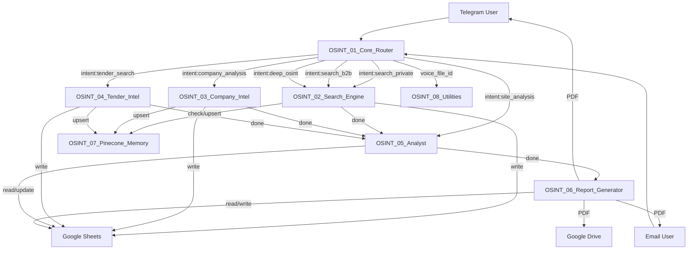

# WORKFLOW_MAP.md

## Purpose
Единая карта всех восьми workflow OSINT-платформы XandAI на базе n8n. Документ восстанавливает фактическое состояние каждого workflow по состоянию на 2026-07-31: триггеры, контракты данных, внешние зависимости, вызовы, persistent storage, критические точки отказа и статус верификации.

## Source of Truth
- Актуальные JSON-экспорты из продакшен-сервера n8n (xandai.ru) по состоянию на 2026-07-31.
- `ERROR_HISTORY_DRAFT.md` и `DECISIONS_DRAFT.md` — черновые консолидированные документы.
- История чатов Open WebUI с DeepSeek v4 Pro (июль 2026).

## Platform Overview
- **8 микро-воркфлоу** на одном инстансе n8n, self-hosted на VPS Beget.
- Межворкфлоу-коммуникация: `Execute Workflow` (нативная нода n8n).
- Центральная шина данных: Google Sheets (листы `jobs`, `leads`, `companies`, `tenders`, `reports`, `logs`).
- Векторное хранилище: Pinecone (через OSINT_07).
- PDF-генерация: Gotenberg 8 (внутренний Docker-контейнер).
- Основной LLM-провайдер: DeepSeek (flash/pro).
- Поисковые API: Serper, Tavily.
- Скрейпинг: Firecrawl (ограниченно).
- STT: Groq Whisper.

## Workflow Inventory

| ID | Workflow | Purpose | Trigger | Calls | Called by | Status |
|----|----------|---------|---------|-------|-----------|--------|
| WF1 | OSINT_01_Core_Router | Приём из Telegram/Email, классификация intent, маршрутизация | Telegram Trigger + IMAP Trigger | WF2, WF3, WF4, WF5, WF8 | — | PRESENT |
| WF2 | OSINT_02_Search_Engine | Поиск частных заказчиков/лидов (B2C/B2B) | Execute Workflow Trigger | WF5, WF7 | WF1 | PRESENT |
| WF3 | OSINT_03_Company_Intel | Анализ компаний (сайт, DaData, новости, LLM) | Execute Workflow Trigger | WF5, WF7 | WF1 | PRESENT |
| WF4 | OSINT_04_Tender_Intel | Поиск тендеров (Serper, Tavily, LLM-оценка) | Execute Workflow Trigger | WF5, WF7 | WF1 | PRESENT |
| WF5 | OSINT_05_Analyst | Скоринг найденных сущностей | Execute Workflow Trigger | WF6 | WF2, WF3, WF4, WF1 | PRESENT |
| WF6 | OSINT_06_Report_Generator | Генерация Markdown → HTML → PDF, доставка | Execute Workflow Trigger | — | WF5 | PRESENT |
| WF7 | OSINT_07_Pinecone_Memory | Векторное хранилище (upsert/query/delete) | Execute Workflow Trigger | — | WF2, WF3, WF4 | PRESENT |
| WF8 | OSINT_08_Utilities | Служебные операции (STT, PDF, логирование, throttle) | Execute Workflow Trigger | — | WF1 | PRESENT |

## Global Dependency Graph

## Shared Data Contracts

### `job_id`
| Field | Type | Created by | Consumed by | Required | Notes |
|-------|------|------------|-------------|----------|-------|
| job_id | string | WF1 (Parse Intent) | WF2, WF3, WF4, WF5, WF6, WF8 | Yes | Формат: `job_{timestamp36}_{random8}`. Первичный ключ для всех листов Google Sheets. Пробелы/кавычки в значении ломают фильтры. |

### `entities`
| Field | Type | Created by | Consumed by | Required | Notes |
|-------|------|------------|-------------|----------|-------|
| entities | object → string (JSON) | WF1 (Parse Intent) | WF2, WF3, WF4 | Yes | Сериализуется через JSON.stringify при передаче и записи в Sheets. Может прийти строкой — требуется двойной парсинг. Поля: service, region, keywords, budget_min, budget_max, target_url, target_inn, target_name. |
| entities.service | string | WF1 | WF2, WF4 | Yes | Дефолт: 'услуга' (WF2), 'проектирование' (WF4) |
| entities.region | string | WF1 | WF2, WF4 | Yes | Дефолт: 'Россия' |

### `user_id` / `chat_id`
| Field | Type | Created by | Consumed by | Required | Notes |
|-------|------|------------|-------------|----------|-------|
| user_id | string | WF1 (Normalize Input) | WF6 (Send Email) | No | Telegram user ID или email-адрес |
| chat_id | string | WF1 (Normalize Input) | WF6 (Telegram Send PDF), WF1 (Send Confirmation) | No | Telegram chat ID |

### `source_platform`
| Field | Type | Created by | Consumed by | Required | Notes |
|-------|------|------------|-------------|----------|-------|
| source_platform | string | WF2 (Build Query Matrix) | WF2 (Extract URLs, Append Lead) | No | Дефолт: 'general'. Теряется при ошибках в циклах. |

### `entity_type`
| Field | Type | Created by | Consumed by | Required | Notes |
|-------|------|------------|-------------|----------|-------|
| entity_type | string | WF2/WF3/WF4 (при вызове WF5) | WF5, WF6 | Yes | 'lead', 'company', 'tender'. Определяет имя листа Google Sheets. |

### `status`
| Field | Type | Created by | Consumed by | Required | Notes |
|-------|------|------------|-------------|----------|-------|
| status | string | WF1, WF2, WF5, WF6 | Google Sheets | Yes | WF1: 'processing'. WF5: 'qualified' (score≥60) / 'new'. WF6: 'done'. |

### `report_url`
| Field | Type | Created by | Consumed by | Required | Notes |
|-------|------|------------|-------------|----------|-------|
| report_url | string | WF6 (Upload to Drive) | WF6 (Update Job Done) | No | Google Drive webViewLink. |

## External Services Matrix

| Service | Used by workflows | Purpose | Input | Output | Failure behavior |
|---------|-------------------|---------|-------|--------|------------------|
| DeepSeek API (flash) | WF1, WF4 | Intent classification, tender analysis | raw_text / tender data | JSON response | Retry 3×, timeout 45s. On fail → `intent:error` (WF1), continueRegularOutput (WF4) |
| DeepSeek API (pro) | WF3, WF5, WF6 | Company analysis, scoring, MD report | entity data / context | JSON response | Retry 3×, timeout 120s. On fail → continueRegularOutput (WF5), silent fail (WF3) |
| Serper API | WF2, WF3, WF4 | Google search | query string | organic results (JSON) | continueRegularOutput, empty array → 0 results |
| Tavily API | WF4 | Tender search | query string | results (JSON) | continueRegularOutput |
| Firecrawl API | WF2, WF3 | Web scraping | URL | markdown content | continueRegularOutput. Блокируется Cloudflare для Avito, Telegram, Zakupki |
| Groq API (Whisper) | WF8 | STT (voice → text) | audio file (multipart) | text (JSON) | No retry. |
| DaData API | WF3 | Company info by INN | INN string | suggestions (JSON) | continueRegularOutput |
| Jina API | WF7 | Embeddings | text (≤8000 chars) | vector (1024-dim) | No retry. Returns error object. |
| Pinecone API | WF7 | Vector upsert/query/delete | vectors/metadata | matches/upsertedCount | No retry. continueRegularOutput at callers. |
| Gotenberg | WF6, WF8 | HTML → PDF | binary index.html | PDF binary | Timeout 120s. No retry — blocks report delivery. |
| Google Sheets | WF1, WF2, WF3, WF4, WF5, WF6, WF8 | Operational data store | rows (append/update/read) | — | Не транзакционна. Риск гонки данных. Google API quota limits. |
| Google Drive | WF6 | PDF storage | PDF binary | webViewLink | No explicit error handling. |
| Telegram API | WF1, WF6, WF8 | Bot messaging, file download | chat_id, text/file | — | No retry on send. |
| Yandex SMTP | WF6 | Email delivery | HTML email | — | No explicit error handling. |
| IMAP (Email) | WF1 | Email trigger | — | email data | postProcessAction: "read". Custom config: ["UNSEEN"]. |

## Persistent Storage

### PostgreSQL (n8n internal)
- Хранит execution data, credentials (зашифрованы), workflow definitions.
- Не используется напрямую OSINT-логикой.

### Redis (n8n internal)
- Бэкенд очередей для n8n Worker.
- Не используется напрямую OSINT-логикой.

### Google Sheets
- **Document ID:** `1BddnyOBG8Q0BYpXoE0QFkJG2pJi_oxk0aLfJ86IggXA`
- **Листы:**
  - `jobs` — WF1 (append), WF6 (read, update). Колонки: job_id, created_at, source, user_id, chat_id, raw_text, intent, entities, confidence, status, finished_at, report_url.
  - `leads` — WF2 (append), WF5 (read, update). Колонки: lead_id, job_id, source_platform, source_url, title, description, contact_phone, contact_tg, contact_email, region, budget, scraped_at, dedup_hash, pinecone_id, total_score, status.
  - `companies` — WF3 (append), WF5 (read, update). Колонки: company_id, job_id, name, inn, ogrn, website, industry, employees_est, revenue_est, tech_stack, contacts_json, news_summary, pain_points, why_relevant, recommended_pitch, total_score, scraped_at.
  - `tenders` — WF4 (append), WF5 (read, update). Колонки: tender_id, job_id, platform, tender_number, title, budget, deadline, url, matched_service, win_probability, required_prerequisites, summary, relevance_score, total_score, scraped_at.
  - `reports` — WF6 (append). Колонки: report_id, job_id, created_at, pdf_drive_url, md_content_short, email_sent.
  - `logs` — WF8 (append). Колонки: ts, workflow, node, level, job_id, message, payload_short.

### Pinecone
- **Host:** `groq-osint-viwj8s6.svc.aped-4627-b74a.pinecone.io`
- **Embedding model:** `jina-embeddings-v3`, task: retrieval.passage / retrieval.query, dimensions: 1024.
- **Namespaces:** `leads`, `companies`, `tenders`.
- **Операции:** upsert (с metadata: lead_id/company_id/tender_id, job_id, source_url, etc.), query (threshold filtering), delete.

### Google Drive
- **Folder ID:** `1xm1Luua_anWS8hLghLJLg_MKZenQ1-SZ`
- Назначение: хранение сгенерированных PDF-отчётов.

---

## WF-01 — OSINT_01_Core_Router

### Purpose
Приём запросов из Telegram и Email, нормализация, классификация intent через DeepSeek v4-flash, запись задачи в Google Sheets, маршрутизация в соответствующий search workflow, отправка подтверждения пользователю.

### Status
PRESENT — активен на сервере, выполнение не проверено сквозным прогоном.

### Trigger
- **Telegram Trigger** (node: `Telegram Trigger`) — `updates: ["message","edited_message","callback_query"]`. Production webhook.
- **Email IMAP Trigger** (node: `Email IMAP Trigger`) — `customEmailConfig: ["UNSEEN"]`, `forceReconnect: 60`, `postProcessAction: "read"`. После Filter Email (`subject contains "OSINT-AI"`).

### Called By
- Telegram users напрямую.
- Email-клиенты (тема письма должна содержать "OSINT-AI").

### Calls
| Workflow | Node | Wait | On Error |
|----------|------|------|----------|
| OSINT_08_Utilities | Execute STT | true (waitForSubWorkflow) | — |
| OSINT_02_Search_Engine | Execute Search Private | false | continueRegularOutput |
| OSINT_02_Search_Engine | Execute Search B2B | false | continueRegularOutput |
| OSINT_02_Search_Engine | Execute Deep OSINT | false | continueRegularOutput |
| OSINT_03_Company_Intel | Execute Company Intel | false | continueRegularOutput |
| OSINT_04_Tender_Intel | Execute Tender Intel | false | continueRegularOutput |
| OSINT_05_Analyst | Execute Site Analysis | false | continueRegularOutput |

### Input Contract
| Field | Type | Required | Source | Notes |
|-------|------|----------|--------|-------|
| message / edited_message / callback_query | object | No | Telegram Trigger | Обрабатывается в Normalize Input |
| subject + from | string | No | IMAP Trigger | Фильтруется: subject contains "OSINT-AI" |
| raw_text | string | No | Google Sheets (ручной запуск) | — |

### Output Contract
| Field | Type | Produced by | Consumer | Notes |
|-------|------|-------------|----------|-------|
| job_id | string | Parse Intent | WF2/WF3/WF4/WF5, Google Sheets (jobs) | Формат: `job_{timestamp36}_{random8}` |
| intent | string | Parse Intent | Route by Intent | search_private, search_b2b, company_analysis, tender_search, site_analysis, deep_osint |
| entities | object | Parse Intent | WF2/WF3/WF4/WF5 | Сериализуется в JSON для передачи |
| confidence | number | Parse Intent | Check Parse Success | Порог: ≥0.3 |
| source | string | Normalize Input | Is Telegram? | 'telegram', 'email', 'sheets' |
| user_id | string | Normalize Input | Send Confirmation | Telegram user ID или email |
| chat_id | string | Normalize Input | Send Confirmation, WF6 | Telegram chat ID |
| status | string | Parse Intent | Google Sheets (jobs) | 'processing' |

### Node Flow
1. **Telegram Trigger** — Telegram Trigger — приём сообщений.
2. **Email IMAP Trigger** — EmailReadImap — приём писем.
3. **Filter Email** — IF — пропускает только письма с "OSINT-AI" в теме.
4. **Normalize Input** — Code — нормализация: извлечение source, user_id, chat_id, raw_text, voice_file_id.
5. **Has Voice?** — IF — `$json.voice_file_id isNotEmpty`.
   - TRUE → **Execute STT** (→WF8, wait=true) → **Merge Voice Result** → **Merge After Voice**.
   - FALSE → **Merge After Voice** (напрямую).
6. **Merge After Voice** — Merge — объединение голосовой и текстовой веток.
7. **Filter Length** — IF — `raw_text.length > 10`.
   - TRUE → продолжение.
   - FALSE → execution stops.
8. **DeepSeek Intent Classifier** — HTTP Request (DeepSeek v4-flash) — классификация intent. Retry 3×, timeout 45s.
9. **Parse Intent** — Code — парсинг JSON-ответа, генерация job_id. При пустом ответе → throw (retry).
10. **Check Parse Success** — IF — `confidence >= 0.3`.
    - TRUE → **Create Job Row** + параллельно на **Route by Intent**.
    - FALSE → **Notify Admin**.
11. **Create Job Row** — Google Sheets — запись в лист `jobs`.
12. **Route by Intent** — Switch — 6 выходов по значению `intent`.
    - `search_private` → Execute Search Private (→WF2).
    - `search_b2b` → Execute Search B2B (→WF2).
    - `company_analysis` → Execute Company Intel (→WF3).
    - `tender_search` → Execute Tender Intel (→WF4).
    - `site_analysis` → Execute Site Analysis (→WF5).
    - `deep_osint` → Execute Deep OSINT (→WF2).
13. **Is Telegram?** — IF — проверка `source === 'telegram'`.
    - TRUE → **Send Confirmation** (Telegram).
14. **Notify Admin** — Telegram — отправка alert при ошибке.

### Data Transformations
- **Parse Intent:** raw_text → {job_id, intent, entities, confidence}. Критическая точка: если `entities` — строка, требуется JSON.parse. Если не распарсилось → `entities: {}`.
- **Route by Intent:** передаёт `job_id`, `entities` (JSON.stringify), `user_id`, `chat_id` во все Execute Workflow узлы.

### External Dependencies
- DeepSeek API (v4-flash): классификация intent.
- Telegram Bot API: приём/отправка сообщений, загрузка голосовых файлов.
- IMAP-сервер (Email): приём писем.
- Google Sheets API: запись в `jobs`.
- OSINT_08_Utilities: STT (через Execute Workflow).

### Credentials Required
- Telegram API
- IMAP account
- DeepSeek API (httpHeaderAuth)
- Google Sheets OAuth2

### Persistent Writes
- Google Sheets `jobs`: append (job_id, created_at, source, user_id, chat_id, raw_text, intent, entities, confidence, status).

### Error Handling
- DeepSeek Intent Classifier: retry 3×, timeout 45s. При fail → throw в Parse Intent (пустой ответ).
- Check Parse Success → FALSE: Notify Admin (Telegram).
- Execute Workflow узлы: onError="continueRegularOutput" (не блокируют основной поток).
- Has Voice? → FALSE: прямое продолжение без STT.
- Filter Length → FALSE: тихая остановка (нет уведомления).

### Known Failure Points
- **ERR-002:** DeepSeek возвращает 400 без слова "json" в system prompt.
- **ERR-003:** Префикс "OSINT-AI:" сбивает классификатор.
- **ERR-016:** ECONNRESET при нестабильности API.
- **ERR-001:** Потеря контекста при передаче entities как строки.
- **In HR-015:** Create Job Row «съедал» данные до роутинга (исправлено — Route by Intent получает данные напрямую с Check Parse Success).

### Related Decisions
- ADR-002: DeepSeek flash/pro split.
- ADR-011: Retry-политика для LLM API.
- ADR-017: IMAP postProcessAction: "read".

### Verification Evidence
- JSON подтверждает структуру. Выполнение не проверено сквозным прогоном.

### Open Questions
- Подтверждён ли сквозной прогон WF1 → WF2 с реальными job_id?
- Правильно ли обрабатываются callback_query от Telegram (инлайн-кнопки)?

---

## WF-02 — OSINT_02_Search_Engine

### Purpose
Поиск частных заказчиков/лидов (B2C и B2B): генерация поисковых запросов, поиск через Serper, извлечение URL, скрейпинг через Firecrawl, извлечение контактов, дедупликация через Pinecone, запись в Google Sheets.

### Status
PRESENT — активен на сервере. Сквозной прогон до Append Lead не подтверждён.

### Trigger
- **Execute Workflow Trigger** (node: `Trigger`) — вызывается из WF1 с `job_id`, `entities`, `user_id`, `chat_id`. `inputSource: "passthrough"`.

### Called By
- WF1 (Core Router): intent search_private, search_b2b, deep_osint.

### Calls
| Workflow | Node | Wait | On Error |
|----------|------|------|----------|
| OSINT_05_Analyst | Run Analyst | false | — |
| OSINT_07_Pinecone_Memory | Check Duplicate | true | continueRegularOutput |
| OSINT_07_Pinecone_Memory | Upsert to Pinecone | true | continueRegularOutput |

### Input Contract
| Field | Type | Required | Source | Notes |
|-------|------|----------|--------|-------|
| job_id | string | Yes | WF1 | — |
| entities | object/string | Yes | WF1 | Может быть строкой — требуется двойной парсинг в Build Query Matrix |
| user_id | string | No | WF1 | — |
| chat_id | string | No | WF1 | — |

### Output Contract
| Field | Type | Produced by | Consumer | Notes |
|-------|------|-------------|----------|-------|
| lead_id | string | Extract Contacts | Google Sheets (leads), WF5 | — |
| job_id | string | Build Query Matrix | Extract URLs, Extract Contacts, Append Lead | Сохраняется через $items() или putOutputInField |
| source_platform | string | Build Query Matrix | Extract URLs, Append Lead | Дефолт: 'general' |
| source_url | string | Extract URLs | Extract Contacts, Append Lead | URL найденной страницы |
| title | string | Extract URLs | Extract Contacts, Append Lead | — |
| contact_phone | string | Extract Contacts | Append Lead | — |
| contact_tg | string | Extract Contacts | Append Lead | — |
| contact_email | string | Extract Contacts | Append Lead | — |
| dedup_hash | string | Extract Contacts | Append Lead, Pinecone | — |
| total_score | number | Extract Contacts | Append Lead, WF5 | Дефолт: 0 (пересчитывается в WF5) |

### Node Flow
1. **Trigger** — Execute Workflow Trigger — получение параметров от WF1.
2. **Build Query Matrix** — Code — генерация 10–14 поисковых запросов. Парсинг entities (двойной, до 3 попыток). Выход: массив объектов {query, source_platform, region, job_id, service, budget_min, budget_max}.
3. **Loop Queries** — SplitInBatches — batchSize=1.
   - **loop output → Serper Search.**
   - **done output → Run Analyst (→WF5).**
4. **Serper Search** — HTTP Request — Serper API. `putOutputInField: "serperResult"`. `onError: continueRegularOutput`.
5. **Extract URLs** — Code — извлечение top-3 organic-результатов. Контекст (job_id, query, source_platform) через `$items("Loop Queries", 0, $runIndex)` + fallback `$('Loop Queries').item.json`.
6. **Filter Empty** — IF — `$json.skip !== true AND $json.url isNotEmpty`.
   - TRUE → **Loop URLs**.
   - FALSE → возврат в **Loop Queries** (следующая итерация).
7. **Loop URLs** — SplitInBatches — batchSize=1.
   - **loop output → Firecrawl Scrape.**
   - **done output → Loop Queries** (следующая итерация).
8. **Firecrawl Scrape** — HTTP Request — Firecrawl API. `putOutputInField: "firecrawlResult"`. `onError: continueRegularOutput`.
9. **Extract Contacts** — Code — извлечение телефонов, Telegram, email. Контекст URL через `$items("Loop URLs", 0, $runIndex)` + fallback. При отсутствии markdown → `no_results: true`. При отсутствии контактов → продолжение (Has Contacts? решит).
10. **Has Contacts?** — IF — контакты > 0 OR source_url не пуст.
    - TRUE → **Check Duplicate (→WF7)**.
    - FALSE → **Skip No Contacts** → **Back to URL Loop**.
11. **Check Duplicate** — Execute Workflow (→WF7, wait=true) — query в Pinecone.
12. **Is Not Duplicate?** — IF — `count === 0 OR matches.length === 0`.
    - TRUE → **Upsert to Pinecone (→WF7, wait=true)** → **Append Lead**.
    - FALSE → **Skip Duplicate** → **Back to URL Loop**.
13. **Append Lead** — Google Sheets — запись в `leads`.
14. **Back to URL Loop** — NoOp → возврат в **Loop URLs** (следующая итерация).

### Data Transformations
- **Build Query Matrix:** entities → массив queries. Критическая точка: двойной парсинг entities. При ошибке → `service: "услуга"`, `region: "Россия"`.
- **Extract URLs:** Serper response → массив {url, title, snippet, source_platform, query, job_id}. Критическая точка: контекст через $items() — при ошибке батча может потеряться.
- **Extract Contacts:** Firecrawl markdown → {lead_id, phones, telegrams, emails, budgets, dedup_hash}. Критическая точка: регулярки для телефонов могут давать ложные срабатывания.

### External Dependencies
- Serper API: поиск.
- Firecrawl API: скрейпинг (блокируется Cloudflare).
- DeepSeek: не используется напрямую в WF2.
- Pinecone (через WF7): дедупликация и upsert.
- Google Sheets: запись в `leads`.

### Credentials Required
- serper.dev API (httpHeaderAuth)
- Firecrawl API (httpHeaderAuth)
- Google Sheets OAuth2

### Persistent Writes
- Google Sheets `leads`: append (lead_id, job_id, source_platform, source_url, title, description, contact_phone, contact_tg, contact_email, region, budget, scraped_at, dedup_hash, pinecone_id, total_score, status).
- Pinecone `leads` namespace: upsert (через WF7).

### Error Handling
- Serper Search: onError="continueRegularOutput" → empty response → Extract URLs вернёт skip:true.
- Firecrawl Scrape: onError="continueRegularOutput" → Extract Contacts вернёт no_results:true.
- Check Duplicate/Upsert to Pinecone: onError="continueRegularOutput".
- Build Query Matrix: throw при service="услуга" без intent (критическая ошибка).

### Known Failure Points
- **ERR-001:** Потеря контекста (job_id, query, source_platform) в HTTP Request узлах. Исправлено через putOutputInField, но $items() всё ещё используется как fallback.
- **ERR-005:** Firecrawl возвращает "Access Denied" для Avito, Telegram, Profi, Zakupki.
- **ERR-008:** Filter Empty блокирует все URL (отключён looseTypeValidation).
- **ERR-009:** $('Loop Queries').item возвращает пустой объект.
- **In HR-013:** Execute Workflow на loop-выходе вместо done (исправлено).

### Related Decisions
- ADR-005: Put Output in Field.
- ADR-012: Disabling Firecrawl (частично).
- ADR-014: Pinecone + Jina для векторной памяти.

### Verification Evidence
- JSON подтверждает структуру. Сквозной прогон до Append Lead не подтверждён.

### Open Questions
- Выполняется ли Run Analyst на done-выходе корректно?
- Не слетает ли putOutputInField после ручного редактирования в UI?

---

## WF-03 — OSINT_03_Company_Intel

### Purpose
Анализ компаний: сбор данных с сайта (Firecrawl), получение информации по ИНН (DaData), поиск новостей (Serper), LLM-анализ (DeepSeek v4-pro), запись в Google Sheets и Pinecone.

### Status
PRESENT — активен на сервере.

### Trigger
- **Execute Workflow Trigger** (node: `Start`) — вызывается из WF1 с `job_id`, `entities`, `user_id`, `chat_id`.

### Called By
- WF1 (Core Router): intent company_analysis.

### Calls
| Workflow | Node | Wait | On Error |
|----------|------|------|----------|
| OSINT_07_Pinecone_Memory | Pinecone Upsert | true | — |
| OSINT_05_Analyst | Trigger Analyst | false | — |

### Input Contract
См. WF1 Output Contract (job_id, entities).

### Output Contract
| Field | Type | Produced by | Consumer | Notes |
|-------|------|-------------|----------|-------|
| company_id | string | Build Company Row | Google Sheets (companies), WF5 | — |
| job_id | string | Config | — | Пробрасывается через $('Config').item |
| name | string | Normalize DaData / Build Company Row | Google Sheets | — |
| inn | string | Extract Site Facts / Normalize DaData | Google Sheets | — |
| total_score | number | Build Company Row | Google Sheets, WF5 | relevance_to_our_services от DeepSeek |

### Node Flow
1. **Start** → **Config** (Set) — извлечение job_id, target_url, target_inn, target_name из entities.
2. Параллельно:
   - **Has URL?** → TRUE: **Firecrawl Scrape** → **Extract Site Facts** → **Merge Sources** (input 0).
   - **Has URL?** → FALSE: **No URL Fallback** → **Merge Sources** (input 0).
   - **Has INN?** → TRUE: **DaData Suggest** → **Normalize DaData** → **Merge Sources** (input 1).
   - **Has INN?** → FALSE: **No INN Fallback** → **Merge Sources** (input 1).
3. **Merge Sources** — Merge (combine + mergeByPosition) — объединение данных из URL-ветки и INN-ветки.
4. **Serper News** — HTTP Request — поиск новостей/отзывов/судов по названию компании.
5. **Prepare LLM Input** — Code — сбор всех данных для DeepSeek.
6. **DeepSeek Analyze Company** — HTTP Request (DeepSeek v4-pro) — анализ компании. Retry 3×, timeout 120s.
7. **Build Company Row** — Code — формирование финальной строки, извлечение контактов.
8. **Pinecone Upsert** — Execute Workflow (→WF7, wait=true).
9. **Append Company** — Google Sheets — запись в `companies`.
10. **Trigger Analyst** — Execute Workflow (→WF5, wait=false).

### Data Transformations
- **Config:** `entities` (строка или объект) → `{job_id, target_url, target_inn, target_name}`.
- **Extract Site Facts:** Firecrawl markdown + html → `{inn, ogrn, phones, emails, telegrams, tech_stack}`.
- **Normalize DaData:** DaData response → `{inn, ogrn, name, okved, employees, revenue, address, phones, emails}`.
- **Build Company Row:** DeepSeek response + site facts + dadata facts → финальная строка для Google Sheets.

### External Dependencies
- Firecrawl API: скрейпинг сайта.
- DaData API: информация по ИНН.
- Serper API: поиск новостей.
- DeepSeek API (v4-pro): анализ компании.
- Pinecone (через WF7): upsert.
- Google Sheets: запись в `companies`.

### Credentials Required
- Firecrawl API (httpHeaderAuth)
- DaData API (httpHeaderAuth)
- serper.dev API (httpHeaderAuth)
- DeepSeek API (httpHeaderAuth)
- Google Sheets OAuth2

### Persistent Writes
- Google Sheets `companies`: append (company_id, job_id, name, inn, ogrn, website, industry, employees_est, revenue_est, tech_stack, contacts_json, social_links, news_summary, pain_points, why_relevant, recommended_pitch, total_score, scraped_at).
- Pinecone `companies` namespace: upsert (через WF7).

### Error Handling
- Firecrawl Scrape: onError="continueRegularOutput".
- DaData Suggest: onError="continueRegularOutput".
- DeepSeek Analyze Company: retry 3×, timeout 120s.
- Нет явного error-узла — при полном отказе workflow останавливается.

### Known Failure Points
- **ERR-005:** Firecrawl "Access Denied" для защищённых сайтов.
- $('Config').item.json — потенциальная потеря контекста (pairedItem).
- Двойной парсинг entities (как в WF2) не реализован в Config (используется напрямую `$json.entities?.target_url`).

### Related Decisions
- ADR-002: DeepSeek flash/pro split.
- ADR-012: Disabling Firecrawl (частично).

### Verification Evidence
- JSON подтверждает структуру. Выполнение не проверено.

### Open Questions
- Работает ли `$('Config').item.json` надёжно после Execute Workflow Trigger?
- Корректно ли Merge Sources объединяет 4 возможные комбинации входов?

---

## WF-04 — OSINT_04_Tender_Intel

### Purpose
Поиск тендеров: поиск через Serper и Tavily, извлечение URL, LLM-анализ каждого тендера (DeepSeek v4-flash), фильтрация по relevance, запись в Google Sheets и Pinecone.

### Status
PRESENT — активен на сервере. Firecrawl отключён в тендерной ветке.

### Trigger
- **Execute Workflow Trigger** (node: `Start`) — вызывается из WF1 с `job_id`, `entities`, `user_id`, `chat_id`.

### Called By
- WF1 (Core Router): intent tender_search.

### Calls
| Workflow | Node | Wait | On Error |
|----------|------|------|----------|
| OSINT_07_Pinecone_Memory | Pinecone Upsert | true | continueRegularOutput |
| OSINT_05_Analyst | Trigger Analyst | false | — |

### Input Contract
См. WF1 Output Contract (job_id, entities).

### Output Contract
| Field | Type | Produced by | Consumer | Notes |
|-------|------|-------------|----------|-------|
| tender_id | string | Enrich Tender | Google Sheets (tenders), WF5 | — |
| job_id | string | Config | — | Через $items() |
| platform | string | Enrich Tender | Google Sheets | hostname из URL |
| relevance_score | number | DeepSeek Tender Analysis | Filter Relevance, Google Sheets | Порог: ≥20 |
| total_score | number | Enrich Tender | Google Sheets, WF5 | = relevance_score |

### Node Flow
1. **Start** → **Config** (Code) — парсинг entities (двойной, как в WF2). Выход: {job_id, service, region, keywords}.
2. Параллельно:
   - **Serper Zakupki** — HTTP Request (Serper) — поиск тендеров. `onError: continueRegularOutput`.
   - **Tavily Tenders** — HTTP Request (Tavily) — поиск тендеров. `onError: continueRegularOutput`.
3. **Merge Sources** — Merge (combineAll) — объединение результатов Serper + Tavily.
4. **Extract URLs** — Code — извлечение уникальных URL (top 10). Фильтрация youtube, instagram, facebook.
5. **Filter Skip** — IF — `$json.url isNotEmpty`.
   - TRUE → **Loop Tenders**.
   - FALSE → execution stops.
6. **Loop Tenders** — SplitInBatches — batchSize=1.
   - **loop output → DeepSeek Tender Analysis.**
   - **done output → Trigger Analyst (→WF5).**
7. **DeepSeek Tender Analysis** — HTTP Request (DeepSeek v4-flash) — оценка релевантности тендера. Retry 3×, timeout 120s. `onError: continueRegularOutput`.
8. **Enrich Tender** — Code — парсинг ответа DeepSeek + восстановление контекста через `$items("Loop Tenders", 0, $runIndex)`. Извлечение бюджета из snippet.
9. **Filter Relevance** — IF — `relevance_score >= 20`.
   - TRUE → **Pinecone Upsert (→WF7, wait=true)** → **Append Tender** → **Back to Loop**.
   - FALSE → **Back to Loop**.
10. **Append Tender** — Google Sheets — запись в `tenders`.
11. **Back to Loop** — NoOp → возврат в Loop Tenders.

### Data Transformations
- **Config:** entities → {job_id, service, region, budget_min, budget_max, keywords}.
- **Extract URLs:** Serper organic + Tavily results → массив {url, title, snippet, job_id, source}.
- **Enrich Tender:** DeepSeek response + контекст → {tender_id, job_id, platform, url, title, budget, deadline, tender_number, relevance_score, matched_service, win_probability, required_prerequisites, summary, total_score}.

### External Dependencies
- Serper API: поиск тендеров.
- Tavily API: поиск тендеров.
- DeepSeek API (v4-flash): анализ тендеров.
- Pinecone (через WF7): upsert.
- Google Sheets: запись в `tenders`.

### Credentials Required
- serper.dev API (httpHeaderAuth)
- Tavily API (httpHeaderAuth)
- DeepSeek API (httpHeaderAuth)
- Google Sheets OAuth2

### Persistent Writes
- Google Sheets `tenders`: append (tender_id, job_id, platform, tender_number, title, budget, deadline, url, matched_service, win_probability, required_prerequisites, summary, relevance_score, total_score, scraped_at).
- Pinecone `tenders` namespace: upsert (через WF7).

### Error Handling
- Serper Zakupki, Tavily Tenders: onError="continueRegularOutput".
- DeepSeek Tender Analysis: retry 3×, timeout 120s. onError="continueRegularOutput".
- Pinecone Upsert: onError="continueRegularOutput".
- Filter Skip → FALSE: тихая остановка.
- Filter Relevance → FALSE: пропуск тендера (без записи).

### Known Failure Points
- **ERR-005:** Firecrawl отключён — анализ только по сниппетам.
- Контекст через $items() — хрупкий паттерн.
- Tavily include_domains может фильтровать релевантные площадки.
- DeepSeek v4-flash timeout 120s — может быть избыточным для flash-модели.

### Related Decisions
- ADR-012: Disabling Firecrawl для защищённых целей.
- ADR-002: DeepSeek flash/pro split.

### Verification Evidence
- JSON подтверждает структуру. Выполнение не проверено.

### Open Questions
- Достаточно ли сниппетов Serper/Tavily для качественного скоринга тендеров?

---

## WF-05 — OSINT_05_Analyst

### Purpose
Универсальный аналитик: чтение сущностей из Google Sheets по job_id, итеративный скоринг каждой через DeepSeek v4-pro, обновление строк в Google Sheets, вызов Report Generator.

### Status
PRESENT — активен на сервере (`active: true`). Ключевой узел пайплайна.

### Trigger
- **Execute Workflow Trigger** (node: `Start`) — вызывается из WF2, WF3, WF4 (done-ветки), WF1 (site_analysis).

### Called By
- WF1 (intent: site_analysis)
- WF2 (done Loop Queries → Run Analyst)
- WF3 (Trigger Analyst)
- WF4 (done Loop Tenders → Trigger Analyst)

### Calls
| Workflow | Node | Wait | On Error |
|----------|------|------|----------|
| OSINT_06_Report_Generator | Trigger Report | false | — |

### Input Contract
| Field | Type | Required | Source | Notes |
|-------|------|----------|--------|-------|
| job_id | string | Yes | WF1/WF2/WF3/WF4 | — |
| entity_type | string | Yes | WF1/WF2/WF3/WF4 | 'lead', 'company', 'tender' |

### Output Contract
| Field | Type | Produced by | Consumer | Notes |
|-------|------|-------------|----------|-------|
| job_id | string | Set Job Vars | WF6 (Trigger Report) | — |
| entity_type | string | Set Job Vars | WF6, Google Sheets (имя листа) | — |
| total_score | number | Parse Scores | Google Sheets, WF6 | 0.35×relevance + 0.20×freshness + 0.25×solvency + 0.20×contactability |
| status | string | Parse Scores | Google Sheets | 'qualified' (total≥60) / 'new' |
| matched_service | string | Parse Scores | Google Sheets | Одна услуга из списка |
| why_relevant | string | Parse Scores | Google Sheets, WF6 | 3 предложения |
| recommended_action | string | Parse Scores | Google Sheets, WF6 | Конкретное действие |
| first_message_draft | string | Parse Scores | Google Sheets, WF6 | Персонализированное сообщение |

### Node Flow
1. **Start** → **Set Job Vars** (Set) — фиксация job_id, entity_type.
2. **Read Entities** — Google Sheets — чтение из листа на основе entity_type ('companies', 'tenders', 'leads'). Фильтр: `job_id = $json.job_id`. `alwaysOutputData: true`.
3. **Loop Entities** — SplitInBatches.
   - **loop output → DeepSeek All Scores.**
   - **done output → Trigger Report (→WF6).**
4. **DeepSeek All Scores** — HTTP Request (DeepSeek v4-pro) — скоринг. Retry 3×, timeout 120s, wait 5s. `onError: continueRegularOutput`.
5. **Rate Limit Wait** — Wait (0.5s) — защита от rate-limit.
6. **Parse Scores** — Code — парсинг ответа DeepSeek. Контекст сущности через `$('Loop Entities').item.json`. Вычисление total_score. Выход: обогащённая сущность.
7. **Update Row** — Google Sheets — update строки по lead_id/company_id/tender_id.

### Data Transformations
- **Read Entities:** динамический sheetName: `entity_type === 'company' ? 'companies' : (entity_type === 'tender' ? 'tenders' : 'leads')`.
- **Parse Scores:** DeepSeek JSON → scores + контекст сущности объединяются. Критическая точка: `$('Loop Entities').item.json` — при пустом item → throw.

### External Dependencies
- DeepSeek API (v4-pro): скоринг.
- Google Sheets: чтение и обновление.

### Credentials Required
- DeepSeek API (httpHeaderAuth)
- Google Sheets OAuth2

### Persistent Writes
- Google Sheets: update строк в `leads`, `companies`, `tenders` (relevance_score, freshness_score, solvency_score, contactability_score, total_score, matched_service, why_relevant, recommended_action, first_message_draft, status).

### Error Handling
- DeepSeek All Scores: retry 3×, timeout 120s, onError="continueRegularOutput".
- Parse Scores: throw при отсутствии данных (пустой ответ, пустой контекст) → остановка.
- Rate Limit Wait: гарантирует не более 2 запросов/сек.
- `alwaysOutputData: true` на Read Entities предотвращает тихую остановку при отсутствии данных.

### Known Failure Points
- **ERR-016:** ECONNABORTED/timeout при высокой нагрузке DeepSeek.
- **ERR-015:** `$('Loop Entities').item.json` может быть недоступен.
- **In HR-013 (ERROR_HISTORY2):** Trigger Report вызывается на done-выходе — ранее был на loop-выходе.
- Динамический sheetName — нестабильность при изменении имени листа в Google Sheets.
- Update Row: matchingColumns зависит от entity_type — при рассинхроне обновление молча не срабатывает.

### Related Decisions
- ADR-002: DeepSeek pro для скоринга.
- ADR-011: Retry-политика.
- ADR-016: Always Output Data.

### Verification Evidence
- JSON подтверждает структуру. `active: true`. Выполнение не проверено сквозным прогоном.

### Open Questions
- Правильно ли Update Row находит строку по lead_id/company_id/tender_id после чтения?
- Не перезаписывает ли Update Row поля, не входящие в autoMapInputData?

---

## WF-06 — OSINT_06_Report_Generator

### Purpose
Генерация финального PDF-отчёта: чтение job и entities из Google Sheets, генерация Markdown через DeepSeek v4-pro, конвертация в HTML, создание бинарного файла, рендеринг PDF через Gotenberg, доставка в Telegram, Email и Google Drive, запись в Google Sheets.

### Status
PRESENT — активен на сервере (`active: true`). Цепочка создания PDF подтверждена.

### Trigger
- **Execute Workflow Trigger** (node: `Start`) — вызывается из WF5 (done Loop Entities → Trigger Report).

### Called By
- WF5 (Analyst).

### Calls
Не вызывает другие workflow.

### Input Contract
| Field | Type | Required | Source | Notes |
|-------|------|----------|--------|-------|
| job_id | string | Yes | WF5 | — |
| entity_type | string | Yes | WF5 | 'lead', 'company', 'tender' |

### Output Contract
| Field | Type | Produced by | Consumer | Notes |
|-------|------|-------------|----------|-------|
| report_id | string | Log Report | Google Sheets (reports) | — |
| job_id | string | Set Vars | Google Sheets, Telegram, Email | — |
| pdf_drive_url | string | Upload to Drive | Email, Google Sheets (jobs, reports) | Google Drive webViewLink |
| filename | string | MD to HTML | Upload to Drive | Формат: `OSINT_{job_id}_{date}.pdf` |

### Node Flow
1. **Start** → **Set Vars** (Set) — фиксация job_id, entity_type.
2. **Read Job** — Google Sheets — чтение из `jobs` по job_id.
3. **Read Qualified Entities** — Google Sheets — чтение из листа по entity_type. Фильтр по job_id. `alwaysOutputData: true`.
4. **Prepare Context** — Code — сортировка по total_score, top-20, статистика.
5. **DeepSeek Generate MD** — HTTP Request (DeepSeek v4-pro) — генерация Markdown-отчёта. Timeout 120s, без retry.
6. **MD to HTML** — Code — конвертация Markdown → HTML (самописный конвертер). Генерация полного HTML-документа с CSS.
7. **Create HTML Binary** — Code — `await this.helpers.prepareBinaryData(html, 'index.html', 'text/html')`.
8. **Gotenberg to PDF** — HTTP Request — multipart-форма с `files: index.html`. Timeout 120s.
9. Параллельно:
   - **Upload to Drive** — Google Drive — загрузка PDF.
   - **Telegram Send PDF** — Telegram — отправка PDF с caption (total_found, qualified, avg_score).
10. **Log Report** — Google Sheets — запись в `reports`.
11. **Send Email** — Email Send (Yandex SMTP) — письмо со ссылкой на PDF.
12. **Update Job Done** — Google Sheets — обновление `jobs`: status='done', finished_at, report_url.

### Data Transformations
- **Prepare Context:** entities[] → {job, entities: top-20, stats: {total_found, qualified, avg_score}}.
- **MD to HTML:** Markdown → полный HTML с инлайн-CSS.
- **Create HTML Binary:** строка HTML → бинарный файл `index.html` (MIME: text/html).

### External Dependencies
- DeepSeek API (v4-pro): генерация Markdown.
- Gotenberg (Docker): HTML → PDF.
- Google Sheets: чтение и запись.
- Google Drive: загрузка PDF.
- Telegram Bot API: отправка PDF.
- Yandex SMTP: отправка Email.

### Credentials Required
- DeepSeek API (httpHeaderAuth)
- Google Sheets OAuth2
- Google Drive OAuth2
- Telegram API
- Yandex SMTP

### Persistent Writes
- Google Drive: PDF-файл.
- Google Sheets `reports`: append (report_id, job_id, created_at, pdf_drive_url, md_content_short, email_sent).
- Google Sheets `jobs`: update (status='done', finished_at, report_url).

### Error Handling
- DeepSeek Generate MD: timeout 120s, без retry. При fail → MD to HTML получит пустой контент.
- Gotenberg to PDF: timeout 120s. При fail → цепочка доставки обрывается.
- Read Qualified Entities: alwaysOutputData=true.
- Нет явного error-узла для обработки пустых entities (генерируется отчёт "Сущности не найдены").

### Known Failure Points
- **ERR-010:** Gotenberg требует binary `index.html` — исправлено через Create HTML Binary (prepareBinaryData).
- **ERR-006:** Buffer.from() недоступен — исправлено через prepareBinaryData.
- MD to HTML: самописный конвертер, неполная поддержка Markdown (нет поддержки ссылок, изображений, вложенных списков).
- При `total_found == 0` генерируется и отправляется "успешный" PDF-отчёт (TD-02).
- Telegram Send PDF: если chat_id пуст (email-источник), отправка молча не срабатывает.

### Related Decisions
- ADR-006: Gotenberg 8 для генерации PDF.
- ADR-007: prepareBinaryData для HTML→binary.
- ADR-008: Sandbox-safe код (отказ от Buffer, crypto).
- ADR-016: Always Output Data.

### Verification Evidence
- JSON подтверждает структуру. `active: true`. PDF ~25 kB создаются успешно согласно DECISIONS4.md.

### Open Questions
- Подтверждена ли доставка Email при пустом chat_id?
- Корректно ли отображается Markdown-таблица после самописного конвертера?

---

## WF-07 — OSINT_07_Pinecone_Memory

### Purpose
Адаптер к Pinecone: векторизация текста через Jina embeddings, upsert/query/delete в Pinecone.

### Status
PRESENT — активен на сервере. Базовые операции подтверждены.

### Trigger
- **Execute Workflow Trigger** (node: `Start`) — вызывается из WF2, WF3, WF4.

### Called By
- WF2 (Check Duplicate, Upsert to Pinecone)
- WF3 (Pinecone Upsert)
- WF4 (Pinecone Upsert)

### Calls
Не вызывает другие workflow.

### Input Contract
| Field | Type | Required | Source | Notes |
|-------|------|----------|--------|-------|
| operation | string | Yes | Caller | 'upsert', 'query', 'delete' |
| namespace | string | Yes | Caller | 'leads', 'companies', 'tenders' |
| text | string | Yes (upsert, query) | Caller | Обрезается до 8000 символов |
| metadata | object | Yes (upsert) | Caller | — |
| top_k | number | No | Caller | Дефолт: 5 |
| threshold | number | No | Caller | Дефолт: 0 |
| id / vector_id | string | No | Caller | Автогенерация при отсутствии |

### Output Contract
| Field | Type | Produced by | Consumer | Notes |
|-------|------|-------------|----------|-------|
| vector_id | string | Return Upsert / Set Config | Caller | — |
| upserted | boolean | Return Upsert | Caller | — |
| matches | array | Filter Matches | Caller | Отфильтровано по threshold |
| count | number | Filter Matches | Caller | — |
| deleted | boolean | Return Delete | Caller | — |

### Node Flow
1. **Start** → **Set Config** (Set) — извлечение параметров, задание pinecone_host.
2. **Route Operation** — Switch:
   - **upsert** → Jina Embed Passage → Build Upsert Body → Pinecone Upsert → Return Upsert.
   - **query** → Jina Embed Query → Pinecone Query → Filter Matches.
   - **delete** → Pinecone Delete → Return Delete.

### Data Transformations
- **Jina Embed Passage:** `task: "retrieval.passage"`, `dimensions: 1024`.
- **Jina Embed Query:** `task: "retrieval.query"`, `dimensions: 1024`.
- **Build Upsert Body:** embedding + metadata → `{vectors: [{id, values, metadata}], namespace}`.
- **Filter Matches:** `matches.filter(m => m.score >= threshold)`.

### External Dependencies
- Jina API: embeddings.
- Pinecone API: upsert/query/delete.

### Credentials Required
- Jina API (httpHeaderAuth)
- Pinecone API (httpHeaderAuth)

### Persistent Writes
- Pinecone (управляется caller'ами): namespace `leads`, `companies`, `tenders`.

### Error Handling
- Jina API: без retry. При ошибке → возврат {error: 'no_embedding'}.
- Pinecone API: без retry. Статус ошибки не проверяется явно.
- На уровне caller'ов: onError="continueRegularOutput".

### Known Failure Points
- **ERR-011:** Неправильный endpoint Pinecone (исправлено: `/vectors/upsert`).
- Размерность эмбеддинга: 1024 (jina-embeddings-v3). Должна совпадать с индексом Pinecone.

### Related Decisions
- ADR-014: Jina embeddings + Pinecone.

### Verification Evidence
- JSON подтверждает структуру. `upsertedCount > 0` подтверждено в ERROR_HISTORY (1).md.

### Open Questions
- Соответствует ли размерность 1024 текущему индексу Pinecone?
- Какие существуют namespace помимо `leads`, `companies`, `tenders`?

---

## WF-08 — OSINT_08_Utilities

### Purpose
Служебные операции: STT (Whisper через Groq), генерация PDF через Gotenberg, логирование ошибок в Google Sheets, уведомление админа, проверка throttle.

### Status
PRESENT — активен на сервере.

### Trigger
- **Execute Workflow Trigger** (node: `Start`) — вызывается из WF1 (STT) или других workflow для логирования/PDF.

### Called By
- WF1 (Execute STT).

### Calls
Не вызывает другие workflow.

### Input Contract
| Field | Type | Required | Source | Notes |
|-------|------|----------|--------|-------|
| operation | string | Yes | Caller | 'stt', 'pdf_from_html', 'notify_admin', 'throttle_check' |
| file_id | string | Yes (stt) | WF1 | Telegram file_id голосового сообщения |
| workflow | string | No (notify) | Caller | Имя workflow для логирования |
| message | string | No (notify) | Caller | Сообщение об ошибке |
| level | string | No (notify) | Caller | 'error' / 'info' / 'warn' |
| service | string | Yes (throttle) | Caller | Имя сервиса для проверки лимита |

### Output Contract
| Field | Type | Produced by | Consumer | Notes |
|-------|------|-------------|----------|-------|
| text | string | Return STT | WF1 (Merge Voice Result) | Распознанный текст |
| allowed | boolean | Throttle Check | Caller | Разрешён ли запрос |
| limit | number | Throttle Check | Caller | Максимум запросов |
| remaining | number | Throttle Check | Caller | Оставшиеся запросы |

### Node Flow
1. **Start** → **Route Operation** — Switch:
   - **stt** → Telegram Get File Info → Telegram Download Audio → Groq Whisper STT → Return STT.
   - **pdf** → Gotenberg PDF → Return PDF.
   - **notify** → Log to Sheets → If Error Level (TRUE: level='error') → Telegram Notify Admin.
   - **throttle** → Throttle Check.

### Data Transformations
- **Throttle Check:** использует `staticData` для хранения состояния окон (windowStart, count). Лимиты: deepseek=3, groq=5, serper=10, tavily=5, firecrawl=3, jina=20. Окно: 1000ms.

### External Dependencies
- Telegram Bot API: получение информации о файле, скачивание аудио.
- Groq API (Whisper): STT.
- Gotenberg: HTML → PDF.
- Google Sheets: запись в `logs`.
- Telegram Bot API: уведомление админа.

### Credentials Required
- Telegram API (bot token через `$env.TELEGRAM_BOT_TOKEN`)
- Groq API (httpHeaderAuth)
- Google Sheets OAuth2

### Persistent Writes
- Google Sheets `logs`: append (ts, workflow, node, level, job_id, message, payload_short).

### Error Handling
- Groq Whisper STT: timeout 120s, без retry.
- Gotenberg PDF: timeout 120s.
- Log to Sheets: без обработки ошибок.
- Telegram Notify Admin: только при level='error'.

### Known Failure Points
- Throttle Check основан на `staticData` — при рестарте n8n состояние сбрасывается.
- Telegram Get File Info: если file_id невалиден → 400.
- Gotenberg PDF: требует binary `index.html` на входе.

### Related Decisions
- ADR-023: Отказ от retry на 429 от Groq.

### Verification Evidence
- JSON подтверждает структуру. STT-цепочка подтверждена.

### Open Questions
- Используется ли throttle_check в текущих workflow?
- Корректно ли работает staticData при параллельных вызовах?

---

## Cross-Workflow Risks

1. **Гонка данных (Race Condition):** WF2, WF3, WF4 вызывают WF5 асинхронно (wait=false). WF5 читает данные по job_id из Google Sheets, но WF2/WF3/WF4 могут ещё не завершить запись. Риск: неполные данные в отчёте.
2. **Отсутствие транзакционности:** Google Sheets не гарантирует атомарность. При параллельных запусках возможна потеря или дублирование строк.
3. **Каскадный сбой:** Ошибка в WF1 → WF2 не получает entities → WF5 не находит строк → WF6 генерирует пустой отчёт. Пользователь получает "успешный" PDF с `total_found: 0`.
4. **Token/API-key ротация:** Все API-ключи захардкожены в credential n8n. При отзыве ключа — молчаливый отказ соответствующего сервиса.
5. **Gotenberg Single Point of Failure:** При падении контейнера Gotenberg блокируется вся доставка отчётов (WF6, WF8/pdf).

## Orphaned Workflows or Nodes

- **OSINT Memory** (ID: `Ht9cSNqymaGwWzT4`) — активен, но не входит в OSINT-сьют (старая версия OSINT_07?).
- **OSINT Agent (YandexGPT)** (ID: `dSEbG1YpaIUAgoJM`) — активен, но не интегрирован в текущий пайплайн.
- **Yandex Search (tool)** (ID: `5ehrDjfBTocR1bJ4`) — активен, но не вызывается из core-workflow.
- **AI Estimate Engine V5.2 ENTERPRISE SAFE** (ID: `wwyHhoWp4wOPxkcJ`) — активен, не относится к OSINT-сьюту.

## Missing Input/Output Contracts

1. **WF1 → WF2/3/4/5: `user_id` и `chat_id`** передаются, но не документирован контракт их использования в search workflow.
2. **WF2/3/4 → WF5: `entity_type`** — значения проверяются только в WF5 (Read Entities), но не валидируются на входе.
3. **WF5 → WF6: `entity_type`** — передаётся, но WF6 использует его только для выбора листа при чтении entities.
4. **WF7: `threshold` и `filter`** — передаются caller'ами, но их формат не стандартизирован.

## Unverified Connections

1. **WF1 (Execute Site Analysis → WF5):** intent: site_analysis маршрутизируется напрямую в WF5, минуя search engine. Непонятно, какие данные WF5 получит для анализа сайта.
2. **WF1 (Execute Deep OSINT → WF2):** intent: deep_osint вызывает WF2, но неясно, чем поведение WF2 отличается для этого intent.
3. **WF2 (Run Analyst → WF5):** вызывается на done-выходе Loop Queries. Подтверждено ли, что WF5 получает корректный job_id?
4. **WF5 (Update Row):** matchingColumns динамический (`lead_id`, `company_id`, `tender_id`). Подтверждено ли, что autoMapInputData корректно маппит поля?
5. **WF6 (Send Email):** `fromEmail: xander1s@yandex.ru`, `toEmail: xander1s@yandex.ru` — письма всегда уходят на один адрес, независимо от user_id.

## Recommended Verification Order

1. Запустить WF1 с тестовым Telegram-сообщением → проверить логирование в Google Sheets `jobs`.
2. Проверить WF2 изолированно через Manual Trigger → убедиться, что Build Query Matrix → Serper → Extract URLs → Filter Empty работает.
3. Проверить WF4 изолированно → убедиться, что Serper + Tavily → Merge Sources → Extract URLs → Loop Tenders → DeepSeek Tender Analysis → Enrich Tender работает.
4. Проверить WF7 изолированно → upsert + query в одном namespace.
5. Проверить WF5 изолированно с тестовым job_id → убедиться, что Read Entities → Loop Entities → DeepSeek All Scores → Parse Scores → Update Row работает.
6. Проверить WF6 изолированно с тестовым job_id → убедиться, что цепочка Read → Generate MD → HTML → PDF → Upload → Send работает.
7. Провести сквозной прогон WF1 → WF2 → WF5 → WF6 с одним тестовым запросом.
8. Проверить обработку пустых результатов (total_found=0) на всех этапах.
