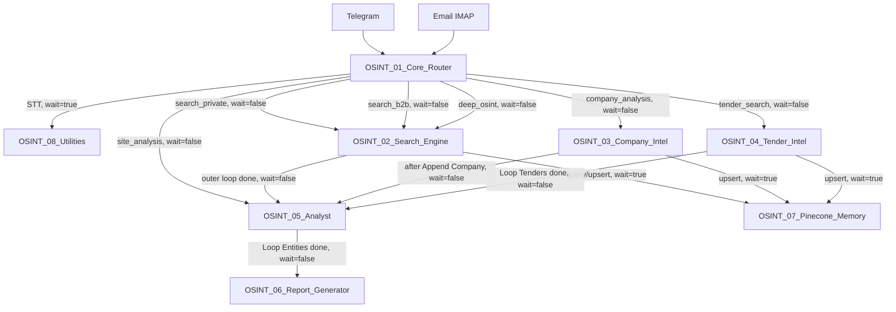

# WORKFLOW_MAP.md

> **Status:** APPROVED  
> **Evidence baseline:** Git commit `8420e423c98dcb1d11fa02f554e0674b9705bb81`  
> **Compatibility baseline:** n8n 2.32.7  
> **Source of truth:** `workflows/OSINT_*.json` in GitHub  
> **Live active/published state:** UNKNOWN unless explicitly supported by separate live evidence

* * *

## 1. Purpose

This document is the canonical structural map of the eight n8n workflows in the OSINT Platform.
It records only what is supported by:

*   root workflow fields;
    
*   `nodes`;
    
*   `connections`;
    
*   node parameters;
    
*   explicit `Execute Workflow` input mappings;
    
*   explicit storage and external-service references.
    

GitHub presence does not prove that a workflow is active or published on the n8n server.

* * *

## 2. Workflow Inventory

| WF | Exact workflow name | Root ID | Entry point | Called by | Calls | GitHub state |
| --- | --- | --- | --- | --- | --- | --- |
| WF1 | `OSINT_01_Core_Router` | `WtkTm484CwBpahGt` | Telegram Trigger; Email IMAP Trigger | External Telegram and email events | WF2, WF3, WF4, WF5, WF8 | PRESENT; live state UNKNOWN |
| WF2 | `OSINT_02_Search_Engine` | `fgf3zI8fRJhkqlHC` | Execute Workflow Trigger `Trigger` | WF1 | WF5, WF7 | PRESENT; live state UNKNOWN |
| WF3 | `OSINT_03_Company_Intel` | `gxCPpkQkvqc0yWf8` | Execute Workflow Trigger `Start` | WF1 | WF5, WF7 | PRESENT; live state UNKNOWN |
| WF4 | `OSINT_04_Tender_Intel` | `zcpU6hLvcMl5RiUa` | Execute Workflow Trigger `Start` | WF1 | WF5, WF7 | PRESENT; live state UNKNOWN |
| WF5 | `OSINT_05_Analyst` | `viR4AZBaC4CFA4qx` | Execute Workflow Trigger `Start` | WF1, WF2, WF3, WF4 | WF6 | PRESENT; live state UNKNOWN |
| WF6 | `OSINT_06_Report_Generator` | `qXWixFd94G7Tfgaa` | Execute Workflow Trigger `Start` | WF5 | — | PRESENT; live state UNKNOWN |
| WF7 | `OSINT_07_Pinecone_Memory` | `O3Ke6qflNx8CL1x7` | Execute Workflow Trigger `Start` | WF2, WF3, WF4 | — | PRESENT; live state UNKNOWN |
| WF8 | `OSINT_08_Utilities` | `IR4oQQAYQgUwIUjJ` | Execute Workflow Trigger `Start` | WF1 for `stt` | — | PRESENT; live state UNKNOWN |

* * *

## 3. Confirmed Cross-Workflow Graph



### Confirmed sequence

1.  WF1 writes the job row before routing to WF2, WF3, WF4 or WF5.
    
2.  WF1 dispatches search/company/tender/site-analysis workflows asynchronously.
    
3.  WF2 calls WF5 from the done-output of `Loop Queries`.
    
4.  WF3 calls WF5 after `Append Company`.
    
5.  WF4 calls WF5 from the done-output of `Loop Tenders`.
    
6.  WF5 calls WF6 from the done-output of `Loop Entities`.
    
7.  WF6 does not call another workflow.
    

### People verification branch

A dedicated people/person verification branch is absent.
There is:

*   no person-specific intent in WF1;
    
*   no person-check workflow;
    
*   no corresponding `Execute Workflow` connection;
    
*   no person-verification storage table.
    

`search_private` is a lead-search route, not an identity or people-verification route.

* * *

## 4. Shared Storage Map

### Google Sheets document

All Google Sheets nodes reference the same document.
| Sheet | Writers | Readers/updaters | Confirmed purpose |
| --- | --- | --- | --- |
| `jobs` | WF1 append | WF6 read and update | Job metadata and report completion |
| `leads` | WF2 append | WF5 read/update; WF6 read | Private/B2B lead entities |
| `companies` | WF3 append | WF5 read/update; WF6 read | Company entities |
| `tenders` | WF4 append | WF5 read/update; WF6 read | Tender entities |
| `reports` | WF6 append | — | Report metadata |
| `logs` | WF8 append | — | Utility logging |

### Confirmed columns written by each workflow

`jobs`**, WF1 append**
`job_id`, `created_at`, `source`, `user_id`, `chat_id`, `raw_text`, `intent`, `entities`, `confidence`, `status`.
`jobs`**, WF6 update**
`job_id`, `status`, `finished_at`, `report_url`, `row_number`.
`leads`**, WF2 append**
`lead_id`, `job_id`, `source_platform`, `source_url`, `title`, `description`, `contact_phone`, `contact_tg`, `contact_email`, `region`, `budget`, `scraped_at`, `dedup_hash`, `pinecone_id`, `total_score`, `status`.
`companies`**, WF3 append**
`company_id`, `job_id`, `name`, `inn`, `ogrn`, `website`, `industry`, `employees_est`, `revenue_est`, `tech_stack`, `contacts_json`, `social_links`, `news_summary`, `pain_points`, `why_relevant`, `recommended_pitch`, `total_score`, `scraped_at`.
`tenders`**, WF4 append**
`tender_id`, `job_id`, `platform`, `tender_number`, `title`, `budget`, `deadline`, `url`, `matched_service`, `win_probability`, `required_prerequisites`, `summary`, `relevance_score`, `total_score`, `scraped_at`.
`reports`**, WF6 append**
`report_id`, `job_id`, `created_at`, `pdf_drive_url`, `md_content_short`, `email_sent`.
`logs`**, WF8 append**
`ts`, `workflow`, `node`, `level`, `job_id`, `message`, `payload_short`.

### Pinecone

WF7 provides the confirmed operations:

*   `upsert`;
    
*   `query`;
    
*   `delete`.
    

Current callers use namespaces:

*   `leads`;
    
*   `companies`;
    
*   `tenders`.
    

Jina embeddings use:

*   model `jina-embeddings-v3`;
    
*   dimensions `1024`;
    
*   task `retrieval.passage` for upsert;
    
*   task `retrieval.query` for query.
    

### Google Drive

WF6 uploads generated PDFs to a configured Google Drive folder and uses the returned `webViewLink` in Sheets and email content.

* * *

# 5. WF1 — OSINT_01_Core_Router

## Identity

| Property | Value |
| --- | --- |
| Exact name | `OSINT_01_Core_Router` |
| Root ID | `WtkTm484CwBpahGt` |
| Entry points | `Telegram Trigger`, `Email IMAP Trigger` |
| Called by | External events |
| Calls | WF2, WF3, WF4, WF5, WF8 |
| Live active/published state | UNKNOWN |

## Entry contract

### Telegram

Accepted update structures:

*   `message`;
    
*   `edited_message`;
    
*   `callback_query`.
    

`Normalize Input` produces:

*   `source`;
    
*   `user_id`;
    
*   `chat_id`;
    
*   `raw_text`;
    
*   `voice_file_id`;
    
*   `timestamp`.
    

### Email

The email branch enters through `Email IMAP Trigger`, then `Filter Email`.
Confirmed filter:

```text
subject contains "OSINT-AI"
```

Confirmed IMAP options:

*   `customEmailConfig: ["UNSEEN"]`;
    
*   `forceReconnect: 60`.
    

`postProcessAction` is not present in the JSON.

## Dispatch contract

After successful classification, WF1 creates:

*   `job_id`;
    
*   `created_at`;
    
*   `source`;
    
*   `user_id`;
    
*   `chat_id`;
    
*   `raw_text`;
    
*   `intent`;
    
*   `entities`;
    
*   `confidence`;
    
*   `status: processing`.
    

For WF2, WF3, WF4 and WF5, Execute Workflow nodes pass:

```json
{
  "job_id": "<string>",
  "entities": "<JSON-serialized string>",
  "user_id": "<string>",
  "chat_id": "<string|null>"
}
```

The `intent` field is not passed.
For WF8 STT, WF1 passes:

```json
{
  "operation": "stt",
  "file_id": "<Telegram file_id>",
  "user_id": "<string>",
  "chat_id": "<string>"
}
```

## Subworkflow calls

| Node | Target | `waitForSubWorkflow` | `onError` |
| --- | --- | --- | --- |
| `Execute STT` | WF8 | true | not set |
| `Execute Search Private` | WF2 | false | `continueRegularOutput` |
| `Execute Search B2B` | WF2 | false | `continueRegularOutput` |
| `Execute Company Intel` | WF3 | false | `continueRegularOutput` |
| `Execute Tender Intel` | WF4 | false | `continueRegularOutput` |
| `Execute Site Analysis` | WF5 | false | `continueRegularOutput` |
| `Execute Deep OSINT` | WF2 | false | `continueRegularOutput` |

## Key branches

1.  Telegram and email events converge at `Normalize Input`.
    
2.  Voice input:  
    `Has Voice?` → WF8 STT synchronously → `Merge Voice Result`.
    
3.  Text and STT paths converge at `Merge After Voice`.
    
4.  `Filter Length` passes only `raw_text.length > 10`.
    
5.  DeepSeek classifies one of six intents.
    
6.  `Check Parse Success` passes only `confidence >= 0.3`.
    
7.  Success path:  
    `Create Job Row` → parallel outputs to:
    *   `Route by Intent`;
        
    *   `Is Telegram?`.
        
8.  Parse-failure path:  
    `Notify Admin`.
    
9.  `Route by Intent` fallback output is not connected.
    

## Persistent output

WF1 appends one row to `jobs`.

## Done-path

WF1 has no common terminal node.
Each dispatched Execute Workflow node is terminal. The Telegram confirmation branch terminates at `Send Confirmation`.

## Unconfirmed or conflicting areas

*   Active/published state is UNKNOWN.
    
*   WF2 does not receive `intent`; B2B and deep-OSINT calls therefore do not have a confirmed distinct downstream contract.
    
*   WF3 receives serialized `entities`, while its `Config` node expects object-style property access.
    
*   Direct `site_analysis` calls do not provide `entity_type`; WF5 defaults to `lead`.
    
*   Runtime handling of Telegram `callback_query` is not proven by GitHub JSON.
    
*   IMAP messages being marked as read is not confirmed.
    

* * *

# 6. WF2 — OSINT_02_Search_Engine

## Identity

| Property | Value |
| --- | --- |
| Exact name | `OSINT_02_Search_Engine` |
| Root ID | `fgf3zI8fRJhkqlHC` |
| Entry point | Execute Workflow Trigger `Trigger` |
| Called by | WF1 |
| Calls | WF7, WF5 |
| Live active/published state | UNKNOWN |

## Input contract

| Field | Required by code | Actual WF1 payload | Notes |
| --- | --- | --- | --- |
| `job_id` | expected | yes | Fallback generates `job_recovered_*` |
| `entities` | expected | yes, serialized string | Parsed up to three times |
| `intent` | optional | no | Defaults to `search_private` |
| `user_id` | unused | yes | Not used by WF2 nodes |
| `chat_id` | unused | yes | Not used by WF2 nodes |

`entities` may provide:

*   `service`;
    
*   `region`;
    
*   `budget_min`;
    
*   `budget_max`.
    

## Persistent output contract

WF2 appends lead rows to `leads`.
Core output fields:

*   `lead_id`;
    
*   `job_id`;
    
*   `source_platform`;
    
*   `source_url`;
    
*   `title`;
    
*   `description`;
    
*   contact fields;
    
*   `budget`;
    
*   `dedup_hash`;
    
*   `pinecone_id`;
    
*   `total_score`;
    
*   `status`.
    

After the outer query loop is done, WF2 dispatches to WF5:

```json
{
  "job_id": "<Trigger.job_id>",
  "entity_type": "lead"
}
```

## Subworkflow calls

| Node | Target | Operation | Wait | On error |
| --- | --- | --- | --- | --- |
| `Check Duplicate` | WF7 | `query`, namespace `leads` | true | `continueRegularOutput` |
| `Upsert to Pinecone` | WF7 | `upsert`, namespace `leads` | true | `continueRegularOutput` |
| `Run Analyst` | WF5 | entity type `lead` | false | not set |

## Key branches and loops

1.  `Build Query Matrix` creates query items.
    
2.  `Loop Queries`, output 0:  
    `Serper Search`.
    
3.  `Serper Search` stores its response in `serperResult`.
    
4.  `Extract URLs` produces at most three URL items per query.
    
5.  `Filter Empty`:
    *   true → `Loop URLs`;
        
    *   false → back to `Loop Queries`.
        
6.  `Loop URLs`, output 0:  
    `Firecrawl Scrape`.
    
7.  `Loop URLs`, done-output:  
    back to `Loop Queries`.
    
8.  `Has Contacts?` uses OR logic:  
    contact count greater than zero **or** `source_url` not empty.
    
9.  Duplicate check:
    *   no match → Pinecone upsert → append lead;
        
    *   match → `Skip Duplicate`.
        
10.  No-contact and duplicate paths both return to `Loop URLs`.
     

## Confirmed done-path

```text
Loop URLs done
    → Loop Queries next iteration

Loop Queries done
    → Run Analyst
    → WF5, wait=false
```

The JSON connects the outer-loop done-output to input index 1 of `Run Analyst`. Runtime significance of that target index is not confirmed.

## External services and storage

*   Serper;
    
*   Firecrawl;
    
*   WF7/Jina/Pinecone;
    
*   Google Sheets `leads`;
    
*   DeepSeek indirectly through WF5.
    

## Unconfirmed or conflicting areas

*   Active/published state is UNKNOWN.
    
*   WF1 does not pass `intent`; query-matrix differentiation between private, B2B and deep OSINT is not established at the workflow boundary.
    
*   `Serper Search` writes to `serperResult`, while `Extract URLs` reads root-level `organic`.
    
*   Context restoration still uses `$items(..., $runIndex)` and `.item` fallback.
    
*   Runtime behavior of the done connection to target input index 1 is UNKNOWN.
    
*   No live end-to-end evidence confirms `Append Lead`.
    

* * *

# 7. WF3 — OSINT_03_Company_Intel

## Identity

| Property | Value |
| --- | --- |
| Exact name | `OSINT_03_Company_Intel` |
| Root ID | `gxCPpkQkvqc0yWf8` |
| Entry point | Execute Workflow Trigger `Start` |
| Called by | WF1 |
| Calls | WF7, WF5 |
| Live active/published state | UNKNOWN |

## Input contract

WF1 passes:

```json
{
  "job_id": "<string>",
  "entities": "<JSON-serialized string>",
  "user_id": "<string>",
  "chat_id": "<string|null>"
}
```

WF3 `Config` expects:

```json
{
  "job_id": "<string>",
  "entities": {
    "target_url": "<string>",
    "target_inn": "<string>",
    "target_name": "<string>"
  }
}
```

The caller and callee types for `entities` conflict.

## Persistent output contract

WF3 appends one company row to `companies`.
Core fields include:

*   `company_id`;
    
*   `job_id`;
    
*   identity and registration fields;
    
*   website and industry;
    
*   estimated employees and revenue;
    
*   technology stack;
    
*   contacts;
    
*   news and pain points;
    
*   pitch fields;
    
*   `total_score`;
    
*   `scraped_at`.
    

Then WF3 dispatches to WF5:

```json
{
  "job_id": "<Build Company Row.job_id>",
  "entity_type": "company"
}
```

## Subworkflow calls

| Node | Target | Operation | Wait | On error |
| --- | --- | --- | --- | --- |
| `Pinecone Upsert` | WF7 | `upsert`, namespace `companies` | true | not set |
| `Trigger Analyst` | WF5 | entity type `company` | false | not set |

## Key branches

1.  `Config` starts two parallel checks:
    *   `Has URL?`;
        
    *   `Has INN?`.
        
2.  URL path:
    *   Firecrawl and extraction;
        
    *   or `No URL Fallback`.
        
3.  INN path:
    *   DaData and normalization;
        
    *   or `No INN Fallback`.
        
4.  Both paths join at `Merge Sources` using merge-by-position.
    
5.  Serper searches company news/reviews/court references.
    
6.  DeepSeek produces company analysis.
    
7.  `Build Company Row` creates the row.
    
8.  WF7 upsert executes synchronously.
    
9.  Company row is appended.
    
10.  WF5 is dispatched asynchronously.
     

## Confirmed done-path

```text
Pinecone Upsert
    → Append Company
    → Trigger Analyst
    → WF5, wait=false
```

There is no loop done-output in WF3.

## External services and storage

*   Firecrawl;
    
*   DaData;
    
*   Serper;
    
*   DeepSeek;
    
*   WF7/Jina/Pinecone;
    
*   Google Sheets `companies`.
    

## Unconfirmed or conflicting areas

*   Active/published state is UNKNOWN.
    
*   Serialized `entities` from WF1 is not parsed by `Config`.
    
*   Multiple downstream expressions use `.item`; runtime item-linking is not proven.
    
*   Merge-by-position behavior across fallback and API paths has no live evidence.
    
*   WF7 failure is not configured with `continueRegularOutput`.
    

* * *

# 8. WF4 — OSINT_04_Tender_Intel

## Identity

| Property | Value |
| --- | --- |
| Exact name | `OSINT_04_Tender_Intel` |
| Root ID | `zcpU6hLvcMl5RiUa` |
| Entry point | Execute Workflow Trigger `Start` |
| Called by | WF1 |
| Calls | WF7, WF5 |
| Live active/published state | UNKNOWN |

## Input contract

WF4 accepts:

*   `job_id`;
    
*   `entities` as object or serialized JSON.
    

`Config` derives:

*   `service`;
    
*   `region`;
    
*   `budget_min`;
    
*   `budget_max`;
    
*   `keywords`.
    

## Persistent output contract

WF4 appends tender rows to `tenders`.
Core fields:

*   `tender_id`;
    
*   `job_id`;
    
*   `platform`;
    
*   `tender_number`;
    
*   `title`;
    
*   `budget`;
    
*   `deadline`;
    
*   `url`;
    
*   `matched_service`;
    
*   `win_probability`;
    
*   prerequisites and summary;
    
*   `relevance_score`;
    
*   `total_score`;
    
*   `scraped_at`.
    

After the tender loop is done, WF4 dispatches:

```json
{
  "job_id": "<Config.job_id>",
  "entity_type": "tender"
}
```

## Subworkflow calls

| Node | Target | Operation | Wait | On error |
| --- | --- | --- | --- | --- |
| `Pinecone Upsert` | WF7 | `upsert`, namespace `tenders` | true | `continueRegularOutput` |
| `Trigger Analyst` | WF5 | entity type `tender` | false | not set |

## Key branches and loop

1.  `Config` fans out to:
    *   `Serper Zakupki`;
        
    *   `Tavily Tenders`.
        
2.  `Merge Sources` combines both result sets.
    
3.  `Extract URLs` deduplicates and returns at most ten tender URL items.
    
4.  There is no Firecrawl node in WF4.
    
5.  `Filter Skip`:
    *   true → `Loop Tenders`;
        
    *   false → unconnected terminal path.
        
6.  `Loop Tenders`, output 0:  
    DeepSeek tender analysis.
    
7.  `Filter Relevance` threshold:  
    `relevance_score >= 20`.
    
8.  Relevant tender:  
    WF7 upsert → `Append Tender` → back to loop.
    
9.  Non-relevant tender:  
    directly back to loop.
    

## Confirmed done-path

```text
Loop Tenders done
    → Trigger Analyst
    → WF5, wait=false
```

The JSON connects the loop done-output to input index 1 of `Trigger Analyst`.
If no URL passes `Filter Skip`, the loop is not entered and Analyst is not called by this path.

## External services and storage

*   Serper;
    
*   Tavily;
    
*   DeepSeek;
    
*   WF7/Jina/Pinecone;
    
*   Google Sheets `tenders`.
    

## Unconfirmed areas

*   Active/published state is UNKNOWN.
    
*   Context restoration in `Enrich Tender` uses `$items(..., $runIndex)` and `.item` fallback.
    
*   Runtime behavior of the done connection to target input index 1 is UNKNOWN.
    
*   No live evidence confirms that snippets alone provide sufficient tender data.
    
*   No live evidence confirms the no-results behavior.
    

* * *

# 9. WF5 — OSINT_05_Analyst

## Identity

| Property | Value |
| --- | --- |
| Exact name | `OSINT_05_Analyst` |
| Root ID | `viR4AZBaC4CFA4qx` |
| Entry point | Execute Workflow Trigger `Start` |
| Called by | WF1, WF2, WF3, WF4 |
| Calls | WF6 |
| Live active/published state | UNKNOWN |

## Input contract

| Field | Required | Default | Used for |
| --- | --- | --- | --- |
| `job_id` | expected | none | Sheets filter and WF6 dispatch |
| `entity_type` | no | `lead` | Selects `leads`, `companies` or `tenders` |
| `entities` | no | — | Not used |
| `user_id` | no | — | Not used |
| `chat_id` | no | — | Not used |

Sheet selection:

```text
company → companies
tender  → tenders
other   → leads
```

## Persistent output contract

For every read entity, WF5 adds or replaces:

*   `relevance_score`;
    
*   `freshness_score`;
    
*   `solvency_score`;
    
*   `contactability_score`;
    
*   `total_score`;
    
*   `matched_service`;
    
*   `why_relevant`;
    
*   `recommended_action`;
    
*   `first_message_draft`;
    
*   `status`.
    

Score formula:

```text
total_score =
0.35 × relevance
+ 0.20 × freshness
+ 0.25 × solvency
+ 0.20 × contactability
```

Status:

```text
total_score >= 60 → qualified
otherwise         → new
```

WF5 updates the selected entity table and then dispatches WF6:

```json
{
  "job_id": "<Set Job Vars.job_id>",
  "entity_type": "<Set Job Vars.entity_type>"
}
```

## Subworkflow call

| Node | Target | Wait | On error |
| --- | --- | --- | --- |
| `Trigger Report` | WF6 | false | not set |

## Key loop

1.  `Read Entities` filters by `job_id`.
    
2.  `alwaysOutputData` is enabled.
    
3.  `Loop Entities`, output 0:  
    DeepSeek scoring.
    
4.  `Rate Limit Wait` has `amount: 0.5`.
    
5.  `Parse Scores` reads the current entity through `$('Loop Entities').item`.
    
6.  `Update Row` uses dynamic sheet selection and dynamic matching ID:
    *   `company_id`;
        
    *   `tender_id`;
        
    *   `lead_id`.
        
7.  `Update Row` returns to `Loop Entities`.
    

## Confirmed done-path

```text
Loop Entities done
    → Trigger Report
    → WF6, wait=false
```

## External services and storage

*   DeepSeek;
    
*   Google Sheets `leads`, `companies`, `tenders`;
    
*   WF6.
    

## Unconfirmed or conflicting areas

*   Active/published state is UNKNOWN.
    
*   `Parse Scores` depends on `.item` linkage after HTTP Request and Wait nodes.
    
*   Direct WF1 `site_analysis` calls omit `entity_type`, so WF5 defaults to `lead`.
    
*   Direct WF1 `site_analysis` passes `entities`, but WF5 does not consume it.
    
*   Runtime behavior when `Read Entities` finds no rows is not established.
    
*   Dynamic matching-column behavior has no live evidence.
    

* * *

# 10. WF6 — OSINT_06_Report_Generator

## Identity

| Property | Value |
| --- | --- |
| Exact name | `OSINT_06_Report_Generator` |
| Root ID | `qXWixFd94G7Tfgaa` |
| Entry point | Execute Workflow Trigger `Start` |
| Called by | WF5 |
| Calls | None |
| Live active/published state | UNKNOWN |

## Input contract

| Field | Required | Default |
| --- | --- | --- |
| `job_id` | expected | none |
| `entity_type` | no | `lead` |

WF6 reads:

*   `jobs` by `job_id`;
    
*   one entity table by `entity_type`, filtered only by `job_id`.
    

Despite its name, `Read Qualified Entities` has no `status = qualified` filter.

## Output and side-effect contract

WF6 produces:

*   Markdown report;
    
*   HTML document;
    
*   binary `index.html`;
    
*   PDF binary;
    
*   Google Drive upload;
    
*   Telegram document send path;
    
*   SMTP email;
    
*   `reports` row;
    
*   `jobs` completion update.
    

`Prepare Context`:

*   removes empty rows lacking `source_url`, `url` and `title`;
    
*   sorts by `total_score`;
    
*   keeps at most twenty entities;
    
*   sets `qualified` equal to the count of all remaining entities.
    

## Key path

```text
Start
→ Set Vars
→ Read Job
→ Read Qualified Entities
→ Prepare Context
→ DeepSeek Generate MD
→ MD to HTML
→ Create HTML Binary
→ Gotenberg to PDF
```

Connections after Gotenberg are:

```text
main[0] → Upload to Drive
main[1] → Telegram Send PDF
```

Storage/email path:

```text
Upload to Drive
→ Log Report
→ Send Email
→ Update Job Done
```

Telegram path terminates at `Telegram Send PDF`.

## Persistent writes

*   append `reports`;
    
*   update `jobs` with `done`, `finished_at` and `report_url`.
    

## External services and storage

*   DeepSeek;
    
*   Gotenberg;
    
*   Google Drive;
    
*   Telegram;
    
*   SMTP;
    
*   Google Sheets `jobs`, selected entity table and `reports`.
    

## Confirmed done-path

The confirmed storage/email terminal node is:

```text
Update Job Done
```

The Telegram branch is connected to output index 1 of `Gotenberg to PDF`; runtime emission of that output is UNKNOWN.

## Unconfirmed or conflicting areas

*   Active/published state is UNKNOWN.
    
*   Telegram output-index behavior is not confirmed.
    
*   `Read Qualified Entities` does not actually filter qualified status.
    
*   `qualified` statistics count all non-empty entities.
    
*   SMTP recipient is fixed in node configuration and is not derived from the initiating user.
    
*   Telegram delivery for email-originated jobs is not confirmed.
    
*   End-to-end PDF delivery is not confirmed by JSON alone.
    

* * *

# 11. WF7 — OSINT_07_Pinecone_Memory

## Identity

| Property | Value |
| --- | --- |
| Exact name | `OSINT_07_Pinecone_Memory` |
| Root ID | `O3Ke6qflNx8CL1x7` |
| Entry point | Execute Workflow Trigger `Start` |
| Called by | WF2, WF3, WF4 |
| Calls | None |
| Live active/published state | UNKNOWN |

## Input contract

| Field | Required | Notes |
| --- | --- | --- |
| `operation` | yes | `upsert`, `query`, `delete` |
| `namespace` | yes | Current callers use `leads`, `companies`, `tenders` |
| `text` | upsert/query | Truncated to 8000 characters |
| `id` | no | Used as vector ID; generated if absent |
| `metadata` | upsert | Defaults to `{}` |
| `top_k` | no | Defaults to 5 |
| `threshold` | no | Defaults to 0 |
| `filter` | no | Defaults to `{}` |

The input field consumed for an explicit vector identifier is `id`.

## Output contracts

### Upsert

```json
{
  "vector_id": "<string>",
  "upserted": true,
  "namespace": "<string>"
}
```

### Query

```json
{
  "matches": [],
  "count": 0,
  "namespace": "<string>"
}
```

### Delete

```json
{
  "deleted": true,
  "vector_id": "<string>"
}
```

## Branches

```text
upsert
→ Jina Embed Passage
→ Build Upsert Body
→ Pinecone Upsert
→ Return Upsert

query
→ Jina Embed Query
→ Pinecone Query
→ Filter Matches

delete
→ Pinecone Delete
→ Return Delete
```

## External services and storage

*   Jina embeddings;
    
*   Pinecone.
    

WF7 does not access Google Sheets.

## Unconfirmed areas

*   Active/published state is UNKNOWN.
    
*   Pinecone index dimension and availability are not proven by JSON.
    
*   Delete has no caller among the current eight workflow JSON files.
    
*   API success, retry and failure behavior are not confirmed by live evidence.
    

* * *

# 12. WF8 — OSINT_08_Utilities

## Identity

| Property | Value |
| --- | --- |
| Exact name | `OSINT_08_Utilities` |
| Root ID | `IR4oQQAYQgUwIUjJ` |
| Entry point | Execute Workflow Trigger `Start` |
| Called by | WF1 for `stt` |
| Calls | None |
| Live active/published state | UNKNOWN |

## Operation contracts

### `stt`

Input:

*   `operation: stt`;
    
*   `file_id`;
    
*   optional `user_id`;
    
*   optional `chat_id`.
    

Path:

```text
Telegram Get File Info
→ Telegram Download Audio
→ Groq Whisper STT
→ Return STT
```

Output:

```json
{
  "text": "<recognized text>",
  "operation": "stt"
}
```

### `pdf_from_html`

Input:

*   `operation: pdf_from_html`;
    
*   binary property `index.html`;
    
*   optional `filename`.
    

Path:

```text
Gotenberg PDF
→ Return PDF
```

Expected output contains PDF binary plus:

*   `operation`;
    
*   `filename`.
    

No current caller exists among WF1–WF8.

### `notify_admin`

Input fields used by the branch:

*   `workflow`;
    
*   `node`;
    
*   `level`;
    
*   `job_id`;
    
*   `message`;
    
*   remaining input serialized into `payload_short`.
    

Path:

```text
Log to Sheets
→ If Error Level
→ Telegram Notify Admin when level == error
```

The log row is appended before the error-level check.
No current Execute Workflow caller exists among WF1–WF8.

### `throttle_check`

Input:

*   `operation: throttle_check`;
    
*   `service`.
    

Output includes:

*   `allowed`;
    
*   `service`;
    
*   `limit`;
    
*   `current`;
    
*   `remaining` when allowed;
    
*   `retryAfter` when denied;
    
*   `windowMs`.
    

No current caller exists among WF1–WF8.

## External services and storage

*   Telegram file API;
    
*   Groq Whisper;
    
*   Gotenberg;
    
*   Google Sheets `logs`;
    
*   Telegram admin notification;
    
*   workflow static data for throttling.
    

## Unconfirmed areas

*   Active/published state is UNKNOWN.
    
*   Only the `stt` operation has a confirmed caller.
    
*   Preservation of PDF binary through `Return PDF` has no live evidence.
    
*   Static-data behavior under parallel executions and restarts is not confirmed.
    
*   Environment variables required by Telegram and admin notification are not verified by workflow JSON.
    

* * *

## 13. Status and Evidence Rules

### CONFIRMED BY JSON

The following are confirmed by the eight workflow JSON files:

*   exact workflow names and root IDs;
    
*   node and connection topology;
    
*   Execute Workflow target IDs;
    
*   `waitForSubWorkflow`;
    
*   loop output and done-output connections;
    
*   Google Sheets names and explicit write mappings;
    
*   external service endpoints referenced by nodes;
    
*   absence of a dedicated people-verification branch.
    

### CONFIRMED BY LIVE DATA

The current environment version is:

```text
n8n 2.32.7
```

Live active/published state is not included in this document.

### UNKNOWN

*   active/published state of all eight workflows;
    
*   runtime success of individual external-service calls;
    
*   end-to-end completion;
    
*   runtime behavior of connections targeting input index 1;
    
*   WF6 Gotenberg output index 1;
    
*   item-linking expressions using `.item` and `$items(..., $runIndex)`;
    
*   server response/export fields.
    

### CONFLICT

The following contract conflicts are recorded without diagnosing or fixing them in this document:

1.  WF1 does not pass `intent` to WF2.
    
2.  WF1 serializes `entities`, while WF3 accesses it as an object.
    
3.  WF1 direct `site_analysis` does not pass `entity_type`; WF5 defaults to `lead`.
    
4.  WF2 stores Serper response in `serperResult`, while `Extract URLs` reads root `organic`.
    
5.  WF6 labels all non-empty read entities as `qualified`.
